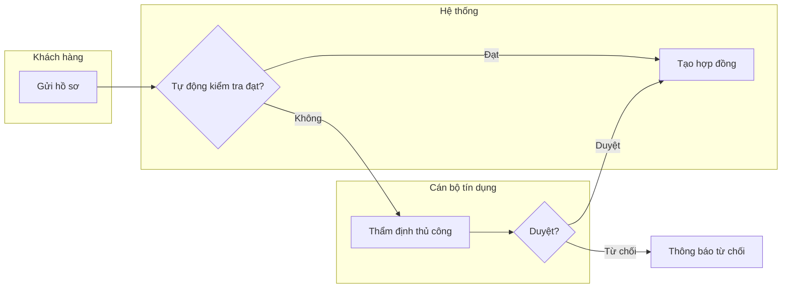
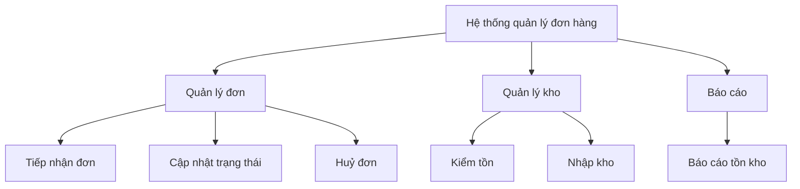
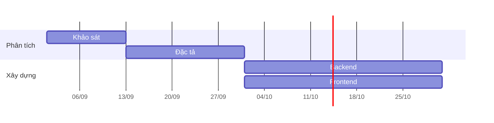

# 1.1 Problem survey — Khảo sát

The first documents written on any initiative. They describe the problem domain and how the business works today — not the software. They outlive any particular implementation, and they are the only documents most stakeholders will ever read carefully.

| File | Answers | Lives at |
|---|---|---|
| Survey / business requirements (BRD) | The eight sections below | `docs/business/khao-sat-<initiative>.md` |
| Process flow | How work moves between people and systems, in detail | `docs/business/process-<name>.md` |

The survey is one document. The process flow is split out only when section 6 grows past a page or when one process spans several initiatives — otherwise it stays inline, because a two-page survey that a stakeholder reads beats a five-file set that they do not. The decision logic goes in [1.2 Business rules](1.2-business-rules.md) either way.

## Contents

- [The eight sections](#the-eight-sections)
- [Template](#template)
- [1.1.1 Mô tả yêu cầu bài toán](#111-mô-tả-yêu-cầu-bài-toán)
- [1.1.2 Phân tích nhu cầu người dùng](#112-phân-tích-nhu-cầu-người-dùng)
- [1.1.3 Biểu đồ mô tả nghiệp vụ](#113-biểu-đồ-mô-tả-nghiệp-vụ)
- [1.1.4 Yêu cầu chức năng](#114-yêu-cầu-chức-năng)
- [1.1.5 Biểu đồ phân cấp chức năng](#115-biểu-đồ-phân-cấp-chức-năng)
- [1.1.6 Input, Process, Output](#116-input-process-output)
- [1.1.7 Ràng buộc kỹ thuật và bảo mật](#117-ràng-buộc-kỹ-thuật-và-bảo-mật)
- [1.1.8 Kế hoạch dự án và quản lý rủi ro](#118-kế-hoạch-dự-án-và-quản-lý-rủi-ro)
- [Cô đọng nhưng đủ ý](#cô-đọng-nhưng-đủ-ý)
- [Relationship to feature specs](#relationship-to-feature-specs)

## The eight sections

Every survey carries all eight, in this order, numbered `1.1.<n>` per [0.1](0.1-visual-style.md#section-numbering-and-subsystem-tiers). Write the headings in the document's language (`.software-docs.json`); the English names below are for finding the right section in this reference, not for the output.

| Mục | Section | Answers | Main form |
|---|---|---|---|
| 1.1.1 | Mô tả yêu cầu bài toán · Problem statement | What is wrong today, what "fixed" means, how far this goes, **which box is being built** | Prose + objectives + two scope tables |
| 1.1.2 | Phân tích nhu cầu người dùng · User needs | Who, what they are trying to achieve, where it hurts now | `N<n>` table |
| 1.1.3 | Biểu đồ mô tả nghiệp vụ · Business process | Who does what today, in what order, including the manual steps | Swimlane flowchart + step table |
| 1.1.4 | Yêu cầu chức năng · Functional requirements | What the system must be able to do | `FR<n>` table |
| 1.1.5 | Biểu đồ phân cấp chức năng · Function hierarchy | The full set of functions, decomposed | Tree diagram |
| 1.1.6 | Input · Process · Output | For each leaf function: what goes in, what happens, what comes out | One IPO table |
| 1.1.7 | Ràng buộc kỹ thuật và bảo mật · Constraints | What is fixed before design starts, and what must not leak | Two tables |
| 1.1.8 | Kế hoạch dự án, quản lý rủi ro · Plan and risk | When it lands, what could stop it | Milestone + risk tables |

The ordering is the dependency chain, and it changed once for exactly that reason ([0.1](0.1-visual-style.md#thứ-tự-các-mục)): needs (1.1.2) come from watching the work, so the as-is process (1.1.3) is written before the functional requirements (1.1.4) that answer it, not after. The tree (1.1.5) sorts those requirements into leaves, and the IPO table (1.1.6) is written **one row per leaf** — writing IPO first means detailing operations nothing has named yet. Constraints (1.1.7) sit after the functions because most of them surface as *"that function cannot work that way here"*; the plan (1.1.8) schedules what 1.1.4–1.1.7 just scoped.

The tree (1.1.5) and the process diagram (1.1.3) must agree — same functions, one arranged in time and one in a hierarchy. Disagreement means one of them is missing a step, and it is nearly always the tree.

**A section with nothing in it is written as `**TBD** — <what's missing> (owner: <name>)`, never deleted.** An empty *Ràng buộc bảo mật* is the most informative line in a survey: it means nobody has asked what data this system will hold. Dropping the heading hides the question; leaving it visible makes someone answer it.

## Template

```markdown
# <Initiative or product area> — Khảo sát

<metadata table, plus:>
| **Sponsor** | |
| **Business owner** | |
| **Target timeframe** | |

<plain-language summary paragraph — 2–4 sentences, no jargon>

## 1.1.1 Mô tả yêu cầu bài toán
### Bối cảnh hiện tại
### Phát biểu bài toán
### Mục tiêu và tiêu chí thành công
| # | Mục tiêu | Đo bằng | Hiện tại | Mục tiêu |
### Phạm vi
| Trong phạm vi | Ngoài phạm vi |
### Ranh giới hệ thống
| | |
|---|---|
| **Hệ thống đang thiết kế** | <tên hộp, coi là hộp đen> |
| **Trong hộp** | <thành phần dự án này xây và phát hành> |
| **Ngoài hộp** | <hệ thống có thật, bên khác sở hữu, mà hộp phải trao đổi dữ liệu> |

## 1.1.2 Phân tích nhu cầu người dùng
| Nhóm người dùng | Quy mô / tần suất | Mục tiêu | Cách làm hiện tại | Điểm đau | Nhu cầu |
|---|---|---|---|---|---|
|  |  |  |  |  | N1 … |

## 1.1.3 Biểu đồ mô tả nghiệp vụ
<swimlane flowchart>
<caption>
| Bước | Actor | Input | Output | SLA | Rule |

## 1.1.4 Yêu cầu chức năng
| # | Chức năng | Mô tả (1 dòng) | Actor | Nguồn | Ưu tiên |
|---|---|---|---|---|---|
| FR1 |  |  |  | N2, BR4 | Must |

## 1.1.5 Biểu đồ phân cấp chức năng
<tree>
<caption>

## 1.1.6 Input – Process – Output
| Nghiệp vụ | Input (nguồn) | Process (bước chính) | Output (nơi nhận) | Tần suất | FR |

## 1.1.7 Ràng buộc kỹ thuật và bảo mật
### Ràng buộc kỹ thuật
| # | Ràng buộc | Loại | Nguồn | Hệ quả nếu sai |
### Yêu cầu bảo mật và dữ liệu
| # | Hạng mục | Yêu cầu | Áp dụng cho | Nguồn |

## 1.1.8 Kế hoạch dự án và quản lý rủi ro
| Mốc | Bàn giao | Từ | Đến | Phụ thuộc | Chủ trì |
| # | Rủi ro | Khả năng | Ảnh hưởng | Dấu hiệu sớm | Giảm thiểu | Chủ trì |

## Câu hỏi mở
## Changelog
```

`Sponsor`, `Business owner` and `Target timeframe` join the standard metadata table from `0.1-visual-style.md`. Numbers stop at H2; the H3s inside 1.1.1 and 1.1.7 are named headings, per [0.1](0.1-visual-style.md#section-numbering-and-subsystem-tiers).

## 1.1.1 Mô tả yêu cầu bài toán

Four things, in this order: what happens today, what is wrong with it, what "fixed" would measurably look like, and **where the box ends**.

- **Bối cảnh hiện tại** — how the work is done now, and what it costs in money, hours, error rate or customer impact. A number beats an adjective: *"mỗi đơn mất trung bình 14 phút thao tác tay, 6% sai địa chỉ"* is a background; *"quy trình thủ công, kém hiệu quả"* is a feeling.
- **Phát biểu bài toán** — one paragraph, no solution language. If the sentence names a technology, it is a design decision that has jumped two phases.
- **Mục tiêu** — each with a measure, a baseline and a target. An objective with no baseline cannot be shown to have been met, so it will not be.
- **Phạm vi** — the `Ngoài phạm vi` column is the one that earns its keep. Things people will assume are included, written down as not included, is the cheapest scope protection there is.
- **Ranh giới hệ thống** — *phạm vi* nói **việc gì** thuộc dự án; *ranh giới* nói **hộp nào** đang được xây. Hai câu hỏi khác nhau, và chỉ câu thứ hai quyết định được ai là tác nhân.

Ranh giới là dòng ngắn nhất trong cả tài liệu và là dòng bị bỏ trống nhiều nhất, vì ai cũng thấy nó hiển nhiên. Nó không hiển nhiên: nó là thứ [2.1.1](2.1-actors-and-use-cases.md#211-xác-định-tác-nhân) suy ra bảng tác nhân, [3.4](3.4-data-flow.md) suy ra tác nhân ngoài, và [4.1.1](4.1-design.md) suy ra danh sách container. Ba tài liệu đó đọc cùng một dòng ở đây; không viết ra thì mỗi tài liệu tự đoán một hộp khác nhau, và triệu chứng quen thuộc nhất là một service của chính sản phẩm xuất hiện trong bảng tác nhân.

**`Trong hộp` là những gì dự án này xây và phát hành** — nằm trong repo, trong lần deploy, trong ca trực của đội. `Ngoài hộp` chỉ liệt kê hệ thống **có thật và do bên khác sở hữu**. Sản phẩm gồm nhiều service vẫn là **một** hộp, trừ khi cả bộ tài liệu cố ý viết cho riêng một service — khi đó nói thẳng ra ở đây, vì nó đổi mọi bảng phía sau.

## 1.1.2 Phân tích nhu cầu người dùng

One row per user group, numbered `N1`, `N2` so functional requirements can cite them.

| Nhóm người dùng | Quy mô / tần suất | Mục tiêu | Cách làm hiện tại | Điểm đau | Nhu cầu |
|---|---|---|---|---|---|
| Nhân viên kho | 12 người, ~400 đơn/ngày | Đóng gói đúng đơn, đúng ca | Đối chiếu bảng in với màn hình | Sai đơn khi in lỗi thời | **N1** Danh sách đơn cập nhật theo thời gian thực |

The distinction that makes this section useful rather than decorative: **a need is a goal the user has, not a feature they asked for.** *"Muốn có nút xuất Excel"* is a proposed solution — the need underneath is *"phải nộp báo cáo tồn kho cho kế toán mỗi thứ Hai"*, and once written that way it may be met by a scheduled email instead. Record what they asked for in the `Cách làm hiện tại` column, where it belongs as evidence.

`Quy mô / tần suất` is not filler. Twelve users doing something four hundred times a day and four hundred users doing it once a year need opposite designs, and this is the only place in the whole document set where that number is captured before it starts mattering.

Where the groups differ enough to be worth showing, an actor map is faster than the table's first column — but do not draw one for three actors.

## 1.1.3 Biểu đồ mô tả nghiệp vụ

A swimlane flowchart, one lane per actor, covering the whole path **including the manual steps** — the person who approves, the spreadsheet someone maintains, the phone call. Those steps are invisible in system documentation and are usually where the delays and the errors actually live.



Then the step table, carrying what the diagram cannot:

| Bước | Actor | Input | Output | SLA | Rule |
|---|---|---|---|---|---|

The `Rule` column links to the business rule governing the step; the `SLA` column is what turns a picture into something operations can be measured against.

When documenting a change, draw two diagrams under `Hiện tại (As-is)` and `Đề xuất (To-be)`. Stakeholders approve a change far more confidently when both are on one page — and the diff between them is, in practice, the real scope of the project.

A process flow describes how the business operates and may span several systems and departments. When the flow is one actor achieving one goal inside this system, it is a use case with an activity diagram instead — see `2.1-actors-and-use-cases.md`, which carries the table for choosing between the four flow notations. Do not draw both for the same flow; they will diverge.

## 1.1.4 Yêu cầu chức năng

What the system must be able to do, one line each, numbered `FR1`, `FR2`.

| # | Chức năng | Mô tả | Actor | Nguồn | Ưu tiên |
|---|---|---|---|---|---|
| FR1 | Theo dõi đơn theo thời gian thực | Hiển thị đơn mới trong vòng 5 giây kể từ khi tạo | Nhân viên kho | N1 | Must |
| FR2 | Xuất báo cáo tồn kho | Sinh báo cáo tuần theo kho và gửi cho kế toán | Kế toán | N4, BR2 | Should |

Rules that keep this section from becoming a specification:

- **One line per function.** Flows, alternate paths, validation and error handling belong to the use case (`2.1`) and feature spec (`2.2`). If a row needs three sentences, it is two functions or it is a use case in disguise.
- **Every row cites a source** — an `N<n>`, a `BR<n>`, a regulation, a named stakeholder. A functional requirement with no source is somebody's preference wearing a number, and it will survive every review because nobody can tell.
- **Priority is MoSCoW** — Must / Should / Could / Won't — and *Must* means the release is worthless without it. When everything is Must, nothing has been prioritised and the plan in section 8 is fiction.
- **No solution language.** *"Gọi API của đối tác qua webhook"* is design. *"Nhận cập nhật trạng thái vận chuyển từ đối tác"* is the requirement, and it stays true after the webhook is replaced.

Non-functional requirements — performance, availability, capacity — go in section 4 with the constraints rather than here, because at survey stage they are almost always given to the project rather than chosen by it. They become numbered, measurable `NFR<n>` rows in [2.4](2.4-nfr.md); section 4 here records what the project was handed, that table records what it commits to.

## 1.1.5 Biểu đồ phân cấp chức năng

The same functions as section 3, arranged as a tree: the system at the root, function groups below it, individual functions as leaves.



Four rules, and the first is the one that makes the diagram worth drawing at all:

- **Leaves and `FR<n>` are one-to-one.** A leaf with no functional requirement means section 3 is incomplete; an `FR` with no leaf means the tree is. Checking the two against each other takes a minute and is the only completeness check the survey has.
- **Depth stops at three levels.** Deeper is decomposition into design, which does not belong in a survey.
- **No arrows meaning "then".** This diagram has no time in it — parent-to-child is *"consists of"*, nothing else. If the tree has sequence, it is section 6 drawn badly.
- **Split above ~12 leaves**, one tree per function group, rather than shrinking the boxes. The ten-node rule in `0.1` applies here too.

The common mistake is drawing something else and calling it a function hierarchy: the **menu structure** (that is a screen map, `4.5`), the **code package layout** (that is `5.1`), or the **org chart** (that is section 2). Label the nodes with verbs — *Tiếp nhận đơn*, not *Màn hình đơn hàng* — and the mistake becomes hard to make.

## 1.1.6 Input, Process, Output

One row per business operation. This is the section that turns the process diagram into something a data model can be built from.

| Nghiệp vụ | Input (nguồn) | Process (bước chính) | Output (nơi nhận) | Tần suất | FR |
|---|---|---|---|---|---|
| Tiếp nhận đơn | Đơn hàng từ website · tồn kho từ WMS | Kiểm tồn → giữ hàng → xác nhận | Đơn đã xác nhận → kho · email → khách | ~400/ngày | FR1 |
| Đối soát cuối ngày | Đơn đã giao · sao kê ngân hàng | Ghép giao dịch → đánh dấu lệch | Báo cáo lệch → kế toán | 1/ngày, 23:00 | FR6 |

Three rules make the table catch real problems instead of restating the diagram:

- **Every input names where it comes from**, and every output names who consumes it. This is the whole point of the parenthetical columns.
- **An output nobody consumes is a finding**, not a formatting slip — either a consumer was forgotten, or the step is producing something nobody needs.
- **An input from nowhere is worse**: it means the operation depends on data the system has not been told how to obtain, which is the classic gap discovered in week six of build.

Keep `Process` to three to five short steps. The detailed step sequence is section 6's job, and the branching logic is `1.2`'s.

## 1.1.7 Ràng buộc kỹ thuật và bảo mật

Two tables. Both describe things that are settled **before** design starts, which is exactly what makes them belong in the survey rather than the SDD.

**Ràng buộc kỹ thuật** — platform and language mandated by the organisation, systems that must be integrated with as they are, data volumes and peaks, response-time and availability targets, browser and device support, budget and deadline.

| # | Ràng buộc | Loại | Nguồn | Hệ quả nếu sai |
|---|---|---|---|---|
| C1 | Chạy trên hạ tầng nội bộ, không dùng cloud công cộng | Hạ tầng | Chính sách CNTT | Phải làm lại kiến trúc triển khai |

**Yêu cầu bảo mật và dữ liệu** — the checklist below is the minimum; a row per line, `**TBD**` where the answer is not known yet:

| Hạng mục | Câu hỏi phải trả lời |
|---|---|
| Phân loại dữ liệu | What is stored, and which of it is personal, financial or regulated |
| Xác thực | Who can sign in, with what, and via which identity system |
| Phân quyền | Which role may do which `FR<n>` — and who grants the role |
| Dữ liệu cá nhân | Which fields, on what legal basis, and can they be exported or erased on request |
| Mã hoá | At rest and in transit, and who holds the keys |
| Lưu vết | Which actions are audited, what the log records, who may read it |
| Lưu trữ và xoá | How long each class of data is kept, and what happens at the end |
| Tuân thủ | Named obligations — Nghị định 13/2023, PCI DSS, ISO 27001, internal policy |

Two failure modes worth naming. First, **a preference recorded as a constraint is expensive**, because everything downstream treats constraints as non-negotiable and nobody revisits them — mark the soft ones as *Ưu tiên* in the `Loại` column and let design push back. Second, security written as a wish (*"hệ thống phải an toàn"*) constrains nothing and cannot be tested; every row here should be specific enough to appear later as a test case in `6.1`.

## 1.1.8 Kế hoạch dự án và quản lý rủi ro

**Mốc và bàn giao.** What lands, when, and what it depends on. Phases matching the document numbering (khảo sát → đặc tả → phân tích → thiết kế → xây dựng → kiểm thử) work well because each one has an artifact that can actually be reviewed.

| Mốc | Bàn giao | Từ | Đến | Phụ thuộc | Chủ trì |
|---|---|---|---|---|---|
| M1 | Khảo sát được duyệt | 01/09 | 12/09 | — | BA |
| M2 | Đặc tả use case + wireframe | 15/09 | 03/10 | M1 | BA, FE |

A Gantt chart is worth adding when there is real parallelism to show, and not otherwise:



**Quản lý rủi ro.** Five to seven risks that are actually being managed, not thirty that are being listed.

| # | Rủi ro | Khả năng | Ảnh hưởng | Dấu hiệu sớm | Giảm thiểu | Chủ trì |
|---|---|---|---|---|---|---|
| R1 | API đối tác vận chuyển chưa sẵn sàng | Cao | Cao | Chưa có tài khoản sandbox sau 15/09 | Làm adapter giả lập, chốt hợp đồng tích hợp trước M2 | TL |

- **`Dấu hiệu sớm` is the column that makes the register useful.** A risk with no observable trigger cannot be managed, only regretted afterwards. Write the thing someone could notice — a date passing, a queue growing, a person not replying — not a restatement of the risk.
- **A mitigation is an action with an owner and a date.** *"Theo dõi sát"* is not a mitigation.
- **Rank, then cut.** Likelihood × impact only earns its place if it changes what the team does; keep what the ranking selected and delete the rest, because a register nobody finishes reading protects nobody.
- Risks that turn out to be certainties are not risks — move them to section 4 as constraints, or to the plan as work.

## Cô đọng nhưng đủ ý

The survey is read by people who will not read anything else, so it has to carry the whole problem in the time someone will actually give it. That means dense, not short.

| Do | Instead of |
|---|---|
| Lead each section with its diagram or table | A paragraph the reader has to mine for the list inside it |
| One line per bullet, seven bullets at most | A bullet with a sub-bullet and an explanatory sentence — that is a table row |
| A number with its unit and its baseline | *"nhiều"*, *"chậm"*, *"thường xuyên"* |
| Prose for the caveat, the reason and the thing the picture cannot show | Prose that restates a table cell in sentence form |

The check before publishing: **read only the diagrams, tables and bullets.** If the problem, the users, the functions, the constraints and the plan are all there, the density is right. If something important only exists in a paragraph, move it into a row.

And the failure mode this rule invites, stated plainly so it is not walked into: **cutting a qualifier that changes the meaning makes a document shorter and wrong.** A survey that fits on one page by leaving out the constraint that will kill the project is not concise, it is incomplete. Every deletion is a bet that no reader needed that; make the bet deliberately.

## Relationship to feature specs

Business documents and feature specs answer different questions and should not absorb each other:

| | Business docs | Feature spec |
|---|---|---|
| Lifespan | Years; updated when the business changes | One release |
| Owner | Business owner | Engineering + PM |
| Contains | Why, for whom, what rules apply | What we build now, and how |
| Cites | Policy, regulation, market evidence | `N<n>`, `FR<n>`, `BR<n>` from the survey |

A feature spec's `Problem` section references the survey's numbers rather than re-arguing the case. If a feature has no `FR` behind it, that is worth noticing before it is built — and if an `FR` never becomes a feature, the survey promised something the release does not deliver, which is worth noticing before someone else notices it.
