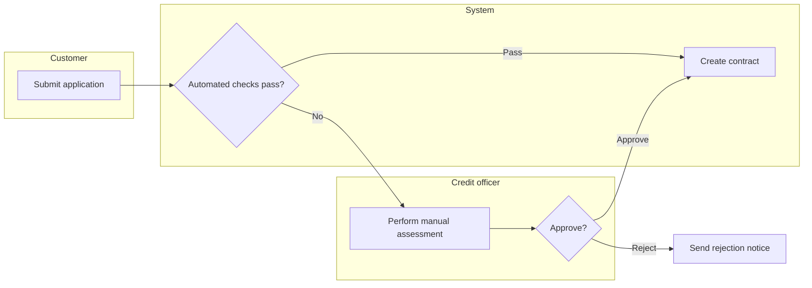
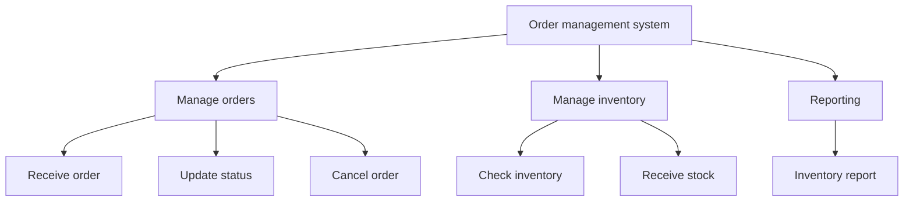

# 1.1 Problem survey

The first documents written on any initiative. They describe the problem domain and how the business works today — not the software. They outlive any particular implementation, and they are the only documents most stakeholders will ever read carefully.

| File | Answers | Lives at |
|---|---|---|
| Survey / business requirements (BRD) | The eight sections below | `docs/business/survey-<initiative>.md` |
| Process flow | How work moves between people and systems, in detail | `docs/business/process-<name>.md` |

The survey is one document. The process flow is split out only when section 6 grows past a page or when one process spans several initiatives — otherwise it stays inline, because a two-page survey that a stakeholder reads beats a five-file set that they do not. The decision logic goes in [1.2 Business rules](1.2-business-rules.md) either way.

## Contents

- [The eight sections](#the-eight-sections)
- [Template](#template)
- [1.1.1 Problem and system boundary](#111-problem-and-system-boundary)
- [1.1.2 Analyze user needs](#112-analyze-user-needs)
- [1.1.3 Business-process diagram](#113-business-process-diagram)
- [1.1.4 Functional requirements](#114-functional-requirements)
- [1.1.5 Function hierarchy](#115-function-hierarchy)
- [1.1.6 Input, Process, Output](#116-input-process-output)
- [1.1.7 Technical and security constraints](#117-technical-and-security-constraints)
- [1.1.8 Project plan and risk management](#118-project-plan-and-risk-management)
- [Concise but complete](#concise-but-complete)
- [Relationship to feature specs](#relationship-to-feature-specs)

## The eight sections

Every survey carries all eight, in this order, numbered `1.1.<n>` per [0.1](0.1-visual-style.md#section-numbering-and-subsystem-tiers). Write the headings in the document's language (`.software-docs.json`); the English names below are for finding the right section in this reference, not for the output.

| No. | Section | Answers | Main form |
|---|---|---|---|
| 1.1.1 | Problem statement | What is wrong today, what "fixed" means, how far this goes, **which box is being built** | Prose + objectives + two scope tables |
| 1.1.2 | User needs | Who, what they are trying to achieve, where it hurts now | `N<n>` table |
| 1.1.3 | Business process | Who does what today, in what order, including the manual steps | Swimlane flowchart + step table |
| 1.1.4 | Functional requirements | What the system must be able to do | `FR<n>` table |
| 1.1.5 | Function hierarchy | The full set of functions, decomposed | Tree diagram |
| 1.1.6 | Input · Process · Output | For each leaf function: what goes in, what happens, what comes out | One IPO table |
| 1.1.7 | Technical and security constraints | What is fixed before design starts, and what must not leak | Two tables |
| 1.1.8 | Project plan and risk management | When it lands, what could stop it | Milestone + risk tables |

The ordering is the dependency chain, and it changed once for exactly that reason ([0.1](0.1-visual-style.md#section-order)): needs (1.1.2) come from watching the work, so the as-is process (1.1.3) is written before the functional requirements (1.1.4) that answer it, not after. The tree (1.1.5) sorts those requirements into leaves, and the IPO table (1.1.6) is written **one row per leaf**—writing IPO first means detailing operations nothing has named yet. Constraints (1.1.7) sit after the functions because most of them surface as *"that function cannot work that way here"*; the plan (1.1.8) schedules what 1.1.4–1.1.7 just scoped.

The tree (1.1.5) and the process diagram (1.1.3) must agree — same functions, one arranged in time and one in a hierarchy. Disagreement means one of them is missing a step, and it is nearly always the tree.

**A section with nothing in it is written as `**TBD** — <what's missing> (owner: <name>)`, never deleted.** An empty *Security constraints* section is the most informative line in a survey: it means nobody has asked what data this system will hold. Dropping the heading hides the question; leaving it visible makes someone answer it.

## Template

```markdown
# <Initiative or product area> — Survey

<metadata table, plus:>
| **Sponsor** | |
| **Business owner** | |
| **Target timeframe** | |

<plain-language summary paragraph — 2–4 sentences, no jargon>

## 1.1.1 Problem and system boundary
### Current context
### Problem statement
### Objectives and success criteria
| # | Objective | Measure | Baseline | Target |
### Scope
| In scope | Out of scope |
### System boundary
| | |
|---|---|
| **System being designed** | <box name, treated as a black box> |
| **Inside the box** | <components this project builds and releases> |
| **Outside the box** | <real systems owned by other parties with which the box exchanges data> |

## 1.1.2 Analyze user needs
| User group | Scale / frequency | Goal | Current approach | Pain point | Need |
|---|---|---|---|---|---|
|  |  |  |  |  | N1 … |

## 1.1.3 Business-process diagram
<swimlane flowchart>
<caption>
| Step | Actor | Input | Output | SLA | Rule |

## 1.1.4 Functional requirements
| # | Function | Description (one line) | Actor | Source | Priority |
|---|---|---|---|---|---|
| FR1 |  |  |  | N2, BR4 | Must |

## 1.1.5 Function hierarchy
<tree>
<caption>

## 1.1.6 Input – Process – Output
| Operation | Input (source) | Process (main steps) | Output (recipient) | Frequency | FR |

## 1.1.7 Technical and security constraints
### Technical constraints
| # | Constraint | Type | Source | Consequence if wrong |
### Security and data requirements
| # | Item | Requirement | Applies to | Source |

## 1.1.8 Project plan and risk management
| Milestone | Deliverable | From | To | Dependencies | Owner |
| # | Risk | Likelihood | Impact | Early warning | Mitigation | Owner |

## Open questions
## Changelog
```

`Sponsor`, `Business owner` and `Target timeframe` join the standard metadata table from `0.1-visual-style.md`. Numbers stop at H2; the H3s inside 1.1.1 and 1.1.7 are named headings, per [0.1](0.1-visual-style.md#section-numbering-and-subsystem-tiers).

## 1.1.1 Problem and system boundary

Four things, in this order: what happens today, what is wrong with it, what "fixed" would measurably look like, and **where the box ends**.

- **Current context** — how the work is done now, and what it costs in money, hours, error rate, or customer impact. A number beats an adjective: *"each order takes an average of 14 minutes of manual work, with 6% containing an incorrect address"* is context; *"the manual process is inefficient"* is a feeling.
- **Problem statement** — one paragraph, with no solution language. If the sentence names a technology, it is a design decision that has jumped two phases.
- **Objectives** — each with a measure, a baseline, and a target. An objective with no baseline cannot be shown to have been met, so it will not be.
- **Scope** — the `Out of scope` column is the one that earns its keep. Explicitly excluding things people will assume are included is the cheapest scope protection available.
- **System boundary** — *scope* says **what work** belongs to the project; the *boundary* says **which box** is being built. These are different questions, and only the second determines who qualifies as an actor.

The boundary is the shortest line in the entire document and the one most often left blank because everyone assumes it is obvious. It is not: [2.1.1](2.1-actors-and-use-cases.md#211-identify-actors) derives the actor table from it, [3.4](3.4-data-flow.md) derives external entities from it, and [4.1.1](4.1-design.md) derives the container list from it. Those three documents read the same line here. If it is absent, each document guesses a different box; the most familiar symptom is one of the product's own services appearing in the actor table.

**`Inside the box` is everything this project builds and releases**—in the repository, in the deployment, and under the team's operational ownership. `Outside the box` lists only systems that **actually exist and are owned by another party**. A product with multiple services is still **one** box unless the entire document set intentionally describes a single service. If so, state that explicitly here because it changes every downstream table.

## 1.1.2 Analyze user needs

One row per user group, numbered `N1`, `N2` so functional requirements can cite them.

| User group | Scale / frequency | Goal | Current approach | Pain point | Need |
|---|---|---|---|---|---|
| Inventory employees | 12 people, ~400 orders/day | Pack the correct orders during the correct shift | Compare a printed sheet against the screen | Incorrect orders when printouts become stale | **N1** Real-time order list |

The distinction that makes this section useful rather than decorative: **a need is a goal the user has, not a feature they asked for.** *"We want an Export to Excel button"* is a proposed solution—the underlying need is *"submit an inventory report to Accounting every Monday"*. Once stated that way, a scheduled email may satisfy it instead. Record what users asked for in the `Current approach` column, where it belongs as evidence.

`Scale / frequency` is not filler. Twelve users doing something four hundred times a day and four hundred users doing it once a year need opposite designs, and this is the only place in the whole document set where that number is captured before it starts mattering.

Where the groups differ enough to be worth showing, an actor map is faster than the table's first column — but do not draw one for three actors.

## 1.1.3 Business-process diagram

A swimlane flowchart, one lane per actor, covering the whole path **including the manual steps** — the person who approves, the spreadsheet someone maintains, the phone call. Those steps are invisible in system documentation and are usually where the delays and the errors actually live.



Then the step table, carrying what the diagram cannot:

| Step | Actor | Input | Output | SLA | Rule |
|---|---|---|---|---|---|

The `Rule` column links to the business rule governing the step; the `SLA` column is what turns a picture into something operations can be measured against.

When documenting a change, draw two diagrams under `Current (As-is)` and `Proposed (To-be)`. Stakeholders approve a change far more confidently when both are on one page—and the difference between them is, in practice, the project's real scope.

A process flow describes how the business operates and may span several systems and departments. When the flow is one actor achieving one goal inside this system, it is a use case with an activity diagram instead — see `2.1-actors-and-use-cases.md`, which carries the table for choosing between the four flow notations. Do not draw both for the same flow; they will diverge.

## 1.1.4 Functional requirements

What the system must be able to do, one line each, numbered `FR1`, `FR2`.

| # | Function | Description | Actor | Source | Priority |
|---|---|---|---|---|---|
| FR1 | Track orders in real time | Display new orders within 5 seconds of creation | Inventory employee | N1 | Must |
| FR2 | Export inventory report | Generate a weekly report by warehouse and send it to Accounting | Accountant | N4, BR2 | Should |

Rules that keep this section from becoming a specification:

- **One line per function.** Flows, alternate paths, validation and error handling belong to the use case (`2.1`) and feature spec (`2.2`). If a row needs three sentences, it is two functions or it is a use case in disguise.
- **Every row cites a source** — an `N<n>`, a `BR<n>`, a regulation, a named stakeholder. A functional requirement with no source is somebody's preference wearing a number, and it will survive every review because nobody can tell.
- **Priority is MoSCoW** — Must / Should / Could / Won't — and *Must* means the release is worthless without it. When everything is Must, nothing has been prioritised and the plan in section 8 is fiction.
- **No solution language.** *"Call the partner API through a webhook"* is design. *"Receive shipping-status updates from the partner"* is the requirement, and it remains true after the webhook is replaced.

Non-functional requirements — performance, availability, capacity — go in section 4 with the constraints rather than here, because at survey stage they are almost always given to the project rather than chosen by it. They become numbered, measurable `NFR<n>` rows in [2.4](2.4-nfr.md); section 4 here records what the project was handed, that table records what it commits to.

## 1.1.5 Function hierarchy

The same functions as section 3, arranged as a tree: the system at the root, function groups below it, individual functions as leaves.



Four rules, and the first is the one that makes the diagram worth drawing at all:

- **Leaves and `FR<n>` are one-to-one.** A leaf with no functional requirement means section 3 is incomplete; an `FR` with no leaf means the tree is. Checking the two against each other takes a minute and is the only completeness check the survey has.
- **Depth stops at three levels.** Deeper is decomposition into design, which does not belong in a survey.
- **No arrows meaning "then".** This diagram has no time in it — parent-to-child is *"consists of"*, nothing else. If the tree has sequence, it is section 6 drawn badly.
- **Split above ~12 leaves**, one tree per function group, rather than shrinking the boxes. The ten-node rule in `0.1` applies here too.

The common mistake is drawing something else and calling it a function hierarchy: the **menu structure** (a screen map, `4.5`), the **code package layout** (`5.1`), or the **organization chart** (section 2). Label nodes with verbs—*Receive order*, not *Order screen*—and the mistake becomes hard to make.

## 1.1.6 Input, Process, Output

One row per business operation. This is the section that turns the process diagram into something a data model can be built from.

| Operation | Input (source) | Process (main steps) | Output (recipient) | Frequency | FR |
|---|---|---|---|---|---|
| Receive order | Order from website · inventory from WMS | Check inventory → reserve stock → confirm | Confirmed order → warehouse · email → customer | ~400/day | FR1 |
| End-of-day reconciliation | Delivered orders · bank statement | Match transactions → flag discrepancies | Discrepancy report → Accounting | Once/day, 23:00 | FR6 |

Three rules make the table catch real problems instead of restating the diagram:

- **Every input names where it comes from**, and every output names who consumes it. This is the whole point of the parenthetical columns.
- **An output nobody consumes is a finding**, not a formatting slip — either a consumer was forgotten, or the step is producing something nobody needs.
- **An input from nowhere is worse**: it means the operation depends on data the system has not been told how to obtain, which is the classic gap discovered in week six of build.

Keep `Process` to three to five short steps. The detailed step sequence is section 6's job, and the branching logic is `1.2`'s.

## 1.1.7 Technical and security constraints

Two tables. Both describe things that are settled **before** design starts, which is exactly what makes them belong in the survey rather than the SDD.

**Technical constraints** — platform and language mandated by the organization, systems that must be integrated with as they are, data volumes and peaks, response-time and availability targets, browser and device support, budget, and deadline.

| # | Constraint | Type | Source | Consequence if wrong |
|---|---|---|---|---|
| C1 | Run on on-premises infrastructure; do not use a public cloud | Infrastructure | IT policy | Deployment architecture must be redesigned |

**Security and data requirements** — the checklist below is the minimum; use one row per item and `**TBD**` where the answer is not known yet:

| Item | Question to answer |
|---|---|
| Data classification | What is stored, and which data is personal, financial, or regulated |
| Authentication | Who can sign in, with what, and through which identity system |
| Authorization | Which role may perform each `FR<n>`, and who grants the role |
| Personal data | Which fields, on what legal basis, and whether they can be exported or erased on request |
| Encryption | At rest and in transit, and who holds the keys |
| Audit trail | Which actions are audited, what the log records, and who may read it |
| Retention and deletion | How long each data class is retained and what happens at the end |
| Compliance | Named obligations—Decree 13/2023, PCI DSS, ISO 27001, or internal policy |

Two failure modes are worth naming. First, **a preference recorded as a constraint is expensive**, because everything downstream treats constraints as non-negotiable and nobody revisits them—mark soft constraints as *Preferred* in the `Type` column and let design challenge them. Second, security written as a wish (*"the system must be secure"*) constrains nothing and cannot be tested; every row here should be specific enough to appear later as a test case in `6.1`.

## 1.1.8 Project plan and risk management

**Milestones and deliverables.** What lands, when, and what it depends on. Phases matching the document numbering (survey → specification → analysis → design → implementation → testing) work well because each has an artifact that can actually be reviewed.

| Milestone | Deliverable | From | To | Dependencies | Owner |
|---|---|---|---|---|---|
| M1 | Approved survey | 01/09 | 12/09 | — | BA |
| M2 | Use case specifications + wireframes | 15/09 | 03/10 | M1 | BA, FE |

A Gantt chart is worth adding when there is real parallelism to show, and not otherwise:


**Risk management.** Five to seven risks that are actually being managed, not thirty that are merely listed.

| # | Risk | Likelihood | Impact | Early warning | Mitigation | Owner |
|---|---|---|---|---|---|---|
| R1 | Shipping partner API is not ready | High | High | No sandbox account by 15/09 | Build a mock adapter and finalize the integration contract before M2 | TL |

- **`Early warning` is the column that makes the register useful.** A risk with no observable trigger cannot be managed, only regretted afterward. Write something a person could notice—a date passing, a queue growing, or a person not replying—not a restatement of the risk.
- **A mitigation is an action with an owner and a date.** *"Monitor closely"* is not a mitigation.
- **Rank, then cut.** Likelihood × impact only earns its place if it changes what the team does; keep what the ranking selected and delete the rest, because a register nobody finishes reading protects nobody.
- Risks that turn out to be certainties are not risks — move them to section 4 as constraints, or to the plan as work.

## Concise but complete

The survey is read by people who will not read anything else, so it has to carry the whole problem in the time someone will actually give it. That means dense, not short.

| Do | Instead of |
|---|---|
| Lead each section with its diagram or table | A paragraph the reader has to mine for the list inside it |
| One line per bullet, seven bullets at most | A bullet with a sub-bullet and an explanatory sentence — that is a table row |
| A number with its unit and its baseline | *"many"*, *"slow"*, *"frequent"* |
| Prose for the caveat, the reason and the thing the picture cannot show | Prose that restates a table cell in sentence form |

The check before publishing: **read only the diagrams, tables and bullets.** If the problem, the users, the functions, the constraints and the plan are all there, the density is right. If something important only exists in a paragraph, move it into a row.

And the failure mode this rule invites, stated plainly so it is not walked into: **cutting a qualifier that changes the meaning makes a document shorter and wrong.** A survey that fits on one page by leaving out the constraint that will kill the project is not concise, it is incomplete. Every deletion is a bet that no reader needed that; make the bet deliberately.

## Relationship to feature specs

Business documents and feature specs answer different questions and should not absorb each other:

| | Business docs | Feature spec |
|---|---|---|
| Lifespan | Years; updated when the business changes | One release |
| Owner | Business owner | Engineering + PM |
| Contains | Why, for whom, what rules apply | What we build now, and how |
| Cites | Policy, regulation, market evidence | `N<n>`, `FR<n>`, `BR<n>` from the survey |

A feature spec's `Problem` section references the survey's numbers rather than re-arguing the case. If a feature has no `FR` behind it, that is worth noticing before it is built — and if an `FR` never becomes a feature, the survey promised something the release does not deliver, which is worth noticing before someone else notices it.
