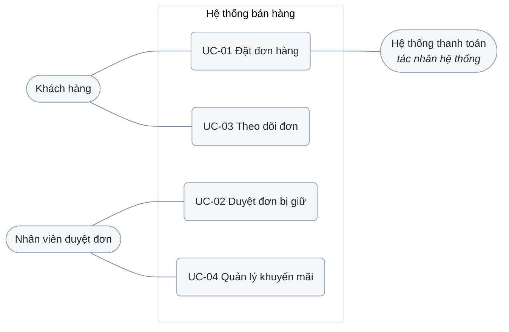
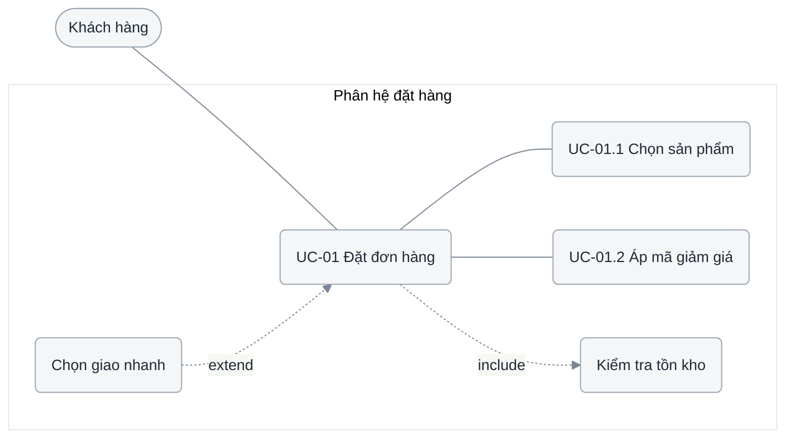
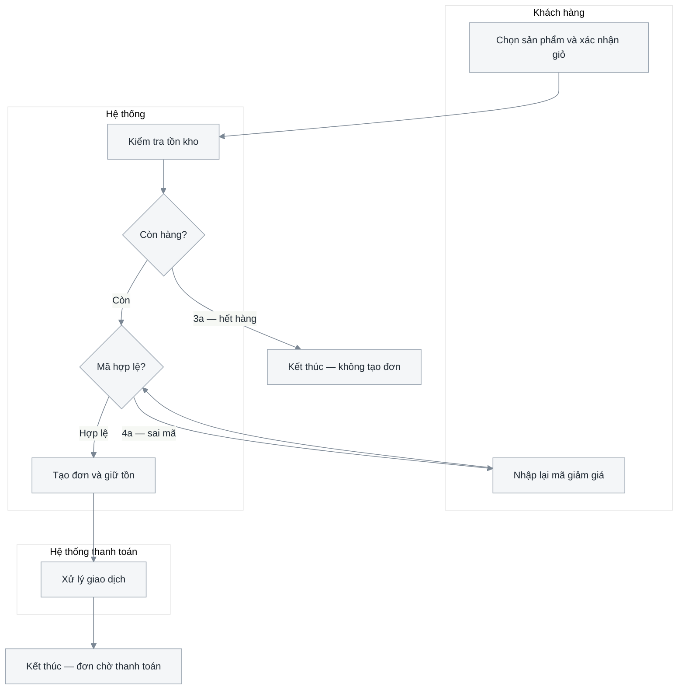

# 2.1 Đặc tả yêu cầu — Use cases

**Phase 2 · Đặc tả.** The last document written in the business's vocabulary and the first one an engineer can build against: who the actors are, which use cases exist, how each runs, what data moves, and what quality bars apply.

**The sections, their order and their headings are mandatory.** Do not rename, reorder or merge them — the traceability checks below only work if the parts are where they are expected to be, and the order is a dependency chain ([0.1](0.1-visual-style.md#thứ-tự-các-mục)).

| Mục | Section | Answers | Form |
|---|---|---|---|
| 2.1.1 | Xác định tác nhân | Ranh giới hệ thống ở đâu, ai đứng **ngoài** nó | Câu ranh giới + one table |
| 2.1.2 | Xác định các ca sử dụng chính | Có những ca nào, thuộc phân hệ nào | One table |
| 2.1.3 | Biểu đồ use case | Ranh giới ở đâu, ai chạm cái gì, phân rã ra sao | 1 overview + n level-2 diagrams |
| 2.1.4 … | Đặc tả sử dụng | Từng ca chạy thế nào, **gồm mấy thao tác**, dữ liệu nào đi qua | One block per use case, một mục mỗi phân hệ |
| cuối | Yêu cầu phi chức năng | Nhanh, chịu tải, an toàn tới mức nào — đo bằng gì | One numbered table |

Mục 2.1.1–2.1.2 is the contract for everything after it: **nothing may appear in a diagram or a specification that is not a row in table 2.1.2, and every row in that table must appear in both.** Đó cũng là lý do hai bảng đứng trước sơ đồ chứ không phải sau: một đặc tả viết trước khi danh sách tác nhân được chốt sẽ bịa ra một tác nhân, và nó sống sót vào thiết kế vì lúc ấy nó đã nằm trong một sơ đồ.

| Standard | Taken from it |
|---|---|
| ISO/IEC/IEEE 29148:2018 | Requirements necessary, unambiguous, **singular**, feasible, **verifiable**, traceable; the four verification methods |
| UML 2.5.1 | *Subject* (the box) and **actor = a role external to the subject**; use case, association, `<<include>>`, `<<extend>>`, generalisation |
| ISO/IEC 25010:2023 | The nine quality characteristics the NFR section is organised by |
| Cockburn, *Writing Effective Use Cases* | **Design scope** and the black-box rule; goal levels; the main / alternate / exception flow structure |
| Larman, *Applying UML and Patterns* | The three actor kinds — primary, supporting, offstage — and finding use cases from actor goals |

Activity diagrams belong to the đặc tả sections of this document and nowhere else; [3.1](3.1-analysis-classes.md) realises each use case in classes and sequences without redrawing its flows.

**Mode A** reads the same sections off the code: routes plus their permission checks give actors, handlers grouped by goal give use cases, validators and DTOs give the field tables, timeouts and SLO config give the NFRs. A use case reconstructed from a route name is a hypothesis until someone confirms the goal behind it.

## Template

```markdown
# <Hệ thống> — Đặc tả yêu cầu

<metadata table>

<plain-language summary paragraph — 2–4 sentences, no jargon>

## 2.1.1 Xác định tác nhân trong hệ thống

**Hệ thống đang đặc tả:** <tên hộp>, coi là hộp đen. **Trong hộp:** <những gì dự án này xây và phát hành>.

| STT | Tên tác nhân | Loại | Mô tả tác nhân | Nguồn |
|---|---|---|---|---|

## 2.1.2 Xác định các ca sử dụng chính
| STT | Mã use case | Tên use case | Phân hệ | Mô tả use case | Tác nhân tương tác | Nguồn |
|---|---|---|---|---|---|---|

## 2.1.3 Biểu đồ use case

### Biểu đồ use case tổng quan
<diagram>
<caption 2–4 câu>

### <Phân hệ Bán hàng> — phân rã mức 2
<diagram>
<caption>
| Quan hệ | Từ | Đến | Điều kiện |
|---|---|---|---|

### <Phân hệ Kho> — phân rã mức 2
<lặp cho từng phân hệ>

## 2.1.4 Đặc tả sử dụng — <Phân hệ Bán hàng>

<bỏ phần "— <Phân hệ>" khi hệ thống không chia phân hệ; phân hệ thứ hai lên 2.1.5>

### UC-01 — <Tên use case>
| | |
|---|---|
| **Tác nhân chính** | |
| **Tác nhân phụ** | |
| **Kích hoạt** | |
| **Tiền điều kiện** | |
| **Hậu điều kiện — thành công** | |
| **Hậu điều kiện — thất bại** | |
| **Tần suất** | |
| **Liên quan** | FR2 · BR4 · NFR3 |

**Mục đích**
<1–2 câu: tác nhân đạt được gì, và vì sao ca này tồn tại>

**Bảng thao tác**
<bắt buộc khi ca có ≥ 2 thao tác; soát bằng 13 dòng danh mục của 0.7>
| Mã | Thao tác | Tác nhân | Kích hoạt | Tiền điều kiện | Dữ liệu vào | Kết quả · hậu điều kiện | Luật | Ngoại lệ | Màn hình | I<n> |
|---|---|---|---|---|---|---|---|---|---|---|
| T1 | | | | | | | | | | |

**Luồng hoạt động**
<một luồng chính cho mỗi thao tác khác nhau ở tiền điều kiện hoặc ở ai gọi ai;
các thao tác còn lại là nhánh đánh số trong luồng chính, mang mã T<n>>

*Luồng chính — T1 <tên thao tác>*
1. …

*Luồng thay thế*
- 3a. …

*Luồng ngoại lệ*
- 6a. …

**Các trường dữ liệu**
| Trường | Nhãn hiển thị | Kiểu | Bắt buộc | Ràng buộc hợp lệ | Nguồn / đích | Ghi chú |
|---|---|---|---|---|---|---|

**Biểu đồ hoạt động**
<activity diagram>
<caption>

<lặp lại khối trên cho TỪNG use case, theo đúng thứ tự bảng 2.1.2>

## 2.1.5 Đặc tả sử dụng — <Phân hệ Kho>
<lặp cho từng phân hệ>

## 2.1.<n> Yêu cầu phi chức năng
| # | Nhóm chất lượng | Yêu cầu | Ngưỡng đo | Cách kiểm chứng | Ưu tiên | Áp dụng cho | Nguồn |
|---|---|---|---|---|---|---|---|
| NFR1 | Hiệu năng | | | Test | Must | UC-01, UC-03 | |

## Câu hỏi mở
## Changelog
```

- **`STT` is display order; `Mã use case` is identity.** Everything else cites the mã — an `STT` used as a reference points at the wrong use case as soon as a row is inserted.
- **Numbering follows the system shape**: one system `UC-01`; several, a letter each matching the file suffix (`UC-A01` admin, `UC-U01` user).
- **Số dừng ở H2, use case là H3 không số** ([0.1](0.1-visual-style.md#section-numbering-and-subsystem-tiers)). Phân hệ vì thế **lên H2, mỗi phân hệ một số** — không có tầng thứ tư, và một phân hệ mới là một số mới ở cuối chứ không phải đánh số lại cả nhánh. NFR luôn là mục cuối, nên số của nó phụ thuộc số phân hệ.
- **Cột `Phân hệ` của bảng 2.1.2 là trục dùng cho cả bộ tài liệu.** Đây là chỗ nó được chốt; [3.1](3.1-analysis-classes.md), [3.2](3.2-sequence-diagrams.md), [3.3](3.3-class-diagrams.md), [4.3](4.3-detailed-design.md) và [4.5](4.5-ui-design.md) chép lại đúng tên và đúng thứ tự đó. Hệ thống nhỏ thì để `—` cả cột và bỏ tầng phân hệ ở mọi tài liệu sau, chứ đừng để mỗi tài liệu tự chia một kiểu.
- **Thứ tự hai mục đầu là bắt buộc** ([0.1](0.1-visual-style.md#thứ-tự-các-mục)): tác nhân → danh sách use case → biểu đồ → đặc tả. Biểu đồ vẽ được vì danh sách đã đóng, và đặc tả viết được vì biểu đồ đã chỉ ra quan hệ `<<include>>`/`<<extend>>`. Vẽ biểu đồ trước là cách chắc chắn nhất để sinh ra một use case không có trong bảng.

## 2.1.1 Xác định tác nhân

UML 2.5.1 định nghĩa tác nhân bằng đúng một mệnh đề: *"a role played by an entity that interacts with the subject … but which is **external to the subject**"*. Cả bảng này treo vào một chữ — **external** — nên **hộp phải được vẽ trước**, không phải suy ra sau. Đây là ứng dụng trực tiếp của luật *quyết định trước bức tranh* ([0.1](0.1-visual-style.md#thứ-tự-các-mục)): ranh giới là quyết định, danh sách tác nhân chỉ là hệ quả.

### Ba bước, theo đúng thứ tự

**Bước 1 — nói hộp là cái gì, một câu, ngay đầu mục.** Chép từ [1.1.1](1.1-problem-survey.md#111-mô-tả-yêu-cầu-bài-toán) nếu đã có:

> Hệ thống đang đặc tả: **Nền tảng bán hàng**, coi là hộp đen. Trong hộp: web khách, trang quản trị, dịch vụ đơn hàng, dịch vụ gợi ý.

Cockburn gọi đây là **design scope**, và phân biệt use case **hộp đen** — không nói bên trong hộp có gì — với use case **hộp trắng**, mở hộp ra kể componentry. Mục 2.1 **luôn** là hộp đen; mở hộp là việc của [4.1](4.1-design.md).

**Bước 2 — ba câu hỏi, phải đúng cả ba.**

| # | Câu hỏi | Sai thì nó là gì |
|---|---|---|
| 1 | Nó nằm **ngoài** hộp vừa vẽ? | Trong hộp ⇒ **container**, chỗ của nó là [4.1.1](4.1-design.md) |
| 2 | Nó **trao đổi** cái gì đó qua ranh giới, và dự án này không điều khiển được nó? | Không trao đổi ⇒ bên liên quan, không phải tác nhân |
| 3 | Nó là một **vai**, không phải một con người, một phòng ban hay một máy chủ? | Không ⇒ gộp lại thành vai |

Câu 1 là câu bị bỏ qua nhiều nhất, và nó có một phép thử không cãi được: **thứ do chính dự án này xây thì không bao giờ là tác nhân.** Nằm trong repo của bạn, trong lần phát hành của bạn, trong ca trực của bạn ⇒ nó là thành phần. Một service nội bộ viết vào bảng tác nhân trông rất giống một dòng đúng — nó có tên riêng, có API riêng, có khi do đội khác làm — nhưng nó ở **trong** hộp, và cái nó mô tả là kiến trúc chứ không phải ranh giới.

**Bước 3 — phân loại, cột `Loại`** (Larman): **Chính** đạt được mục tiêu nhờ hệ thống; **Phụ** cung cấp dịch vụ cho hệ thống — cổng thanh toán, dịch vụ SMS, ERP của bên khác. Người có lợi ích nhưng không thao tác (kế toán, kiểm toán, ban giám đốc) là *offstage stakeholder*: **không vào bảng này**, họ là nguồn của `N<n>`, `BR<n>` và `NFR<n>`.

| STT | Tên tác nhân | Loại | Mô tả tác nhân | Nguồn |
|---|---|---|---|---|
| 1 | Khách hàng | Chính | Người mua trên storefront; tự đăng ký, tự đặt đơn, không vào được trang quản trị | 1.1.2 N1 |
| 2 | Nhân viên duyệt đơn | Chính | Xử lý đơn bị hệ thống giữ lại; quyền `order_reviewer` | 1.1.2 N3 |
| 3 | Hệ thống thanh toán | Phụ | Cổng thanh toán bên thứ ba; hệ thống gọi sang, nhận kết quả qua webhook | Q6 · 1.1.1 *Ngoài hộp* |

- **An actor is a role, not a person or a job title.** The test is the permission set, not the org chart: two titles that see the same screens are one row.
- **`Nguồn` nói vai này đến từ đâu** — một nhóm người dùng ở [1.1.2](1.1-problem-survey.md#112-phân-tích-nhu-cầu-người-dùng), một `Q<n>` của buổi phỏng vấn, dòng `Ngoài hộp` của [1.1.1](1.1-problem-survey.md#111-mô-tả-yêu-cầu-bài-toán), hoặc chỗ cấp quyền trong mã ở mode A. Một vai không có nguồn là một vai được nhớ ra ([0.5](0.5-derivation.md#luật-gốc-bằng-chứng-đi-cùng-phần-tử)).
- **Hệ thống ngoài — do bên khác sở hữu — là tác nhân**, và là dòng hay bị quên nhất; quên một dòng là cách một tích hợp lần đầu xuất hiện ở sprint ba. Hệ thống chỉ *nhận* dữ liệu vẫn tính.
- **`Mô tả` says what the role may do and what bounds it**, in one or two sentences, naming the concrete permission in `code` where there is one.
- **Every actor must appear in 2.1.2.** An actor touching no use case is dead scope or a missing use case.

### Cái gì hay bị viết nhầm thành tác nhân

| Viết nhầm | Thật ra là | Chỗ đúng của nó |
|---|---|---|
| Service của chính sản phẩm — *"Backend Service"*, *"AI Service"*, *"Dịch vụ tính giá"* | Container | [4.1.1](4.1-design.md) mức container |
| Cơ sở dữ liệu, cache, hàng đợi, object storage | Kho dữ liệu / hạ tầng | [4.2](4.2-data-model.md); kho `D<n>` ở [3.4](3.4-data-flow.md) |
| Cron, job chạy theo lịch của chính hệ thống | **Kích hoạt** theo thời gian của một use case | Ô `Kích hoạt` ở 2.1.4 |
| Trình duyệt, app di động, widget nhúng | Kênh mà một vai dùng để chạm vào hệ thống | Không đứng riêng — vai mới là dòng |
| Hai chức danh khác nhau trên sơ đồ tổ chức, cùng quyền | Một vai | Gộp thành một dòng |
| Kế toán, kiểm toán, ban giám đốc — quan tâm nhưng không thao tác | Offstage stakeholder | Nguồn của `N<n>`, `BR<n>`, `NFR<n>` |
| *"Quản trị viên hệ thống"* thêm vào vì hệ thống nào chẳng có admin | Chưa phải tác nhân | Chỉ vào bảng khi có ≥ 1 use case thật |

Ba dòng đầu có chung một nguyên nhân và một triệu chứng. Nguyên nhân: người viết đang mô tả **kiến trúc** mình biết chứ không mô tả **ranh giới** mình chọn. Triệu chứng đọc được ngay trên bảng: danh sách tác nhân trông giống mục lục của sơ đồ container.

### Đổi ranh giới thì đổi cả bảng, không phải thêm một dòng

Cùng một thứ là tác nhân ở ranh giới này và là thành phần ở ranh giới kia — đó là tính chất của scope, không phải chỗ để linh hoạt. Thứ không bao giờ được phép là **hai ranh giới trong một bảng**.

Một sản phẩm gồm `web-app`, `order-service` và `recommend-service`, dùng cổng thanh toán bên ngoài:

| Ranh giới đã chọn | Tác nhân | Không phải tác nhân |
|---|---|---|
| Cả sản phẩm — mặc định của 2.1 | Khách hàng · Quản trị viên · Cổng thanh toán | `web-app`, `order-service`, `recommend-service` — **container** |
| Chỉ `recommend-service`, khi đội đó đặc tả riêng | `order-service` · Quản trị viên nạp tri thức · Cổng thanh toán | Khách hàng — **không chạm** vào hộp này |

Đọc theo chiều dọc là ra phép thử tự kiểm: **bảng nào có cả `Khách hàng` lẫn `order-service` là bảng đã trộn hai ranh giới.** Khách hàng chỉ là tác nhân của hộp lớn, `order-service` chỉ là tác nhân của hộp nhỏ; không có ranh giới nào làm cả hai dòng cùng đúng. Chọn hộp nhỏ là một quyết định hợp lệ, nhưng nó **xoá** người dùng cuối khỏi bảng chứ không đứng cạnh họ.

**Kiểm chéo với [4.1.1](4.1-design.md), chạy hai chiều**: mọi dòng của 2.1.1 phải có mặt trong bảng *Tác nhân / hệ thống ngoài* của sơ đồ khung cảnh, và **không dòng nào của 2.1.1 được xuất hiện trong bảng container**. Một cái tên nằm ở cả hai bảng là một cái tên đứng hai bên ranh giới cùng lúc, và một trong hai tài liệu đang sai.

## 2.1.2 Xác định các ca sử dụng chính

| STT | Mã use case | Tên use case | Phân hệ | Mô tả use case | Tác nhân tương tác | Nguồn |
|---|---|---|---|---|---|---|
| 1 | UC-01 | Đặt đơn hàng | Bán hàng | Khách chọn sản phẩm, xác nhận địa chỉ và thanh toán để tạo một đơn hợp lệ | Khách hàng, Hệ thống thanh toán | FR1 · lượt rà 1 |
| 2 | UC-02 | Duyệt đơn bị giữ | Vận hành | Nhân viên xem đơn bị quy tắc rủi ro giữ lại và quyết định cho đi tiếp hay huỷ | Nhân viên duyệt đơn | FR4 · BR11 · lượt rà 5 |
| 3 | UC-03 | Nhả giữ chỗ quá hạn | Bán hàng | Hệ thống trả tồn về kho khi giỏ giữ quá 60 phút mà chưa thanh toán | — (kích hoạt theo thời gian) | BR07 · lượt rà 3 |

- **Cột `Nguồn` là chỗ một dòng chứng minh nó không phải nhớ ra**: một `FR<n>`, một `BR<n>`, số hiệu lượt rà đã tìm ra nó, một `Q<n>`, hoặc `path:line` ở mode A. Luật chung và bốn loại bằng chứng hợp lệ: [0.5](0.5-derivation.md#luật-gốc-bằng-chứng-đi-cùng-phần-tử). Cột này cũng làm lộ ngay một điều mà bảng cũ giấu được — cả bảng chỉ có nguồn từ lượt rà 1 nghĩa là năm lượt kia chưa chạy.
- **Verb + noun, at user-goal level** — *Đặt đơn hàng*, not *Màn hình giỏ hàng* and not *Kiểm tra tồn kho*. Cockburn's test: when it ends, can the primary actor go for coffee satisfied? A step on the way to something else belongs inside a flow in 2.1.4 or behind an `<<include>>`.
- **`Mô tả` is one sentence naming the value delivered**, not a summary of the steps — 2.1.4 owns steps, and a description that lists them will contradict them within a month.
- **`Tác nhân tương tác` lists the primary actor first.** Every name must exist in 2.1.1, spelled identically.
- **CRUD is not a use case set — nhưng một dòng gộp cũng chưa phải một đặc tả.** *Thêm / Sửa / Xoá sản phẩm* thành bốn dòng là bốn thao tác của **một** mục tiêu bị nâng lên thành bốn mục tiêu, và bảng use case phồng gấp bốn mà vẫn không nói được luật nào áp cho thao tác nào. Ngược lại, *"Quản lý sản phẩm"* để trần là một dòng **đúng và rỗng**: nó không nói có mấy thao tác, mỗi thao tác nhận gì, hỏng thì trả gì — và cái thiếu đó chỉ lộ ra ở [4.4](4.4-api-contract.md) khi API contract có một endpoint thay vì sáu. Giữ **một dòng cho mục tiêu**, rồi bắt buộc nó mang **bảng thao tác** ở 2.1.4 ([0.7](0.7-operations.md)). Đó là chỗ duy nhất thoát được cả hai lỗi cùng lúc.
- **Fifteen rows is a lot** — usually subfunctions crept in, or the set should be split by system. A use case matching a leaf of the function hierarchy in [1.1.5](1.1-problem-survey.md#115-biểu-đồ-phân-cấp-chức-năng) one-to-one is right-sized.

### Tìm cho đủ, không dừng ở những ca hiển nhiên

ISO/IEC/IEEE 29148 treats **completeness as a property of the requirement set**, not of any one row — so finding use cases is a deliberate sweep with an end condition, not a list of whatever came up in the workshop. Stopping at the obvious six does not remove the other nine; it moves them into sprint three as *"phát sinh"*, where they cost a redesign instead of a line.

Run all six passes, in order, and add what each turns up:

| # | Lượt rà | Câu hỏi | Hay bỏ sót |
|---|---|---|---|
| 1 | Tác nhân × mục tiêu | Với **từng** tác nhân ở 1.1: người này muốn đạt được những gì? | Vai phụ — kế toán, chăm sóc khách hàng, kiểm toán |
| 2 | Sự kiện từ bên ngoài | Sự kiện nào bên ngoài đập vào hệ thống, hệ thống phản ứng ra sao? | Webhook đối tác, email phản hồi, tệp đối soát |
| 3 | Sự kiện theo thời gian | Việc gì tự chạy theo lịch, theo hạn, theo kỳ? | Hết hạn giữ chỗ, chốt sổ, nhắc lịch, dọn dữ liệu |
| 4 | Vòng đời từng thực thể | Mỗi thực thể sinh ra, đổi, kết thúc bằng những ca nào? | Huỷ, hoàn, sửa sau khi chốt, đóng và lưu trữ |
| 5 | Quản trị và phục hồi | Ai cấu hình, phân quyền, sửa khi dữ liệu sai, đối soát? | Sửa dữ liệu lỗi, chạy lại tác vụ hỏng, xuất báo cáo |
| 6 | Hệ thống ngoài | Mỗi tác nhân hệ thống gọi vào hay nhận ra cái gì? | Chiều ngược — cái hệ thống ta *đẩy* sang bên kia |

Passes 3, 4 and 5 are where the missing use cases actually are, for one reason: nobody clicks a button to start them, so nobody demonstrates them in a workshop.

Lượt 2 và lượt 3 là **phân rã theo sự kiện** (McMenamin & Palmer), và chúng chạy được thành một quy trình chứ không phải một câu hỏi mở: liệt kê sự kiện trước — ngoài · theo thời gian · theo trạng thái — rồi mỗi sự kiện viết thành một phản ứng, và mỗi phản ứng là một dòng ở đây và một tiến trình mức đỉnh ở [3.4](3.4-data-flow.md). Quy trình đầy đủ, cùng lượt rà 4 chạy bằng danh mục phạm trù thực thể: [0.5 K1 và K2](0.5-derivation.md#mười-một-kỹ-thuật).

Then close the list with two coverage checks, each run in both directions:

- **`FR<n>` ↔ use case.** Every functional requirement in [1.1.4](1.1-problem-survey.md#114-yêu-cầu-chức-năng) is realised by ≥ 1 use case, and every use case realises ≥ 1 `FR`. An `FR` with no use case means the sweep missed something — or the row was never a function and belongs in 2.1.6 as an `NFR`.
- **Leaf functions ↔ use case.** Every leaf of the function hierarchy in [1.1.5](1.1-problem-survey.md#115-biểu-đồ-phân-cấp-chức-năng) maps to ≥ 1 use case. Where the tree and the table disagree, one of them is wrong.

**The list is closed only when a full pass adds nothing and both checks come back empty.** Record that in the changelog with a date — "we never agreed to build that" is settled by pointing at it. A use case considered and dropped stays in the table with `Ngoài phạm vi` in its description, so a later reader can tell *not needed* from *not noticed*.

## 2.1.3 Biểu đồ use case

**2.1 Tổng quan** — one diagram, the whole system, **at most ten use cases**. Mermaid has no use case notation: actors are stadium nodes outside the boundary, use cases rounded nodes inside a `subgraph` that *is* the boundary.



Ranh giới `sys` là hệ thống đang đặc tả: bên trong là thứ dự án phải xây, bên ngoài là thứ dự án phải tích hợp. Sơ đồ chỉ nói *ai chạm chức năng nào* — thứ tự, điều kiện và dữ liệu nằm ở mục 3, `<<include>>`/`<<extend>>` để dành cho sơ đồ phân rã. Sơ đồ không có hộp ranh giới là hình vẽ không nói gì.

Sơ đồ này là chỗ lỗi ranh giới **hiện ra thành hình**, nên nó cũng là chỗ dễ bắt nhất: mọi nút ngoài `sys` phải là đúng một dòng của 2.1.1, và mọi nút trong `sys` phải là một use case. Một hộp tên `order-service` nằm trong `sys` cạnh các use case, hay tệ hơn là một stadium node `AI Service` đứng ngoài, nghĩa là sơ đồ đang trộn hai mức C4 vào một hình.

Never decompose into steps here — *Đăng nhập*, *bấm nút gửi*, *kiểm tra dữ liệu nhập* turn the diagram into a screen flow and make eight use cases look like fifty. Past ten nodes this becomes the index and the detail moves to 2.2.

**2.2 Phân rã mức 2** — the overview says what exists, level 2 says what each part is made of. **Pick one axis for the whole section and keep it**: *theo tác nhân* when roles barely overlap (admin vs storefront), *theo phân hệ* when one role uses several modules. Mixing them produces two diagrams that each contain half a use case.



Phân rã của UC-01: hai ca con khách thực sự thao tác, một hành vi bắt buộc dùng lại (`include`) và một hành vi tuỳ chọn cắm vào luồng chính (`extend`). Mũi tên `include` đi từ ca gốc tới ca được dùng lại; `extend` đi ngược lại — đây là chỗ hay vẽ ngược nhất.

| Quan hệ | Hướng | Nghĩa | Dùng khi |
|---|---|---|---|
| `<<include>>` | Ca gốc → ca được gồm | Ca gốc **luôn** chạy qua hành vi đó | Hành vi bắt buộc, dùng lại ở ≥ 2 ca |
| `<<extend>>` | Ca mở rộng → ca gốc | Hành vi **có điều kiện**, cắm vào một điểm mở rộng | Nhánh tuỳ chọn, không phải nhánh lỗi |
| Generalisation | Con → cha | Con kế thừa và thay thế được cha | Hai biến thể thật sự cùng mục tiêu |

**Thao tác không lên biểu đồ use case.** Bốn nút `Thêm` · `Sửa` · `Xoá` · `Xem` treo vào `Quản lý sản phẩm` bằng bốn mũi tên `<<include>>` là cách nhanh nhất để một sơ đồ tám use case trông như năm mươi, và nó vẫn không nói được thao tác nào có ngoại lệ gì. Chỗ của chúng là **bảng thao tác** ở 2.1.4 ([0.7](0.7-operations.md)); `<<include>>` để dành cho hành vi **dùng lại giữa các use case khác nhau**, không phải cho các thao tác bên trong một use case.

An error path is **not** an `<<extend>>` — it is an exception flow in 2.1.4, and drawing it as a relationship both duplicates it and hides it from testers. More `<<include>>` arrows than actors means the analysis has drifted into design. Under each level-2 diagram, list the relationships and their conditions in the small table from the template: the condition is what the picture cannot carry and what a tester needs.

Each group is its own H3 with a hierarchical number (`### 2.2.1 Phân hệ đặt hàng`) — never an H4.

## 2.1.4 Đặc tả sử dụng

One block per use case, in the order of table 2.1.2, each with the same five parts: **Mục đích · Bảng thao tác · Luồng hoạt động · Các trường dữ liệu · Biểu đồ hoạt động.** Nothing is optional, nothing is added — `Bảng thao tác` is dropped only when the use case genuinely has one operation, and then the fact is stated in one line. Group only past about eight use cases, on the **same axis** as 2.1.3, and the group is a **numbered H2 of its own** (`## 2.1.5 Đặc tả sử dụng — Phân hệ quản trị`) with each use case an unnumbered H3 below it.

**Tác nhân chính / phụ** — cả hai ô chỉ được điền bằng tên có trong 2.1.1. `Tác nhân chính` là vai có mục tiêu mà ca này phục vụ, đúng một vai; `Tác nhân phụ` là hệ thống ngoài mà hộp *gọi sang* trong lúc chạy ca. Service nội bộ mà luồng đi qua **không** vào ô nào cả — nó xuất hiện ở [3.2](3.2-sequence-diagrams.md) dưới dạng lifeline, và đó là tài liệu đầu tiên được phép mở hộp ra.

**Mục đích** — one or two sentences: what the primary actor walks away with, and which `FR` it realises. No UI, no mechanism; this is the paragraph a stakeholder reads to decide whether the use case is worth its cost.

**Bảng thao tác** — bắt buộc với mọi ca có từ hai thao tác trở lên, và nó đứng **trước** luồng hoạt động vì chính nó quyết định phải viết bao nhiêu luồng:

| Mã | Thao tác | Tác nhân | Kích hoạt | Tiền điều kiện | Dữ liệu vào | Kết quả · hậu điều kiện | Luật | Ngoại lệ | Màn hình | `I<n>` |
|---|---|---|---|---|---|---|---|---|---|---|
| T1 | Xem danh sách | Nhân viên kho | Mở màn danh mục | quyền `product:read` | bộ lọc, phân trang | Danh sách trang hiện tại + tổng số | — | 6a hết quyền | SCR-P01 | I1 |
| T3 | Tạo mới | Quản lý danh mục | Bấm *Thêm* | quyền `product:write` | 9 trường bắt buộc | Sản phẩm `draft`, có mã | BR3 | 4a trùng SKU | SCR-P03 | I3 |
| T6 | Xoá (mềm) | Quản lý danh mục | Bấm *Xoá* | Không đơn nào đang tham chiếu | `product_id` | `deleted_at` được đặt | BR12 | 7a đang được tham chiếu | SCR-P02 | I6 |

- **Bảng này không được nghĩ ra, nó được soát** bằng danh mục mười ba thao tác của [0.7](0.7-operations.md#danh-mục-mười-ba-thao-tác) — xem · tìm · chi tiết · tạo · sửa · đổi trạng thái · xoá · khôi phục · nhân bản · hàng loạt · nhập/xuất · duyệt · lịch sử. Mỗi dòng ghi `có` hoặc `không, vì …`; ô trống không phân biệt được với chưa ai hỏi.
- **Ca một thao tác vẫn phải nói ra là một thao tác**: *"Ca này chỉ có một thao tác — không có bảng thao tác"*, một dòng. Im lặng đọc như đã bỏ sót.
- **Cột `Ngoại lệ` là cột đắt nhất**, và mỗi ô phải là số hiệu một luồng ngoại lệ có thật ở dưới. Thao tác *ghi* không có ngoại lệ nào là thao tác chưa ai nghĩ tới lúc hỏng.
- **Cột `I<n>` để trống lúc viết và điền ngược** khi [4.3.5](4.3-detailed-design.md#interface-inventory-the-contract-index) đánh số xong. Ô còn trống sau khi API contract đã đóng là một thao tác không ai gọi được.
- **Thao tác đọc phải quyết ba thứ ngay ở đây** — kiểu phân trang, tập trường trả về, thứ tự mặc định ([0.7](0.7-operations.md#đọc-và-tìm-không-phải-là-một-thao-tác)). Không có thứ tự mặc định nghĩa là phân trang không tất định, và một bản ghi hiện ở hai trang.
- **Bốn thao tác đáng chạy nhất là bốn thao tác cuối danh mục** — nhân bản, nhập/xuất, duyệt, lịch sử thay đổi — vì cả bốn **đổi kiến trúc** nếu phát hiện muộn: nhân bản đổi ràng buộc unique, nhập file đổi mô hình lỗi, duyệt thêm một trạng thái và một vai, lịch sử thêm một bảng.

**Thao tác nào được viết riêng tới mức nào** — sáu câu hỏi, một chữ `khác` là đủ để nó có phần biểu diễn riêng. Bảng đầy đủ và các ví dụ ở [0.7](0.7-operations.md#phép-thử-tách-khi-nào-một-thao-tác-được-đứng-riêng); rút gọn:

| Hai thao tác khác nhau ở | Thì phải có riêng |
|---|---|
| Tác nhân chính | **Một use case riêng** ở 2.1.2 — use case được định nghĩa bằng tác nhân |
| Tiền điều kiện hoặc quyền | Một luồng chính riêng, và một nhánh riêng trong biểu đồ hoạt động |
| Ai gọi ai | **Một sơ đồ trình tự riêng** ở [3.2](3.2-sequence-diagrams.md) |
| Dữ liệu đi qua biên | **Một endpoint riêng** ở [4.4](4.4-api-contract.md) và một `I<n>` riêng |
| Hậu điều kiện | Một hàng riêng ở bảng trên, và một ca kiểm thử riêng ở [6.1](6.1-test-plan.md) |
| Tập ngoại lệ | Một nhóm mã lỗi riêng ở [4.4](4.4-api-contract.md) |

*Tạo* và *sửa* trả lời `khác` ở ba câu cuối — khác payload, khác hậu điều kiện, khác ngoại lệ (trùng SKU chỉ có ở tạo, lạc hậu phiên bản chỉ có ở sửa) — nên chúng luôn là **hai luồng, hai nhánh sơ đồ, hai endpoint**, dù vẫn nằm trong một use case. Đây là chỗ hay bị gộp nhất và cũng là chỗ gộp đắt nhất.

**Luồng hoạt động** — three labelled parts, always in this order:

- *Luồng chính* — numbered steps, each naming who acts. Steps alternate actor and system; a step whose subject is unclear is a step whose owner is unclear. **Ca nhiều thao tác có nhiều luồng chính**, mỗi luồng mang mã thao tác trong tiêu đề (*Luồng chính — T3 Tạo mới*); thao tác nào chỉ khác ở dữ liệu thì là một nhánh đánh số bên trong luồng của thao tác gần nó nhất, và nhánh đó vẫn mang mã `T<n>`.
- *Luồng thay thế* — another valid way to reach the goal, numbered against the step it branches from (`3a`, `3b`).
- *Luồng ngoại lệ* — something going wrong, same numbering (`6a`).

**Mọi `T<n>` của bảng thao tác phải xuất hiện trong ít nhất một luồng đánh số.** Một thao tác có tên trong bảng mà không có bước nào chạy nó là một thao tác chưa được đặc tả — và nó vẫn sẽ đi tiếp xuống [3.2](3.2-sequence-diagrams.md) và [4.4](4.4-api-contract.md) như một hàng trống, vì không tài liệu nào ở dưới biết nó lẽ ra phải có gì.

Merging alternates into exceptions is this section's most common defect: error handling ends up buried inside normal behaviour and the test plan inherits the confusion. Write **no UI and no implementation detail** in either — *"Nhân viên ghi nhận quyết định"*, not *"bấm nút Duyệt màu xanh"* and not *"ghi vào bảng `decisions`"*. Screens live in [4.5](4.5-ui-design.md), storage in [4.2](4.2-data-model.md); that is what keeps this document valid after the next redesign.

**Các trường dữ liệu** — every field the use case reads or writes, at the level the actor sees it:

| Trường | Nhãn hiển thị | Kiểu | Bắt buộc | Ràng buộc hợp lệ | Nguồn / đích | Ghi chú |
|---|---|---|---|---|---|---|
| `recipient_phone` | Số điện thoại nhận hàng | string | Có | 10 chữ số, đầu `0`; BR12 | Khách nhập → `orders` | PII — không ghi ra log |
| `voucher_code` | Mã giảm giá | string | Không | Tồn tại và còn hiệu lực; BR07 | Khách nhập → `vouchers` | Sai mã ⇒ luồng 3a |

- **Field names stay English**, in `code`, and are the *same* names the ERD and the API contract will use. This table is the seam between the two vocabularies and the cheapest place to fix a mismatch.
- **`Ràng buộc hợp lệ` must be checkable.** *"Hợp lệ"* is not a constraint; *"10 chữ số, đầu `0`"* is. Cite the `BR<n>` rather than restating the rule.
- **Mark PII in `Ghi chú`** — the earliest and cheapest point to decide something should not be logged.
- **A validation that can reject input needs a matching flow**, or the specification describes a system that accepts everything.

**Biểu đồ hoạt động** — one per use case, and this document is its only home.



Luồng chính của UC-01 với hai nhánh rẽ mang đúng số hiệu của luồng thay thế. Ba làn là ba chủ thể thật sự cầm việc; mỗi lần mũi tên đổi làn là một lần trách nhiệm chuyển tay. Sơ đồ không nói thời gian, lỗi hạ tầng hay dữ liệu — ba thứ đó ở [3.2](3.2-sequence-diagrams.md) và [3.4](3.4-data-flow.md).

| Thành phần | Luật | Vì sao |
|---|---|---|
| Làn (`subgraph`) | Một làn một tác nhân, cộng **đúng một làn `Hệ thống`** cho cả hộp, xếp theo chiều việc chạy | Zíc-zắc qua làn là tín hiệu thật về thiết kế — nhưng chẻ hộp thành `Backend`/`AI` thì zíc-zắc chỉ còn là nội bộ, và đó là biểu đồ trình tự viết nhầm chỗ ([3.2](3.2-sequence-diagrams.md) mới được mở hộp) |
| Hành động `[]` | Động từ + bổ ngữ, một hành động | *"Xử lý yêu cầu"* giấu một nhánh ai đó sẽ phải thiết kế |
| Quyết định `{}` | **Mọi cạnh ra đều có nhãn** | Nhánh không nhãn là nhánh chưa ai quyết |
| Kết thúc | Một nút cho mỗi kết cục khác nhau | Dồn về một nút `End` là giấu mất số cách kết thúc |
| Song song | Một nút toả, một nút hợp có nhãn, nói rõ trong caption | Mermaid không có fork/join; thiếu ghi chú thì người đọc hiểu là tuần tự |

**Every alternate and exception number appears as a labelled branch** (`-->|3a — hết hàng|`), and every branch traces back to a numbered flow. Checking the two lists against each other is the only completeness check this part has. Where the picture cannot carry something — an SLA, the rule behind a decision — add a step table under it (`Bước | Tác nhân | Đầu vào | Đầu ra | SLA | Luật | Luồng`).

**Ca nhiều thao tác thì mọi `T<n>` phải nhìn thấy được trên hình** — đây là chỗ một use case quản lý hay biến thành một biểu đồ của riêng thao tác *tạo*. Hai cách vẽ, chọn theo hình dạng thật của luồng:

| Các thao tác | Vẽ thế nào |
|---|---|
| Chia nhánh sớm từ cùng một điểm vào (màn danh sách rồi rẽ theo nút bấm) | **Một biểu đồ**, một nút quyết định `{Thao tác nào?}` ngay sau bước vào, mỗi cạnh ra mang mã và tên (`-->\|T3 Tạo\|`), mỗi thao tác kết thúc ở nút kết thúc riêng của nó |
| Tiền điều kiện hoặc chuỗi bước khác hẳn nhau (tạo vs duyệt vs nhập file) | **Một biểu đồ cho mỗi thao tác**, mỗi cái một H3 phụ đề `— T<n> <tên>` dưới cùng use case |

Cách một là cách đúng cho phần lớn ca quản lý, và nó có một tính chất đáng giá: **nút quyết định đó buộc phải liệt kê đủ số cạnh**, nên một thao tác bị quên trở thành một cạnh còn thiếu chứ không phải một sự im lặng. Cách hai không bao giờ được dùng để vẽ *một* thao tác rồi ngụ ý phần còn lại giống thế.

A genuinely linear flow is a finding, not a diagram: write *"Luồng tuyến tính, xem luồng chính"* and move on. A document whose activity diagrams are all straight lines has specified screens, not use cases.

## 2.1.5 Yêu cầu phi chức năng

Organised by the nine characteristics of ISO/IEC 25010:2023, because a home-made list always misses the same three — recovery, operability, portability: functional suitability · performance efficiency · compatibility · interaction capability · reliability · security · maintainability · flexibility · safety.

| # | Nhóm chất lượng | Yêu cầu | Ngưỡng đo | Cách kiểm chứng | Ưu tiên | Áp dụng cho | Nguồn |
|---|---|---|---|---|---|---|---|
| NFR1 | Hiệu năng | Trang danh sách đơn **MUST** trả kết quả trong ngưỡng dưới ở tải thiết kế | p95 < 400 ms tại 50 rps, 100k đơn trong DB | Test — kịch bản tải trước phát hành | Must | UC-03 | Ràng buộc 1.1.7 |
| NFR2 | Tin cậy | Đơn đã ghi nhận **MUST NOT** mất khi dịch vụ thanh toán lỗi | 0 đơn mất trong 1.000 ca lỗi mô phỏng | Test — chaos test cổng thanh toán | Must | UC-01 | N3 |
| NFR3 | An toàn | SĐT người nhận **MUST NOT** xuất hiện trong log ứng dụng | 0 lần khớp mẫu SĐT trong 24h log staging | Inspection — rà log tự động | Must | Toàn hệ thống | Chính sách dữ liệu |

- **A non-functional requirement without a number is not a requirement.** Every row carries a threshold **and the condition it holds under** — a latency with no load figure behind it is met trivially by testing with one user.
- **`Cách kiểm chứng` uses the four ISO/IEC/IEEE 29148 methods**: *Test* (chạy và đo) · *Demonstration* (thao tác và quan sát) · *Inspection* (đọc mã, cấu hình, log) · *Analysis* (tính toán, mô hình). A row nobody can name a method for is a row nobody will check.
- **Say what it applies to.** A blanket NFR is usually three different numbers pretending to be one; checkout and the reporting export do not deserve the same latency budget.
- **This is the authoritative statement.** [1.1.7](1.1-problem-survey.md#117-ràng-buộc-kỹ-thuật-và-bảo-mật) records constraints the project was *given*; [4.1](4.1-design.md) and [4.3](4.3-detailed-design.md) say how the design meets each, [6.1](6.1-test-plan.md) how it is tested — both cite `NFR<n>` rather than restating it.

## Which flow notation

| Notation | Scope | Boxes are | Where |
|---|---|---|---|
| Use case diagram | Whole system | Capabilities, actors outside | here, 2.1.3 |
| Activity diagram | One use case | Steps, lanes are people | here, 2.1.4 |
| Process flow | A business process across systems | Steps, lanes are departments | [1.1](1.1-problem-survey.md) |
| Sequence diagram | One interaction | Software components | [3.2](3.2-sequence-diagrams.md) |

If the boxes are software components it is a sequence diagram; if they are steps and the lanes are people it is an activity or process flow; if there are no steps at all it is a use case diagram.

## Self-check before publishing

| # | Check | Fails when |
|---|---|---|
| 1 | Mục 2.1.1 mở đầu bằng **câu ranh giới**, nói rõ trong hộp có gì | Không có gì để kiểm ba câu hỏi tác nhân dựa vào |
| 2 | **Không dòng nào của 2.1.1 là thứ dự án này xây** — đối chiếu bảng container ở [4.1.1](4.1-design.md) | Container bị viết thành tác nhân |
| 3 | Bảng 2.1.1 **không** chứa đồng thời người dùng cuối và một service của chính sản phẩm | Hai ranh giới trộn vào một bảng |
| 4 | Mọi tác nhân ở 2.1.1 xuất hiện ở ≥ 1 dòng của 2.1.2 | Dead scope, or a missing use case |
| 5 | Mọi tên ở cột tác nhân của 2.1.2 có trong 2.1.1, viết y hệt | An actor invented while writing |
| 6 | Mọi nút ngoài `sys` ở 2.1.3 là một dòng của 2.1.1; trong `sys` chỉ có use case | Sơ đồ trộn hai mức C4 vào một hình |
| 7 | Every row of 2.1.2 appears in exactly one diagram in 2.1.3 | Diagram and list have drifted |
| 8 | Every row of 2.1.2 has exactly one specification block in 2.1.4, same mã | The two most-read parts disagree |
| 9 | The overview diagram has ≤ 10 use cases | It has become the level-2 diagram |
| 10 | Mỗi biểu đồ hoạt động có **đúng một làn `Hệ thống`** | Đặc tả tụt xuống mức thành phần sớm một phase |
| 11 | Every use case cites ≥ 1 `FR<n>` **and every `FR<n>` is realised by ≥ 1 use case** | Scope with no requirement, or a requirement nobody noticed missing |
| 12 | Every leaf of the function hierarchy maps to ≥ 1 use case | Tree and table disagree about scope |
| 13 | All six discovery passes run, closing date in the changelog | The list stopped at what someone happened to mention |
| 14 | Every alternate/exception number is a labelled branch in that activity diagram, and vice versa | Behaviour in one artifact and not the other |
| 15 | Every mandatory field has a checkable constraint, and every rejectable field has a flow | A specification that silently accepts everything |
| 16 | Every NFR row has a threshold, a condition and a verification method | An unbuildable, untestable adjective |
| 17 | No `STT` used as a citation anywhere | Citations that break on the next inserted row |
| 18 | Mọi dòng của 2.1.1 và 2.1.2 có `Nguồn`, và cột đó nhắc tới **nhiều hơn một** lượt rà | Một bảng được nhớ ra, hoặc năm trong sáu lượt rà chưa chạy |
| 19 | Khi [3.1](3.1-analysis-classes.md) có bảng lớp, quay lại chạy **ma trận CRUD** và mở lại danh sách này nếu nó bắt được ca thiếu | Ca nhập liệu, di trú và đối soát lọt qua cả hai lượt kiểm phủ ở đây ([0.5 K4](0.5-derivation.md#k4--ma-trận-crud)) |
| 20 | Mọi use case có ≥ 2 thao tác đều có **bảng thao tác**; ca một thao tác nói rõ ra bằng một dòng | Một dòng use case đọc như đã xong mà rỗng bên trong |
| 21 | Đã soát đủ **13 dòng danh mục thao tác**, mỗi dòng `có` hoặc `không, vì …` ([0.7](0.7-operations.md#danh-mục-mười-ba-thao-tác)) | Danh sách dừng ở tạo/sửa/xoá; nhân bản, nhập file, duyệt và lịch sử thay đổi biến mất |
| 22 | Mọi `T<n>` xuất hiện trong ≥ 1 luồng đánh số **và** nhìn thấy được trên biểu đồ hoạt động | Một use case quản lý được đặc tả bằng đúng thao tác *tạo* |
| 23 | Mọi ô cột `Ngoại lệ` của bảng thao tác là số hiệu một luồng ngoại lệ có thật ở dưới | Ngoại lệ được kể tên nhưng không có luồng, nên [4.4](4.4-api-contract.md) không có mã lỗi cho nó |
| 24 | Mọi thao tác đọc đã quyết phân trang, tập trường trả về, thứ tự mặc định | Phân trang không tất định — cùng một bản ghi hiện ở hai trang |

## Common mistakes

| Mistake | Instead |
|---|---|
| Service của chính sản phẩm nằm trong bảng tác nhân | Vẽ ranh giới trước; thứ dự án này xây là container ở [4.1.1](4.1-design.md) |
| Bảng tác nhân vừa có khách hàng vừa có service của mình | Chọn **một** ranh giới; đổi hộp là đổi cả bảng, không phải thêm một dòng |
| Biểu đồ hoạt động chẻ hệ thống thành nhiều làn service | Một làn `Hệ thống`; chi tiết bên trong ở [3.2](3.2-sequence-diagrams.md) |
| The list stops at the obvious use cases | Run all six passes, then both coverage checks |
| Use cases that are UI actions, or CRUD names | One use case per actor goal, named for the goal |
| *"Quản lý X"* để trần, không nói gồm những gì | Một dòng cho mục tiêu, cộng **bảng thao tác** ở 2.1.4 ([0.7](0.7-operations.md)) |
| Bốn dòng `Thêm / Sửa / Xoá / Xem X` trong bảng use case | Một dòng mục tiêu, bốn hàng bảng thao tác — cùng thông tin, không phồng bảng use case |
| Đặc tả *tạo* rồi ngụ ý sửa và xoá "tương tự" | Tạo và sửa khác payload, khác hậu điều kiện, khác ngoại lệ ⇒ hai luồng, hai nhánh, hai endpoint |
| Xoá viết một chữ *"xoá"* | Mềm hay cứng · xoá khi đang được tham chiếu thì sao · khôi phục được không |
| Diagram without specifications | The specification is the deliverable |
| Level-2 diagram that is a screen flow | Decompose into child *goals* |
| `<<extend>>` used for error paths | Exception flow in 2.1.4 |
| Implementation detail in flows or field tables | Observable behaviour, observable data |
| Only the main flow written | Alternates and exceptions are mandatory |
| Field table copied from the DB schema | Only fields the actor supplies or sees |
| NFRs written as adjectives | Threshold + condition + verification method |
