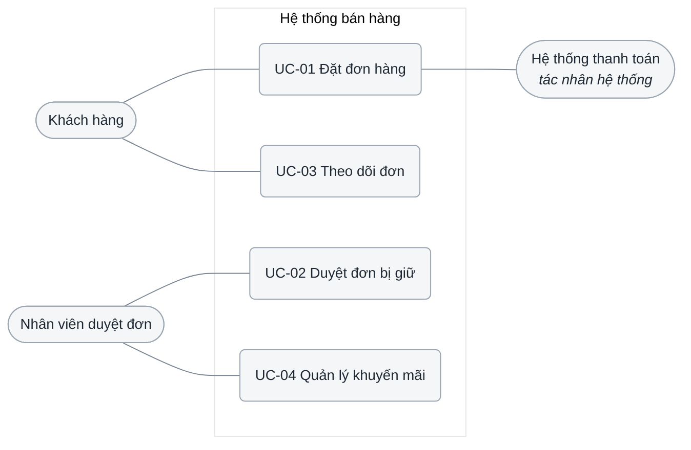
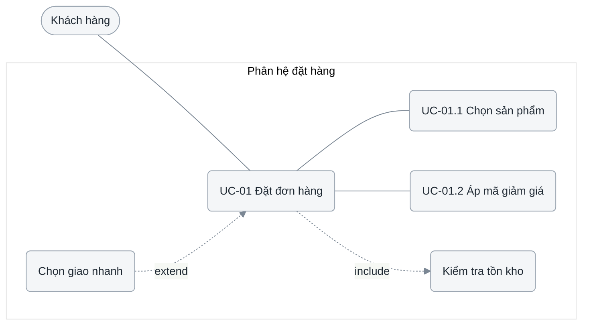

# 2.2 Biểu đồ use case

**Phase 2 · Đặc tả.** Danh sách nói có những gì; biểu đồ nói ai chạm cái gì và ca nào gồm ca nào. Vẽ được vì [2.1.2](2.1-actors-and-use-cases.md#212-xác-định-các-ca-sử-dụng-chính) đã đóng — vẽ trước là cách chắc chắn nhất để sinh ra một use case không có trong bảng.

Chương 2 gồm năm tệp — [2.1 tác nhân + ca](2.1-actors-and-use-cases.md) · **2.2 biểu đồ** · [2.3 đặc tả](2.3-use-case-specs.md) · [2.4 NFR](2.4-nfr.md) · [2.5 feature spec](2.5-feature-spec.md). Viết tệp này sau khi bảng 2.1.2 đã đóng.

| Mục | Nội dung | Form |
|---|---|---|
| 2.2.1 | Biểu đồ tổng quan | 1 sơ đồ, ≤ 10 use case, + caption |
| 2.2.2… | Phân rã mức 2 — mỗi nhóm một mục | 1 sơ đồ + caption + bảng quan hệ mỗi nhóm |

UML 2.5.1 là nguồn của ký hiệu: *subject* là hộp, tác nhân là vai **ngoài** hộp, cộng `<<include>>`, `<<extend>>`, generalisation và hướng của từng cái.

## Template

```markdown
# 2.2 <Hệ thống> — Biểu đồ use case

<metadata table>

<2–4 câu: sơ đồ này nói gì, đọc cùng tài liệu nào>

## 2.2.1 Biểu đồ tổng quan
<diagram>
<caption 2–4 câu>

## 2.2.2 <Phân hệ Bán hàng> — phân rã mức 2
<diagram>
<caption>
| Quan hệ | Từ | Đến | Điều kiện |
|---|---|---|---|

## 2.2.3 <Phân hệ Kho> — phân rã mức 2
<lặp cho từng phân hệ, mỗi phân hệ một H2 mang số riêng>

## Câu hỏi mở
<một dòng trỏ về bảng ở 2.1>

## Changelog
| Ngày | Thay đổi | Tác giả |
|---|---|---|
```

## 2.2.1 Biểu đồ tổng quan

 one diagram, the whole system, **at most ten use cases**. Mermaid has no use case notation: actors are stadium nodes outside the boundary, use cases rounded nodes inside a `subgraph` that *is* the boundary.



Ranh giới `sys` là hệ thống đang đặc tả: bên trong là thứ dự án phải xây, bên ngoài là thứ dự án phải tích hợp. Sơ đồ chỉ nói *ai chạm chức năng nào* — thứ tự, điều kiện và dữ liệu nằm ở [2.3](2.3-use-case-specs.md), `<<include>>`/`<<extend>>` để dành cho sơ đồ phân rã. Sơ đồ không có hộp ranh giới là hình vẽ không nói gì.

Sơ đồ này là chỗ lỗi ranh giới **hiện ra thành hình**, nên nó cũng là chỗ dễ bắt nhất: mọi nút ngoài `sys` phải là đúng một dòng của [2.1.1](2.1-actors-and-use-cases.md#211-xác-định-tác-nhân), và mọi nút trong `sys` phải là một use case. Một hộp tên `order-service` nằm trong `sys` cạnh các use case, hay tệ hơn là một stadium node `AI Service` đứng ngoài, nghĩa là sơ đồ đang trộn hai mức C4 vào một hình.

Never decompose into steps here — *Đăng nhập*, *bấm nút gửi*, *kiểm tra dữ liệu nhập* turn the diagram into a screen flow and make eight use cases look like fifty. Past ten nodes this becomes the index and the detail moves to 2.2.2.

## 2.2.2 Phân rã mức 2

 the overview says what exists, level 2 says what each part is made of. **Pick one axis for the whole section and keep it**: *theo tác nhân* when roles barely overlap (admin vs storefront), *theo phân hệ* when one role uses several modules. Mixing them produces two diagrams that each contain half a use case.



Phân rã của UC-01: hai ca con khách thực sự thao tác, một hành vi bắt buộc dùng lại (`include`) và một hành vi tuỳ chọn cắm vào luồng chính (`extend`). Mũi tên `include` đi từ ca gốc tới ca được dùng lại; `extend` đi ngược lại — đây là chỗ hay vẽ ngược nhất.

| Quan hệ | Hướng | Nghĩa | Dùng khi |
|---|---|---|---|
| `<<include>>` | Ca gốc → ca được gồm | Ca gốc **luôn** chạy qua hành vi đó | Hành vi bắt buộc, dùng lại ở ≥ 2 ca |
| `<<extend>>` | Ca mở rộng → ca gốc | Hành vi **có điều kiện**, cắm vào một điểm mở rộng | Nhánh tuỳ chọn, không phải nhánh lỗi |
| Generalisation | Con → cha | Con kế thừa và thay thế được cha | Hai biến thể thật sự cùng mục tiêu |

**Thao tác không lên biểu đồ use case.** Bốn nút `Thêm` · `Sửa` · `Xoá` · `Xem` treo vào `Quản lý sản phẩm` bằng bốn mũi tên `<<include>>` là cách nhanh nhất để một sơ đồ tám use case trông như năm mươi, và nó vẫn không nói được thao tác nào có ngoại lệ gì. Chỗ của chúng là **bảng thao tác** ở [2.3](2.3-use-case-specs.md) ([0.7](0.7-operations.md)); `<<include>>` để dành cho hành vi **dùng lại giữa các use case khác nhau**, không phải cho các thao tác bên trong một use case.

An error path is **not** an `<<extend>>` — it is an exception flow in [2.3](2.3-use-case-specs.md), and drawing it as a relationship both duplicates it and hides it from testers. More `<<include>>` arrows than actors means the analysis has drifted into design. Under each level-2 diagram, list the relationships and their conditions in the small table from the template: the condition is what the picture cannot carry and what a tester needs.

Mỗi nhóm là **một H2 mang số tiếp theo** (`## 2.2.3 Phân hệ Kho`), không phải H3 và không bao giờ H4 — mục lục trong trang chỉ gom h2 và h3 ([0.1](0.1-visual-style.md#cái-gì-lên-được-mục-lục-trong-trang)). Quá năm nhóm thì tách tệp `2.2.1-…md`, `2.2.2-…md` thay vì kéo dài một trang.


## Self-check before publishing

| # | Check | Fails when |
|---|---|---|
| 1 | Mọi nút ngoài `sys` là một dòng của [2.1.1](2.1-actors-and-use-cases.md#211-xác-định-tác-nhân); trong `sys` chỉ có use case | Sơ đồ trộn hai mức C4 vào một hình |
| 2 | Every row of 2.1.2 appears in exactly one diagram here | Diagram and list have drifted |
| 3 | The overview diagram has ≤ 10 use cases | It has become the level-2 diagram |
| 4 | Không nút nào là một **thao tác** (`Thêm`, `Sửa`, `Xoá`) | Bảng thao tác của [2.3](2.3-use-case-specs.md) bị vẽ thành sơ đồ |
| 5 | Không mũi tên `<<extend>>` nào là một nhánh lỗi | Ngoại lệ bị giấu khỏi người viết test |
| 6 | Mỗi sơ đồ phân rã có bảng quan hệ kèm **điều kiện** | Thứ bức tranh không mang được thì không ai viết ra |
| 7 | Mỗi nhóm là một H2 có số; không có H4 nào trong tệp | Mục không lên được mục lục trong trang |
