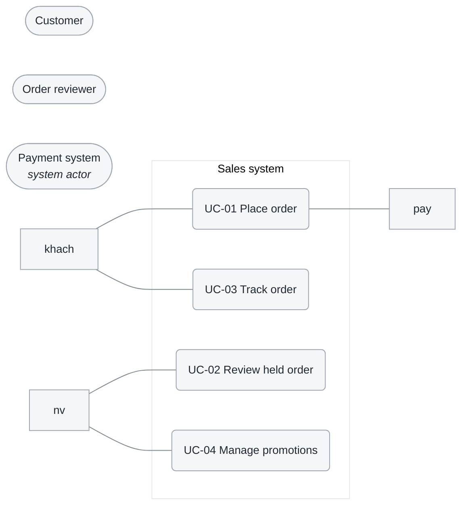
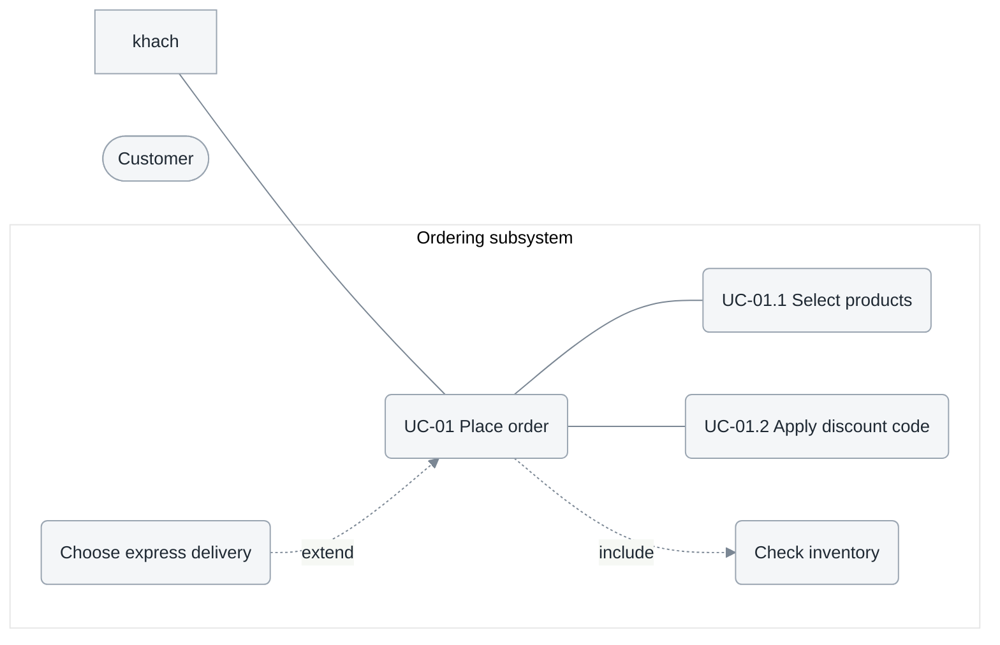

# 2.2 Use case diagrams

**Phase 2 · Specification.** The list states what exists; the diagrams show who interacts with what and which use cases contain others. They can be drawn because [2.1.2](2.1-actors-and-use-cases.md#212-identify-the-main-use-cases) is closed. Drawing them earlier is the surest way to invent a use case that does not appear in the table.

Phase 2 contains five files — [2.1 actors and use cases](2.1-actors-and-use-cases.md) · **2.2 diagrams** · [2.3 specifications](2.3-use-case-specs.md) · [2.4 NFRs](2.4-nfr.md) · [2.5 feature specifications](2.5-feature-spec.md). Write this file only after the table in 2.1.2 is closed.

| Section | Content | Form |
|---|---|---|
| 2.2.1 | Overview diagram | 1 diagram, ≤ 10 use cases, plus caption |
| 2.2.2… | Level-2 decomposition — one section per group | 1 diagram, caption, and relationship table per group |

UML 2.5.1 defines the notation: the *subject* is the box, actors are roles **outside** the box, and `<<include>>`, `<<extend>>`, and generalization each have a defined direction.

## Template

```markdown
# 2.2 <System> — Use case diagrams

<metadata table>

<2–4 sentences: what these diagrams communicate and which documents accompany them>

## 2.2.1 Overview diagram
<diagram>
<2–4 sentence caption>

## 2.2.2 <Sales subsystem> — level-2 decomposition
<diagram>
<caption>
| Relationship | From | To | Condition |
|---|---|---|---|

## 2.2.3 <Inventory subsystem> — level-2 decomposition
<repeat for every subsystem, with one separately numbered H2 per subsystem>

## Open questions
<one line linking to the table in 2.1>

## Changelog
| Date | Change | Author |
|---|---|---|
```

## 2.2.1 Overview diagram

 one diagram, the whole system, **at most ten use cases**. Mermaid has no use case notation: actors are stadium nodes outside the boundary, use cases rounded nodes inside a `subgraph` that *is* the boundary.



The `sys` boundary is the system being specified: inside is what the project must build; outside is what it must integrate. The diagram says only *who interacts with which capability*. Sequence, conditions, and data belong in [2.3](2.3-use-case-specs.md), while `<<include>>` and `<<extend>>` are reserved for decomposition diagrams. A diagram without a boundary box communicates nothing about scope.

This diagram makes boundary errors **visible as shapes**, which also makes them easiest to catch: every node outside `sys` must correspond to exactly one row in [2.1.1](2.1-actors-and-use-cases.md#211-identify-actors), and every node inside `sys` must be a use case. A box named `order-service` inside `sys` beside the use cases, or worse, a stadium-shaped `AI Service` outside, means the picture mixes two C4 levels.

Never decompose into steps here — *Sign in*, *click Submit*, and *validate input* turn the diagram into a screen flow and make eight use cases look like fifty. Above ten nodes, this view becomes the index and the detail moves to 2.2.2.

## 2.2.2 Level-2 decomposition

The overview says what exists; level 2 says what each part contains. **Choose one axis for the entire section and keep it**: *by actor* when roles barely overlap (admin versus storefront), or *by subsystem* when one role uses several modules. Mixing the two produces diagrams that each contain half a use case.



UC-01 decomposed into two child use cases that the customer performs, one mandatory reused behavior (`include`), and one optional behavior inserted into the main flow (`extend`). The `include` arrow points from the base use case to the reused case; `extend` points in the opposite direction. This is the relationship most often drawn backward.

| Relationship | Direction | Meaning | Use when |
|---|---|---|---|
| `<<include>>` | Base case → included case | The base case **always** runs that behavior | Mandatory behavior reused by at least two use cases |
| `<<extend>>` | Extending case → base case | **Conditional** behavior inserted at an extension point | Optional branch, not a failure branch |
| Generalization | Child → parent | The child inherits from and can substitute for the parent | Two genuine variants with the same goal |

**Operations do not belong on a use case diagram.** Hanging four nodes — `Create`, `Update`, `Delete`, and `View` — from `Manage products` with four `<<include>>` arrows is the fastest way to make eight use cases look like fifty, while still failing to show which exceptions belong to each operation. Operations belong in the [2.3](2.3-use-case-specs.md) **operation matrix** ([0.7](0.7-operations.md)); reserve `<<include>>` for behavior **reused across different use cases**, not operations within one use case.

An error path is **not** an `<<extend>>` — it is an exception flow in [2.3](2.3-use-case-specs.md), and drawing it as a relationship both duplicates it and hides it from testers. More `<<include>>` arrows than actors means the analysis has drifted into design. Under each level-2 diagram, list the relationships and their conditions in the small table from the template: the condition is what the picture cannot carry and what a tester needs.

Every group is **a separately numbered H2** (`## 2.2.3 Inventory subsystem`), not H3 and never H4 — the page contents include only H2 and H3 ([0.1](0.1-visual-style.md#what-appears-in-the-page-contents)). Above five groups, split into `2.2.1-…md`, `2.2.2-…md` instead of extending one page.


## Self-check before publishing

| # | Check | Fails when |
|---|---|---|
| 1 | Every node outside `sys` is a row in [2.1.1](2.1-actors-and-use-cases.md#211-identify-actors); only use cases appear inside `sys` | The diagram mixes two C4 levels in one picture |
| 2 | Every row of 2.1.2 appears in exactly one diagram here | Diagram and list have drifted |
| 3 | The overview diagram has ≤ 10 use cases | It has become the level-2 diagram |
| 4 | No node is an **operation** (`Create`, `Update`, `Delete`) | The [2.3](2.3-use-case-specs.md) operation matrix has been drawn as a diagram |
| 5 | No `<<extend>>` arrow represents a failure branch | Exceptions are hidden from the test author |
| 6 | Every decomposition diagram has a relationship table with **conditions** | Information the picture cannot carry is never written down |
| 7 | Every group is a numbered H2; the file contains no H4 | A section does not appear in the page contents |
