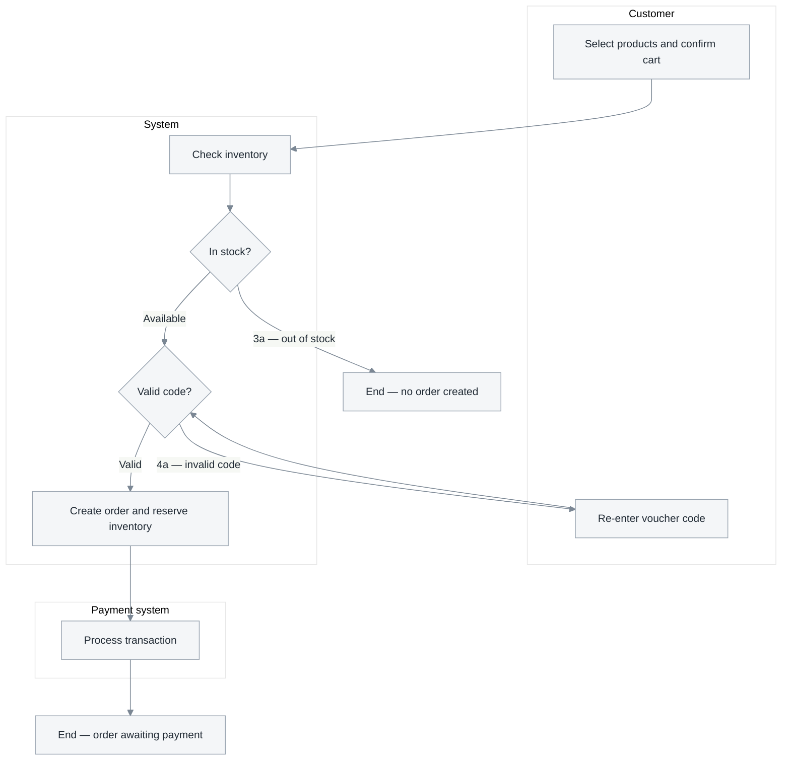

# 2.3 Use case specifications

**Phase 2 · Specifications.** The most detailed file in Chapter 2 and the first one an engineer can build from: how each use case runs, how many operations it contains, what data crosses the boundary, and what remains after a failure.

Chapter 2 contains five files — [2.1 actors and use cases](2.1-actors-and-use-cases.md) · [2.2 diagrams](2.2-use-case-diagrams.md) · **2.3 specifications** · [2.4 NFRs](2.4-nfr.md) · [2.5 feature specifications](2.5-feature-spec.md). Write this file after [2.2](2.2-use-case-diagrams.md) has identified the `<<include>>` and `<<extend>>` relationships.

Three independent checks apply to this file: the constraints for **one** use case in [0.8](0.8-use-case-constraints.md), which must be read before writing the first block; complete **operation** coverage within a use case in [0.7](0.7-operations.md); and the mechanism behind every arrow in [0.6](0.6-mechanism.md).

Activity diagrams belong here and nowhere else; [3.1](3.1-analysis-classes.md) realises each use case in classes and sequences without redrawing its flows.

**Mode A**: validators and DTOs provide the field tables, while handler bodies provide the flows. A flow reconstructed from code remains a hypothesis until someone confirms the goal behind it.

## Document shape

**One use case is one H2 section; its seven parts are H3 sections.** A use case already has an ID, so its H2 carries the **ID** rather than another number ([0.1](0.1-visual-style.md#section-numbering-and-subsystem-tiers)):

```markdown
## UC-01 — Place an order
### Attribute table
### Purpose
### Operation matrix
### Activity flows
### Data fields
### Activity diagram
## UC-02 — Cancel an order
```

Those seven parts **must be headings, not bold text**. Readers navigate to them directly—the in-page table of contents includes only H2 and H3 headings, so a bold `**Purpose**` is neither a section nor visible in the table of contents ([0.1](0.1-visual-style.md#what-appears-in-the-page-contents)).

**Keep roughly five use cases per file.** Seven parts × six use cases produces 42 table-of-contents entries, already beyond one page's budget. When that happens, **split the document into files by subsystem**, using the same subsystem axis established in [2.1.2](2.1-actors-and-use-cases.md#212-identify-the-main-use-cases)—do not demote headings to hide entries:

```text
2.3-use-case-specifications.md  # ≤ ~5 use cases: one file
2.3.1-sales-specifications.md   # split by subsystem: one file per subsystem
2.3.2-inventory-specifications.md
```

Place a subsystem's shared conventions at the **top of that subsystem file**. Do not collect them in a global *"shared conventions"* section, which forces readers to jump backward. Keep open questions in [2.1](2.1-actors-and-use-cases.md) and link to them from the other files.

Nothing is optional and nothing is added. Omit the `Operation matrix` only when the use case genuinely has one operation, and state that fact in one line.

## Template

```markdown
# 2.3 <System> — Use case specifications

<metadata table — required: Status and Last updated; add other fields only when known>

<2–4 sentences: which use cases this file specifies and which documents accompany it>

## UC-01 — <Use case name>

### Attribute table
| | |
|---|---|
| **Primary actor** | |
| **Supporting actor** | |
| **Trigger** | |
| **Preconditions** | |
| **Success postconditions** | |
| **Failure postconditions** | |
| **Frequency** | |
| **Related items** | FR2 · BR4 · NFR3 |

### Purpose
<1–2 sentences: what the actor achieves and why this use case exists>

### Operation matrix
<required when the use case has ≥ 2 operations; check against the 13-item inventory in 0.7>
| ID | Operation | Actor | Trigger | Preconditions | Input data | Result · postconditions | Rules | Exceptions | Screen | I<n> |
|---|---|---|---|---|---|---|---|---|---|---|
| T1 | | | | | | | | | | |

### Activity flows
*Main flow — T1 <operation name>*
1. …

*Alternative flow*
- 3a. …

*Exception flow*
- 6a. …

### Data fields
| Field | Display label | Type | Required | Validation constraints | Source / destination | Notes |
|---|---|---|---|---|---|---|

### Activity diagram
<activity diagram>
<caption>

## UC-02 — <Use case name>
<repeat the block above for EVERY use case, in the exact order used in table 2.1.2>

## Open questions
<one line linking to the table in 2.1>

## Changelog
| Date | Change | Author |
|---|---|---|
```

## The seven parts of a use case block

The seven parts below are **mandatory and fixed**: do not rename, reorder, or omit them. If a part does not apply, retain it and explain why in one line.

### Attribute table

**Primary / supporting actor** — both cells may contain only names from [2.1.1](2.1-actors-and-use-cases.md#211-identify-actors). The `Primary actor` is the single role whose goal the use case serves; a `Supporting actor` is an external system that the box *calls* while the use case runs. Internal services traversed by the flow belong in neither cell—they first appear as lifelines in [3.2](3.2-sequence-diagrams.md), the first document allowed to open the box.

**Preconditions · Postconditions · Frequency** — three cells at the start of the block and three cells often filled with text that merely looks complete. A precondition must be **checkable with a query or a true/false test** and must not disguise a business rule: a rule evaluated *while* the use case runs belongs in [1.2](1.2-business-rules.md) and the operation matrix's `Rules` column. A postcondition is an **observable state**, not an action—*“an `orders` record exists with `status = pending_payment`”*, not *“the system saves the order”*. Writing an action merely repeats the main flow and leaves testers with nothing to observe. The **failure postconditions** cell is mandatory: what is rolled back and what remains. [0.8 R4](0.8-use-case-constraints.md#r4-conditions-preconditions-business-rules-and-assumptions-are-different) distinguishes the three commonly confused concepts—preconditions, business rules, and assumptions. `Frequency` must be numeric ([0.8 R6](0.8-use-case-constraints.md#r6-numbers-frequency-priority-and-thresholds)).

### Purpose

One or two sentences: what the primary actor walks away with, and which `FR` it realises. No UI, no mechanism; this is the paragraph a stakeholder reads to decide whether the use case is worth its cost.

### Operation matrix

Required for every use case with two or more operations. It appears **before** the activity flows because it determines how many flows must be written:

| ID | Operation | Actor | Trigger | Preconditions | Input data | Result · postconditions | Rules | Exceptions | Screen | `I<n>` |
|---|---|---|---|---|---|---|---|---|---|---|
| T1 | View list | Inventory employee | Opens the catalog screen | `product:read` permission | filters, pagination | Current page plus total count | — | 6a permission revoked | SCR-P01 | I1 |
| T3 | Create | Catalog manager | Selects *Add* | `product:write` permission | 9 required fields | Product in `draft` state with an ID | BR3 | 4a duplicate SKU | SCR-P03 | I3 |
| T6 | Soft-delete | Catalog manager | Selects *Delete* | No order currently references it | `product_id` | `deleted_at` is set | BR12 | 7a still referenced | SCR-P02 | I6 |

- **Do not invent this table; audit it** against the thirteen-operation inventory in [0.7](0.7-operations.md#the-thirteen-operation-inventory)—view, search, detail, create, update, change state, delete, restore, clone, bulk actions, import/export, approve, and history. Mark every row `yes` or `no, because …`; a blank cell is indistinguishable from a question nobody asked.
- **A single-operation use case must still state that it has one operation**: *"This use case has only one operation—no operation matrix"*. Silence looks like an omission.
- **The `Exceptions` column is the most expensive column**, and every cell must reference a real exception flow below. A *write* operation with no exception is an operation nobody has considered under failure.
- **Leave the `I<n>` column blank while writing and backfill it** after [4.3.5](4.3-detailed-design.md#interface-inventory-the-contract-index) assigns the IDs. A cell still blank after the API contract is finalized represents an operation that nothing can call.
- **A read operation must decide three things here**—pagination style, returned field set, and default ordering ([0.7](0.7-operations.md#reading-and-searching-are-different-operations)). Without a default order, pagination is nondeterministic and one record can appear on two pages.
- **The four operations most worth checking are the final four in the inventory**—clone, import/export, approve, and change history—because each can **change the architecture** when discovered late: cloning changes uniqueness constraints, file import changes the error model, approval adds a state and a role, and history adds a table.

**How independently an operation should be specified**—six questions, and one `different` answer is enough to require its own representation. The full table and examples are in [0.7](0.7-operations.md#the-split-test-when-an-operation-stands-alone); in summary:

| The two operations differ in | Then they require |
|---|---|
| Primary actor | **A separate use case** in [2.1.2](2.1-actors-and-use-cases.md#212-identify-the-main-use-cases)—the actor defines the use case |
| Preconditions or permissions | A separate main flow and a separate branch in the activity diagram |
| Who calls whom | **A separate sequence diagram** in [3.2](3.2-sequence-diagrams.md) |
| Data crossing the boundary | **A separate endpoint** in [4.4](4.4-api-contract.md) and a separate `I<n>` |
| Postconditions | A separate row in the table above and a separate test case in [6.1](6.1-test-plan.md) |
| Exception set | A separate error-code group in [4.4](4.4-api-contract.md) |

*Create* and *update* answer `different` to the last three questions—their payloads, postconditions, and exceptions differ (duplicate SKU applies only to creation; stale version applies only to updates). They therefore always require **two flows, two diagram branches, and two endpoints**, even when they remain in one use case. This is the most common and most expensive merge.

### Activity flows

Three labelled parts, always in this order:

- *Main flow* — numbered steps, each naming who acts. Steps alternate between actor and system; a step whose subject is unclear has unclear ownership. **A multi-operation use case has multiple main flows**, each carrying the operation ID in its heading (*Main flow — T3 Create*). An operation that differs only in data becomes a numbered branch within the closest operation's flow, and that branch still carries its `T<n>` ID.
- *Alternative flow* — another valid way to reach the goal, numbered against the step from which it branches (`3a`, `3b`).
- *Exception flow* — something going wrong, using the same numbering (`6a`).

**Every `T<n>` in the operation matrix must appear in at least one numbered flow.** An operation named in the table but executed by no step has not been specified. It will still propagate to [3.2](3.2-sequence-diagrams.md) and [4.4](4.4-api-contract.md) as an empty row because no downstream document knows what it should contain.

**Flow-step sentence rules**—use an explicit subject (a name from [2.1.1](2.1-actors-and-use-cases.md#211-identify-actors), or *System*), active voice, present tense, and one action per step. Put **no `if`, `otherwise`, or `repeat until` inside the sentence**, and mention no table or endpoint: [0.8 R3](0.8-use-case-constraints.md#r3-flow-sentences-explicit-subject-one-action-per-step). A branch embedded in a sentence has **no number**, yet the number is what links the flow to the activity diagram, the error code in [4.4](4.4-api-contract.md), and the test case in [6.1](6.1-test-plan.md).

**Every exception flow has exactly three parts**—trigger (which condition, at which step), system response, and **final state** (what is rolled back, what remains, whether the flow ends or returns to a step). Do not invent the exception list; **sweep eight failure modes**: invalid data, business-rule violation, permission revoked, object already deleted, concurrency conflict, external-system failure or timeout, expired session or quota, and **partial success**. Mark every row `yes, flow <number>` or `no, because …` ([0.8 R5](0.8-use-case-constraints.md#r5-alternatives-and-exceptions-sweep-eight-failure-modes)). The final three modes can **change the design** when discovered late.

Merging alternatives into exceptions is this section's most common defect: error handling ends up buried inside normal behavior and the test plan inherits the confusion. Write **no UI or implementation detail** in either—*"The employee records the decision"*, not *"selects the green Approve button"* or *"writes to the `decisions` table"*. Screens belong in [4.5](4.5-ui-design.md) and storage in [4.2](4.2-data-model.md); this separation keeps the document valid after the next redesign.

### Data fields

Every field the use case reads or writes, at the level the actor sees it:

| Field | Display label | Type | Required | Validation constraints | Source / destination | Notes |
|---|---|---|---|---|---|---|
| `recipient_phone` | Recipient phone number | string | Yes | 10 digits, starting with `0`; BR12 | Customer input → `orders` | PII—do not log |
| `voucher_code` | Voucher code | string | No | Exists and remains valid; BR07 | Customer input → `vouchers` | Invalid code ⇒ flow 3a |

- **Field names stay English**, in `code`, and are the *same* names the ERD and the API contract will use. This table is the seam between the two vocabularies and the cheapest place to fix a mismatch.
- **`Validation constraints` must be checkable.** *"Valid"* is not a constraint; *"10 digits, starting with `0`"* is. Cite the `BR<n>` rather than restating the rule.
- **Mark PII in `Notes`**—the earliest and cheapest point to decide that something must not be logged.
- **A validation that can reject input needs a matching flow**, or the specification describes a system that accepts everything.

### Activity diagram

One per use case, and this document is its only home.



The main flow of UC-01 has two branches carrying the exact numbers of their alternative flows. The three lanes represent the three parties that actually own work; every time an arrow crosses a lane, responsibility changes hands. The diagram does not describe timing, infrastructure failures, or data—those belong in [3.2](3.2-sequence-diagrams.md) and [3.4](3.4-data-flow.md).

| Component | Rule | Why |
|---|---|---|
| Lane (`subgraph`) | One lane per actor, plus **exactly one `System` lane** for the whole box, arranged in execution order | Zigzags across lanes are meaningful design signals—but splitting the box into `Backend` and `AI` turns the zigzag into an internal detail and produces a sequence diagram in the wrong place ([3.2](3.2-sequence-diagrams.md) is the first place allowed to open the box) |
| Action `[]` | Verb + object, one action | *"Process request"* hides a branch someone will eventually have to design |
| Decision `{}` | **Every outgoing edge has a label** | An unlabeled branch is an undecided branch |
| End | One node for each distinct outcome | Merging everything into one `End` node hides the number of ways the flow can finish |
| Parallel | One fork and one labeled join, explained in the caption | Mermaid has no native fork/join; without a note, readers interpret the flow as sequential |

**Every alternative and exception number appears as a labeled branch** (`-->|3a — out of stock|`), and every branch traces back to a numbered flow. Comparing the two lists is this part's only completeness check. Where the picture cannot carry something—an SLA or the rule behind a decision—add a step table below it (`Step | Actor | Input | Output | SLA | Rule | Flow`).

**For a multi-operation use case, every `T<n>` must be visible in the diagram.** This is where a management use case often collapses into a diagram showing only the *create* operation. Choose between two representations according to the flow's actual shape:

| Operations | Representation |
|---|---|
| Branch early from the same entry point (a list screen followed by a button choice) | **One diagram**, with a `{Which operation?}` decision immediately after entry; every outgoing edge carries an ID and name (`-->\|T3 Create\|`), and every operation has its own end node |
| Preconditions or step sequences differ substantially (create vs. approve vs. import file) | **One diagram per operation**, each with an H3 subtitle `— T<n> <name>` under the same use case |

The first representation fits most management use cases and has one valuable property: **the decision node must enumerate every edge**, so a forgotten operation appears as a missing edge rather than silence. Never use the second representation to draw *one* operation and imply that all the others are similar.

A genuinely linear flow is a finding, not a diagram: write *"Linear flow; see the main flow"* and move on. A document whose activity diagrams are all straight lines has specified screens, not use cases.


## Which flow notation

| Notation | Scope | Boxes are | Where |
|---|---|---|---|
| Use case diagram | Whole system | Capabilities, actors outside | [2.2](2.2-use-case-diagrams.md) |
| Activity diagram | One use case | Steps, lanes are people | here |
| Process flow | A business process across systems | Steps, lanes are departments | [1.1](1.1-problem-survey.md) |
| Sequence diagram | One interaction | Software components | [3.2](3.2-sequence-diagrams.md) |

If the boxes are software components it is a sequence diagram; if they are steps and the lanes are people it is an activity or process flow; if there are no steps at all it is a use case diagram.

## Self-check before publishing

| # | Check | Fails when |
|---|---|---|
| 1 | Every row of [2.1.2](2.1-actors-and-use-cases.md#212-identify-the-main-use-cases) has exactly one H2 block here with the same ID | The two most-read sections disagree |
| 2 | Every block has **all seven parts, each as an H3** | Bold text does not enter the table of contents and cannot be navigated to |
| 3 | Every `T<n>` in the operation matrix appears in ≥ 1 numbered flow **and** in the activity diagram | An operation propagates to 3.2 and 4.4 as an empty row |
| 4 | A use case with ≥ 2 operations has an operation matrix; a one-operation use case **states that it has one operation** | Silence looks like an omission |
| 5 | Every `Exceptions` cell references a real exception flow below | Nobody has considered how the write operation fails |
| 6 | All eight failure modes have been swept, with each row marked `yes, flow <number>` or `no, because …` | The exception list was invented instead of audited |
| 7 | A postcondition is an **observable state**, not an action | Testers have nothing to observe |
| 8 | Every activity diagram has **exactly one `System` lane** | The specification drops to component level one phase too early |
| 9 | Every alternative and exception flow number has a matching diagram branch, and vice versa | The two lists drift apart |
| 10 | The file has no H4 headings and its in-page table of contents has ≤ ~40 entries | It is time to split the file by subsystem |
