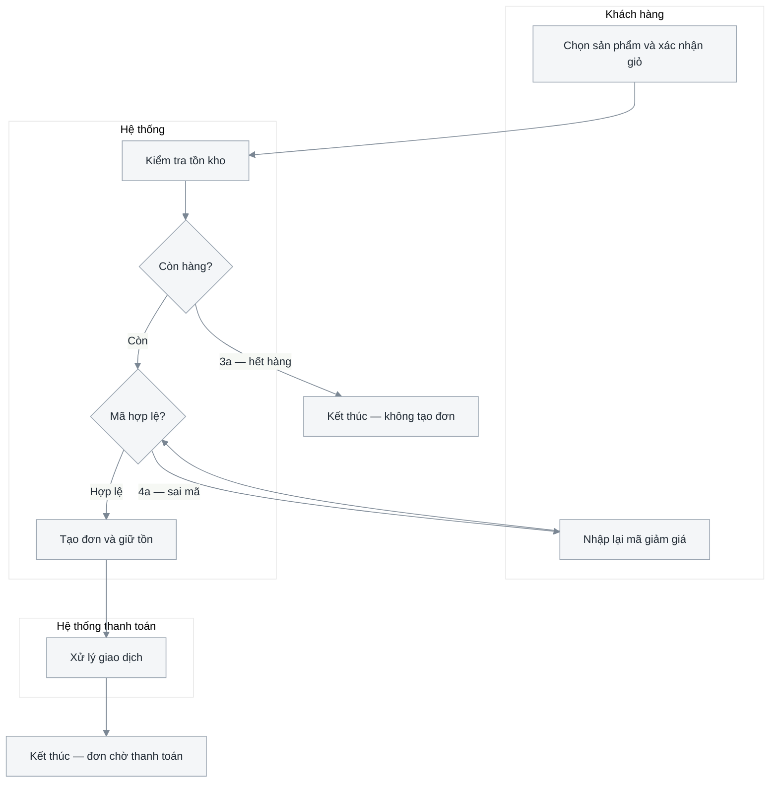

# 2.3 Đặc tả use case

**Phase 2 · Đặc tả.** Tệp dày nhất của chương 2 và tệp đầu tiên một kỹ sư build được theo: từng ca chạy thế nào, gồm mấy thao tác, dữ liệu nào đi qua, hỏng thì còn lại gì.

Chương 2 gồm năm tệp — [2.1 tác nhân + ca](2.1-actors-and-use-cases.md) · [2.2 biểu đồ](2.2-use-case-diagrams.md) · **2.3 đặc tả** · [2.4 NFR](2.4-nfr.md) · [2.5 feature spec](2.5-feature-spec.md). Viết tệp này sau khi [2.2](2.2-use-case-diagrams.md) đã chỉ ra quan hệ `<<include>>`/`<<extend>>`.

Ba lượt kiểm chạy trên tệp này và không thay được nhau: ràng buộc của **một** ca ở [0.8](0.8-use-case-constraints.md) — đọc trước khi viết khối đầu tiên; đủ **thao tác** bên trong một ca ở [0.7](0.7-operations.md); cơ chế của mọi mũi tên ở [0.6](0.6-mechanism.md).

Activity diagrams belong here and nowhere else; [3.1](3.1-analysis-classes.md) realises each use case in classes and sequences without redrawing its flows.

**Mode A**: validators and DTOs give the field tables, handler bodies give the flows. Một luồng dựng lại từ mã là một giả thuyết cho tới khi có người xác nhận mục tiêu đằng sau nó.

## Hình dạng của tài liệu

**Một use case là một mục H2; bảy phần của nó là H3.** Use case đã có mã, nên H2 mang **mã** chứ không mang thêm một số ([0.1](0.1-visual-style.md#section-numbering-and-subsystem-tiers)):

```markdown
## UC-01 — Đặt đơn hàng
### Bảng thuộc tính
### Mục đích
### Bảng thao tác
### Luồng hoạt động
### Các trường dữ liệu
### Biểu đồ hoạt động
## UC-02 — Huỷ đơn
```

Bảy phần đó **phải là heading, không phải chữ in đậm**. Chúng là thứ người đọc nhảy tới — mục lục trong trang chỉ gom h2 và h3, nên `**Mục đích**` in đậm vừa không phải mục vừa không hiện ra ở đâu cả ([0.1](0.1-visual-style.md#cái-gì-lên-được-mục-lục-trong-trang)).

**Khoảng năm use case một tệp.** Bảy phần × sáu ca = 42 dòng mục lục, tức đã quá ngân sách một trang. Quá thì **tách theo phân hệ thành tệp**, cùng trục phân hệ đã chốt ở [2.1.2](2.1-actors-and-use-cases.md#212-xác-định-các-ca-sử-dụng-chính) — không phải hạ tầng heading để giấu bớt:

```text
2.3-dac-ta-use-case.md          # ≤ ~5 ca: một tệp
2.3.1-dac-ta-ban-hang.md        # chia phân hệ: mỗi phân hệ một tệp
2.3.2-dac-ta-kho.md
```

Quy ước chung của một phân hệ nằm ở **đầu tệp phân hệ đó**, không gom thành một mục *"quy ước chung"* đứng trên tất cả — bản gom buộc người đọc nhảy ngược lên. Câu hỏi mở giữ ở [2.1](2.1-actors-and-use-cases.md), các tệp còn lại trỏ sang.

Nothing is optional, nothing is added — `Bảng thao tác` is dropped only when the use case genuinely has one operation, and then the fact is stated in one line.

## Template

```markdown
# 2.3 <Hệ thống> — Đặc tả use case

<metadata table>

<2–4 câu: tệp này đặc tả những ca nào, đọc cùng tài liệu nào>

## UC-01 — <Tên use case>

### Bảng thuộc tính
| | |
|---|---|
| **Tác nhân chính** | |
| **Tác nhân phụ** | |
| **Kích hoạt** | |
| **Tiền điều kiện** | |
| **Hậu điều kiện — thành công** | |
| **Hậu điều kiện — thất bại** | |
| **Tần suất** | |
| **Liên quan** | FR2 · BR4 · NFR3 |

### Mục đích
<1–2 câu: tác nhân đạt được gì, và vì sao ca này tồn tại>

### Bảng thao tác
<bắt buộc khi ca có ≥ 2 thao tác; soát bằng 13 dòng danh mục của 0.7>
| Mã | Thao tác | Tác nhân | Kích hoạt | Tiền điều kiện | Dữ liệu vào | Kết quả · hậu điều kiện | Luật | Ngoại lệ | Màn hình | I<n> |
|---|---|---|---|---|---|---|---|---|---|---|
| T1 | | | | | | | | | | |

### Luồng hoạt động
*Luồng chính — T1 <tên thao tác>*
1. …

*Luồng thay thế*
- 3a. …

*Luồng ngoại lệ*
- 6a. …

### Các trường dữ liệu
| Trường | Nhãn hiển thị | Kiểu | Bắt buộc | Ràng buộc hợp lệ | Nguồn / đích | Ghi chú |
|---|---|---|---|---|---|---|

### Biểu đồ hoạt động
<activity diagram>
<caption>

## UC-02 — <Tên use case>
<lặp lại khối trên cho TỪNG use case, theo đúng thứ tự bảng 2.1.2>

## Câu hỏi mở
<một dòng trỏ về bảng ở 2.1>

## Changelog
| Ngày | Thay đổi | Tác giả |
|---|---|---|
```

## Bảy phần của một khối use case

Bảy phần dưới đây là **bắt buộc và cố định**: không đổi tên, không đổi thứ tự, không bỏ. Phần không áp dụng được viết một dòng nói vì sao, không bị xoá.

### Bảng thuộc tính

**Tác nhân chính / phụ** — cả hai ô chỉ được điền bằng tên có trong [2.1.1](2.1-actors-and-use-cases.md#211-xác-định-tác-nhân). `Tác nhân chính` là vai có mục tiêu mà ca này phục vụ, đúng một vai; `Tác nhân phụ` là hệ thống ngoài mà hộp *gọi sang* trong lúc chạy ca. Service nội bộ mà luồng đi qua **không** vào ô nào cả — nó xuất hiện ở [3.2](3.2-sequence-diagrams.md) dưới dạng lifeline, và đó là tài liệu đầu tiên được phép mở hộp ra.

**Tiền điều kiện · Hậu điều kiện · Tần suất** — ba ô của bảng đầu khối, và ba ô hay được điền bằng chữ trông như đã xong. Tiền điều kiện phải **kiểm được bằng một truy vấn hay một phép thử đúng/sai**, và không được là một luật nghiệp vụ trá hình: luật kiểm *trong* lúc ca chạy nên nó thuộc [1.2](1.2-business-rules.md) và cột `Luật` của bảng thao tác. Hậu điều kiện là **trạng thái quan sát được**, không phải hành động — *“một bản ghi `orders` tồn tại với `status = pending_payment`”*, không phải *“hệ thống lưu đơn”*; viết thành hành động là chép lại luồng chính và bỏ người viết test không có chỗ nào để nhìn. Ô **hậu điều kiện — thất bại** là bắt buộc: cái gì được hoàn tác, cái gì ở lại. Phân biệt đầy đủ ba thứ hay lẫn nhau — tiền điều kiện · luật nghiệp vụ · giả định — ở [0.8 R4](0.8-use-case-constraints.md#r4--điều-kiện-tiền-điều-kiện-luật-nghiệp-vụ-giả-định-là-ba-thứ-khác-nhau); `Tần suất` phải là một con số ([0.8 R6](0.8-use-case-constraints.md#r6--con-số-tần-suất-ưu-tiên-ngưỡng)).

### Mục đích

One or two sentences: what the primary actor walks away with, and which `FR` it realises. No UI, no mechanism; this is the paragraph a stakeholder reads to decide whether the use case is worth its cost.

### Bảng thao tác

Bắt buộc với mọi ca có từ hai thao tác trở lên, và nó đứng **trước** luồng hoạt động vì chính nó quyết định phải viết bao nhiêu luồng:

| Mã | Thao tác | Tác nhân | Kích hoạt | Tiền điều kiện | Dữ liệu vào | Kết quả · hậu điều kiện | Luật | Ngoại lệ | Màn hình | `I<n>` |
|---|---|---|---|---|---|---|---|---|---|---|
| T1 | Xem danh sách | Nhân viên kho | Mở màn danh mục | quyền `product:read` | bộ lọc, phân trang | Danh sách trang hiện tại + tổng số | — | 6a hết quyền | SCR-P01 | I1 |
| T3 | Tạo mới | Quản lý danh mục | Bấm *Thêm* | quyền `product:write` | 9 trường bắt buộc | Sản phẩm `draft`, có mã | BR3 | 4a trùng SKU | SCR-P03 | I3 |
| T6 | Xoá (mềm) | Quản lý danh mục | Bấm *Xoá* | Không đơn nào đang tham chiếu | `product_id` | `deleted_at` được đặt | BR12 | 7a đang được tham chiếu | SCR-P02 | I6 |

- **Bảng này không được nghĩ ra, nó được soát** bằng danh mục mười ba thao tác của [0.7](0.7-operations.md#danh-mục-mười-ba-thao-tác) — xem · tìm · chi tiết · tạo · sửa · đổi trạng thái · xoá · khôi phục · nhân bản · hàng loạt · nhập/xuất · duyệt · lịch sử. Mỗi dòng ghi `có` hoặc `không, vì …`; ô trống không phân biệt được với chưa ai hỏi.
- **Ca một thao tác vẫn phải nói ra là một thao tác**: *"Ca này chỉ có một thao tác — không có bảng thao tác"*, một dòng. Im lặng đọc như đã bỏ sót.
- **Cột `Ngoại lệ` là cột đắt nhất**, và mỗi ô phải là số hiệu một luồng ngoại lệ có thật ở dưới. Thao tác *ghi* không có ngoại lệ nào là thao tác chưa ai nghĩ tới lúc hỏng.
- **Cột `I<n>` để trống lúc viết và điền ngược** khi [4.3.5](4.3-detailed-design.md#interface-inventory-the-contract-index) đánh số xong. Ô còn trống sau khi API contract đã đóng là một thao tác không ai gọi được.
- **Thao tác đọc phải quyết ba thứ ngay ở đây** — kiểu phân trang, tập trường trả về, thứ tự mặc định ([0.7](0.7-operations.md#đọc-và-tìm-không-phải-là-một-thao-tác)). Không có thứ tự mặc định nghĩa là phân trang không tất định, và một bản ghi hiện ở hai trang.
- **Bốn thao tác đáng chạy nhất là bốn thao tác cuối danh mục** — nhân bản, nhập/xuất, duyệt, lịch sử thay đổi — vì cả bốn **đổi kiến trúc** nếu phát hiện muộn: nhân bản đổi ràng buộc unique, nhập file đổi mô hình lỗi, duyệt thêm một trạng thái và một vai, lịch sử thêm một bảng.

**Thao tác nào được viết riêng tới mức nào** — sáu câu hỏi, một chữ `khác` là đủ để nó có phần biểu diễn riêng. Bảng đầy đủ và các ví dụ ở [0.7](0.7-operations.md#phép-thử-tách-khi-nào-một-thao-tác-được-đứng-riêng); rút gọn:

| Hai thao tác khác nhau ở | Thì phải có riêng |
|---|---|
| Tác nhân chính | **Một use case riêng** ở [2.1.2](2.1-actors-and-use-cases.md#212-xác-định-các-ca-sử-dụng-chính) — use case được định nghĩa bằng tác nhân |
| Tiền điều kiện hoặc quyền | Một luồng chính riêng, và một nhánh riêng trong biểu đồ hoạt động |
| Ai gọi ai | **Một sơ đồ trình tự riêng** ở [3.2](3.2-sequence-diagrams.md) |
| Dữ liệu đi qua biên | **Một endpoint riêng** ở [4.4](4.4-api-contract.md) và một `I<n>` riêng |
| Hậu điều kiện | Một hàng riêng ở bảng trên, và một ca kiểm thử riêng ở [6.1](6.1-test-plan.md) |
| Tập ngoại lệ | Một nhóm mã lỗi riêng ở [4.4](4.4-api-contract.md) |

*Tạo* và *sửa* trả lời `khác` ở ba câu cuối — khác payload, khác hậu điều kiện, khác ngoại lệ (trùng SKU chỉ có ở tạo, lạc hậu phiên bản chỉ có ở sửa) — nên chúng luôn là **hai luồng, hai nhánh sơ đồ, hai endpoint**, dù vẫn nằm trong một use case. Đây là chỗ hay bị gộp nhất và cũng là chỗ gộp đắt nhất.

### Luồng hoạt động

Three labelled parts, always in this order:

- *Luồng chính* — numbered steps, each naming who acts. Steps alternate actor and system; a step whose subject is unclear is a step whose owner is unclear. **Ca nhiều thao tác có nhiều luồng chính**, mỗi luồng mang mã thao tác trong tiêu đề (*Luồng chính — T3 Tạo mới*); thao tác nào chỉ khác ở dữ liệu thì là một nhánh đánh số bên trong luồng của thao tác gần nó nhất, và nhánh đó vẫn mang mã `T<n>`.
- *Luồng thay thế* — another valid way to reach the goal, numbered against the step it branches from (`3a`, `3b`).
- *Luồng ngoại lệ* — something going wrong, same numbering (`6a`).

**Mọi `T<n>` của bảng thao tác phải xuất hiện trong ít nhất một luồng đánh số.** Một thao tác có tên trong bảng mà không có bước nào chạy nó là một thao tác chưa được đặc tả — và nó vẫn sẽ đi tiếp xuống [3.2](3.2-sequence-diagrams.md) và [4.4](4.4-api-contract.md) như một hàng trống, vì không tài liệu nào ở dưới biết nó lẽ ra phải có gì.

**Luật câu chữ của một bước** — chủ ngữ hiện (một tên ở [2.1.1](2.1-actors-and-use-cases.md#211-xác-định-tác-nhân), hoặc chữ *Hệ thống*), thể chủ động thì hiện tại, một bước một hành động, **không `nếu` / `ngược lại` / `lặp cho tới khi` nằm trong câu**, không tên bảng và không endpoint: [0.8 R3](0.8-use-case-constraints.md#r3--câu-trong-luồng-chủ-ngữ-hiện-một-bước-một-hành-động). Nhánh nằm trong câu là nhánh **không có số hiệu**, mà số hiệu mới là thứ nối luồng với biểu đồ hoạt động, với mã lỗi ở [4.4](4.4-api-contract.md) và với ca kiểm thử ở [6.1](6.1-test-plan.md).

**Mỗi luồng ngoại lệ có đúng ba phần** — kích hoạt (điều kiện gì, ở bước nào) · phản ứng của hệ thống · **trạng thái cuối** (cái gì hoàn tác, cái gì ở lại, kết thúc hay quay về bước mấy). Danh sách ngoại lệ cũng không được nghĩ ra mà được **quét bằng tám chế độ hỏng**: dữ liệu không hợp lệ · vi phạm luật nghiệp vụ · hết quyền · đối tượng đã bị xoá · xung đột đồng thời · hệ thống ngoài lỗi hoặc quá hạn · hết hạn phiên hay hạn mức · **thành công một phần**. Mỗi dòng ghi `có, luồng <số>` hoặc `không, vì …` ([0.8 R5](0.8-use-case-constraints.md#r5--thay-thế-và-ngoại-lệ-tám-chế-độ-hỏng-phải-quét)); ba dòng cuối là ba dòng **đổi thiết kế** nếu phát hiện muộn.

Merging alternates into exceptions is this section's most common defect: error handling ends up buried inside normal behaviour and the test plan inherits the confusion. Write **no UI and no implementation detail** in either — *"Nhân viên ghi nhận quyết định"*, not *"bấm nút Duyệt màu xanh"* and not *"ghi vào bảng `decisions`"*. Screens live in [4.5](4.5-ui-design.md), storage in [4.2](4.2-data-model.md); that is what keeps this document valid after the next redesign.

### Các trường dữ liệu

Every field the use case reads or writes, at the level the actor sees it:

| Trường | Nhãn hiển thị | Kiểu | Bắt buộc | Ràng buộc hợp lệ | Nguồn / đích | Ghi chú |
|---|---|---|---|---|---|---|
| `recipient_phone` | Số điện thoại nhận hàng | string | Có | 10 chữ số, đầu `0`; BR12 | Khách nhập → `orders` | PII — không ghi ra log |
| `voucher_code` | Mã giảm giá | string | Không | Tồn tại và còn hiệu lực; BR07 | Khách nhập → `vouchers` | Sai mã ⇒ luồng 3a |

- **Field names stay English**, in `code`, and are the *same* names the ERD and the API contract will use. This table is the seam between the two vocabularies and the cheapest place to fix a mismatch.
- **`Ràng buộc hợp lệ` must be checkable.** *"Hợp lệ"* is not a constraint; *"10 chữ số, đầu `0`"* is. Cite the `BR<n>` rather than restating the rule.
- **Mark PII in `Ghi chú`** — the earliest and cheapest point to decide something should not be logged.
- **A validation that can reject input needs a matching flow**, or the specification describes a system that accepts everything.

### Biểu đồ hoạt động

One per use case, and this document is its only home.



Luồng chính của UC-01 với hai nhánh rẽ mang đúng số hiệu của luồng thay thế. Ba làn là ba chủ thể thật sự cầm việc; mỗi lần mũi tên đổi làn là một lần trách nhiệm chuyển tay. Sơ đồ không nói thời gian, lỗi hạ tầng hay dữ liệu — ba thứ đó ở [3.2](3.2-sequence-diagrams.md) và [3.4](3.4-data-flow.md).

| Thành phần | Luật | Vì sao |
|---|---|---|
| Làn (`subgraph`) | Một làn một tác nhân, cộng **đúng một làn `Hệ thống`** cho cả hộp, xếp theo chiều việc chạy | Zíc-zắc qua làn là tín hiệu thật về thiết kế — nhưng chẻ hộp thành `Backend`/`AI` thì zíc-zắc chỉ còn là nội bộ, và đó là biểu đồ trình tự viết nhầm chỗ ([3.2](3.2-sequence-diagrams.md) mới được mở hộp) |
| Hành động `[]` | Động từ + bổ ngữ, một hành động | *"Xử lý yêu cầu"* giấu một nhánh ai đó sẽ phải thiết kế |
| Quyết định `{}` | **Mọi cạnh ra đều có nhãn** | Nhánh không nhãn là nhánh chưa ai quyết |
| Kết thúc | Một nút cho mỗi kết cục khác nhau | Dồn về một nút `End` là giấu mất số cách kết thúc |
| Song song | Một nút toả, một nút hợp có nhãn, nói rõ trong caption | Mermaid không có fork/join; thiếu ghi chú thì người đọc hiểu là tuần tự |

**Every alternate and exception number appears as a labelled branch** (`-->|3a — hết hàng|`), and every branch traces back to a numbered flow. Checking the two lists against each other is the only completeness check this part has. Where the picture cannot carry something — an SLA, the rule behind a decision — add a step table under it (`Bước | Tác nhân | Đầu vào | Đầu ra | SLA | Luật | Luồng`).

**Ca nhiều thao tác thì mọi `T<n>` phải nhìn thấy được trên hình** — đây là chỗ một use case quản lý hay biến thành một biểu đồ của riêng thao tác *tạo*. Hai cách vẽ, chọn theo hình dạng thật của luồng:

| Các thao tác | Vẽ thế nào |
|---|---|
| Chia nhánh sớm từ cùng một điểm vào (màn danh sách rồi rẽ theo nút bấm) | **Một biểu đồ**, một nút quyết định `{Thao tác nào?}` ngay sau bước vào, mỗi cạnh ra mang mã và tên (`-->\|T3 Tạo\|`), mỗi thao tác kết thúc ở nút kết thúc riêng của nó |
| Tiền điều kiện hoặc chuỗi bước khác hẳn nhau (tạo vs duyệt vs nhập file) | **Một biểu đồ cho mỗi thao tác**, mỗi cái một H3 phụ đề `— T<n> <tên>` dưới cùng use case |

Cách một là cách đúng cho phần lớn ca quản lý, và nó có một tính chất đáng giá: **nút quyết định đó buộc phải liệt kê đủ số cạnh**, nên một thao tác bị quên trở thành một cạnh còn thiếu chứ không phải một sự im lặng. Cách hai không bao giờ được dùng để vẽ *một* thao tác rồi ngụ ý phần còn lại giống thế.

A genuinely linear flow is a finding, not a diagram: write *"Luồng tuyến tính, xem luồng chính"* and move on. A document whose activity diagrams are all straight lines has specified screens, not use cases.


## Which flow notation

| Notation | Scope | Boxes are | Where |
|---|---|---|---|
| Use case diagram | Whole system | Capabilities, actors outside | [2.2](2.2-use-case-diagrams.md) |
| Activity diagram | One use case | Steps, lanes are people | here |
| Process flow | A business process across systems | Steps, lanes are departments | [1.1](1.1-problem-survey.md) |
| Sequence diagram | One interaction | Software components | [3.2](3.2-sequence-diagrams.md) |

If the boxes are software components it is a sequence diagram; if they are steps and the lanes are people it is an activity or process flow; if there are no steps at all it is a use case diagram.

## Self-check before publishing

| # | Check | Fails when |
|---|---|---|
| 1 | Every row of [2.1.2](2.1-actors-and-use-cases.md#212-xác-định-các-ca-sử-dụng-chính) has exactly one H2 block here, same mã | The two most-read parts disagree |
| 2 | Mỗi khối có **đủ bảy phần, mỗi phần là một H3** | Phần viết bằng chữ in đậm không lên mục lục và không ai nhảy tới được |
| 3 | Mọi `T<n>` của bảng thao tác xuất hiện trong ≥ 1 luồng đánh số **và** trên biểu đồ hoạt động | Một thao tác đi tiếp xuống 3.2 và 4.4 như một hàng trống |
| 4 | Ca có ≥ 2 thao tác thì có bảng thao tác; ca một thao tác **nói ra là một thao tác** | Im lặng đọc như đã bỏ sót |
| 5 | Mỗi ô cột `Ngoại lệ` là số hiệu một luồng ngoại lệ có thật ở dưới | Thao tác ghi chưa ai nghĩ tới lúc hỏng |
| 6 | Tám chế độ hỏng đã quét, mỗi dòng ghi `có, luồng <số>` hoặc `không, vì …` | Danh sách ngoại lệ được nghĩ ra thay vì quét |
| 7 | Hậu điều kiện là **trạng thái quan sát được**, không phải hành động | Người viết test không có chỗ nào để nhìn |
| 8 | Mỗi biểu đồ hoạt động có **đúng một làn `Hệ thống`** | Đặc tả tụt xuống mức thành phần sớm một phase |
| 9 | Mọi số hiệu luồng thay thế/ngoại lệ có nhánh tương ứng trên biểu đồ, và ngược lại | Hai danh sách trôi khỏi nhau |
| 10 | Không H4 nào trong tệp; mục lục trong trang ≤ ~40 dòng | Đã tới lúc tách tệp theo phân hệ |
