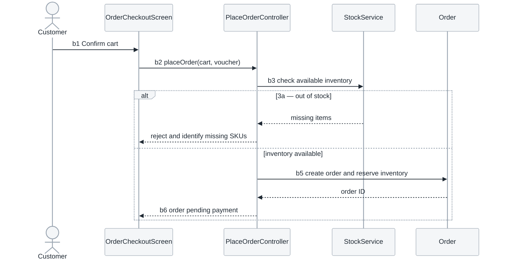

# 3.2 Sequence diagrams for each use case

**Phase 3 · Analysis.** Second of four: [3.1 analysis classes](3.1-analysis-classes.md) → **3.2** → [3.3 class diagrams](3.3-class-diagrams.md) → [3.4 data flow](3.4-data-flow.md). Numbering and the subsystem axis: [0.1](0.1-visual-style.md#section-numbering-and-subsystem-tiers).

Where the use case's activity diagram ([2.3](2.3-use-case-specs.md)) answers *in what order and by whom*, a sequence diagram answers **who calls whom, who waits, and what crosses the boundary**. It is the notation that most directly precedes an API contract: every arrow here becomes a row in the interface inventory of [4.3](4.3-detailed-design.md) and an endpoint in [4.4](4.4-api-contract.md).

**One subsection and one diagram per use case** — even for short use cases and even when two look similar. The diagram shows the **main flow**. An alternative flow receives a separate diagram only when it changes *who calls whom*; if it changes only the outcome, represent it with `alt` in the same diagram.

Four common shortcuts omit subsections, and each removes exactly the information this document exists to provide:

| Shortcut | What is lost |
|---|---|
| Draw only the "main" use cases | Nobody checks the omitted use case's class table, and it is the one most likely to lack an external-system boundary |
| Combine two use cases in one diagram | If they can truly be combined, they are one use case and the [2.1](2.1-actors-and-use-cases.md) table is what must change |
| One "generic" diagram for the subsystem | Calls can no longer be traced to a specific use case |
| **Draw only the *create* operation for a management use case** | Update, delete, and change-state have no diagram; because [4.4](4.4-api-contract.md) is derived from these diagrams, its contract loses the same three endpoints |

## How many diagrams a multi-operation use case needs

The final shortcut is the most expensive in phase 3 because it leaves no visible defect: a diagram for *create* may be entirely valid, and only counting backward from the [2.3](2.3-use-case-specs.md) **operation matrix** reveals the four missing operations.

Rule: **every `T<n>` in the operation matrix must be visible in this document** at one of two levels. Question 3 of the split test decides the level: *do the two operations differ in who calls whom?* ([0.7](0.7-operations.md#the-split-test-when-an-operation-stands-alone)):

| Compared with an operation already drawn | Representation | Example |
|---|---|---|
| Same call sequence, different data and outcome only | An `alt`/`opt` fragment whose guard carries the **operation ID**: `alt T2 — view details` | *List* versus *view details* |
| Different call sequence — another lifeline or check, an external-system call, or an emitted event | **Separate diagram**, with H3 subtitle `— T<n> <operation name>` under the same use case | *Create* (check duplicate SKU) versus *update* (check version) versus *delete* (check references) versus *approve* (add a role) |

*Create* and *update* look similar but almost never belong in one diagram: create checks duplicates and generates an ID, while update reads the old record, checks permission on that record, checks for a stale version, and writes a history row. These are different call sequences and exception sets, ultimately producing two endpoints with different error tables.

Conversely, do not split operations that genuinely share one call sequence: four filters on a list screen form **one** diagram with an `alt`, not four diagrams.

A table beneath each use case subsection closes the loop. This is the countable point and direct input to [4.3.5](4.3-detailed-design.md#interface-inventory-the-contract-index):

| Operation | Drawn in | Cross-boundary message | `I<n>` |
|---|---|---|---|
| T1 List | *Read* diagram, `alt T1` | `listProducts(filter, page)` | I1 |
| T3 Create | *Create* diagram | `createProduct(payload)` | I3 |
| T6 Delete | *Delete* diagram | `softDeleteProduct(id)` | I6 |

**Every arrow must answer the five mechanism questions before it is drawn** — who initiates, whether the caller waits, what actually crosses, where it becomes permanent, and what happens on failure ([0.6](0.6-mechanism.md#the-five-mechanism-questions)). This is the notation in which a guess causes the most damage: frontend, QA, and integration teams may all implement a poll drawn as a push or a queue publish drawn as `->>`. Verify it by reading every edge back as a sentence with evidence ([0.6](0.6-mechanism.md#read-back)).

Two altitudes use this notation, and they are not the same diagram. Here the lifelines are **analysis classes** realising one use case, and the messages carry responsibilities. Later, in design and operations, the lifelines are **deployed components** and the messages carry protocols, timeouts and retries. Everything below applies to both; failure, asynchrony and timeouts start mattering at the second altitude.

## Template

```markdown
# <System> — 3.2 Sequence diagrams for each use case

<metadata table>

<plain-language summary paragraph>

## 3.2.1 Diagram conventions

<arrow notation, step numbering, and subsystem order — 5–8 lines>

## 3.2.2 <Sales subsystem> (UC-U01 … UC-U05)

### UC-U01 — <Use case name>
<sequence diagram>
<caption>

| Step | Message | Caller → receiver | Synchronous | Payload | Return | Possible error | I<n> |
|---|---|---|---|---|---|---|---|

### UC-A03 — <Management use case name> — T3 Create
<sequence diagram for operation T3>
<caption>
<message table>

### UC-A03 — <Management use case name> — T4 Update
<one diagram for every operation that differs in "who calls whom"; represent remaining
operations as alt fragments carrying their T<n> ID in the nearest diagram>

| Operation | Drawn in | Cross-boundary message | I<n> |
|---|---|---|---|

<repeat for EVERY use case — do not merge or omit simple cases>

## 3.2.<n> Cross-subsystem sequence diagram

<only when a flow crosses several subsystems; draw AFTERWARD, not INSTEAD>

## Open questions
## Changelog
```

Subsystems and use case order **match [3.1](3.1-analysis-classes.md)** — the same numbers, names, and order — so the two documents can be read side by side.

## Notation

**The lifelines are exactly the classes from [3.1](3.1-analysis-classes.md)** — the binding rule of this document. A lifeline not in that table means the table is incomplete; a class in the table appearing in no diagram was invented.



Realization of UC-U01: the boundary receives the action and delegates to the control; the control decides and calls entities; entities do not initiate calls back up the chain. The `alt` branch carries the same `3a` identifier as the alternative flow in the use case specification. Timeouts, retries, and queues belong to the design level and later sections.

- **Every message carries its flow step number** (`b3`, `3a`) — the link between prose in [2.1](2.1-actors-and-use-cases.md) and this diagram.
- **A message name is a responsibility, not a command.** *"Check available inventory"* is appropriate at the analysis level; `SELECT … FOR UPDATE` prematurely locks in a design decision.
- **Use combined fragments for branches, not detached arrows**: `alt` · `opt` · `loop` · `par` · `ref`. Write guards in `[…]` and match the condition stated in the flow.
- **A reply message is not decoration** — without it, readers cannot tell where the control obtains the data needed for its next decision.

At the design altitude, participants are the containers from the C4 diagram in [4.1](4.1-design.md), **named identically** and prefixed with the owning team:

| Convention | Rule |
|---|---|
| `->>` / `-->>` / `--)` | Synchronous call / its response / fire-and-forget. The visual difference between *waits* and *does not wait* is the single most useful thing this notation conveys — never draw an async emission as a plain arrow |
| `autonumber` | Always, at the design altitude. It gives reviewers something to point at |
| Participant names | Identical to the C4 container name, prefixed with the team |
| Participant count | Eight maximum; beyond that, split by phase rather than shrinking |

## What every arrow must carry

An arrow labelled *"gets the score"* documents nothing — it is a paraphrase of a call whose shape is exactly the thing two teams need to agree on. Every arrow crossing a team boundary carries four things:

1. **The real interface** — endpoint path, event name, or method: `POST /score`, `application.scored`.
2. **The interface number** — `(I2)` — tying the picture to the contract index in [4.3](4.3-detailed-design.md), so a reader can move between the diagram and the field-level contract without guessing.
3. **What actually goes in the payload**, when it is small enough to fit: `{score, confidence}`. Not the full schema — that is [4.4](4.4-api-contract.md)'s job — but enough that a reader can tell whether the receiver has what it needs.
4. **How it fails** — a return arrow does not have only one shape. Draw a failure branch with `alt` and a guard containing the **real condition** (`alt SKU already exists`); [4.4](4.4-api-contract.md) turns that name into `409 sku_duplicated`. A diagram showing only successful replies is a contract that leaves clients to invent error handling.

The third question exposes design defects: if a payload cannot be written because the caller lacks the data, the design contains a missing lookup nobody noticed. The fourth produces the contract's error table: **every guard on a failure fragment becomes an error code in [4.4](4.4-api-contract.md)**. The chain — exception flow in 2.3 → guard here → method exception in [4.1.3](4.1-design.md#413-detailed-class-design) → error code in 4.4 → message in [4.5](4.5-ui-design.md) → test case in [6.1](6.1-test-plan.md) — must remain connected at every stage ([0.7](0.7-operations.md#exceptions-become-error-codes)).

Any diagram with at least three cross-boundary messages **includes a message table** beneath it, using the template columns: step · message · caller → receiver · synchronous or asynchronous · payload · return · possible error · `I<n>`. The table remains readable when the picture becomes dense and serves as the raw form of an endpoint section in [4.4](4.4-api-contract.md).

## Failure

Every diagram makes a claim about failure whether or not it means to. Choose deliberately:

| Divergence | Approach |
|---|---|
| Small — one different response, same shape | `alt` inside the diagram |
| Large — compensation, rollback, a different actor | A separate diagram under its own heading (`Scoring service unavailable`), cross-referencing the failure row `F<n>` in [4.3](4.3-detailed-design.md) |
| Silent-wrong — the call succeeds and returns plausible nonsense | Not a diagram at all; a row in the failure table. Say in the caption that it is not drawn |

The third is the one teams skip and the one that hurts most, because nothing alerts and the damage accumulates.

## Asynchrony

Three things the notation cannot express on its own, stated in the caption or as `Note over`:

- **When the event is emitted** relative to the transaction — after commit, or inside it. A consumer that reads back and finds nothing is almost always hitting a before-commit emission.
- **What the consumer may observe in between.** A client that gets `201` and immediately polls will find the record in an intermediate state. This is where FE and BE most often disagree, and the sentence that prevents it costs nothing to write.
- **What happens on redelivery**, since at-least-once is the norm and the diagram draws each arrow exactly once.

## Timeouts and retries

Put the numbers on the diagram, not in a paragraph below it: `Note over BE,AI: timeout 400ms, 1 retry, then rule-only fallback`. Three rules keep them honest:

- A caller's timeout is **derived from the performance budget** in [4.3](4.3-detailed-design.md#performance-budget), not chosen independently. Independently chosen timeouts are how retry storms start.
- A retry needs an idempotency story on the receiving side, or it is a duplicate-creation bug drawn as a feature. If the arrow carries `Idempotency-Key`, show it.
- Keep notes rare — three or four per diagram at most, or they become the diagram.

## AI and model calls

Model calls behave differently from ordinary service calls, and the diagram should show the differences rather than hiding them behind one arrow:

- **The fallback branch is always drawn**, never described in prose. A diagram showing only a successful inference describes a system that does not exist.
- **Show the timeout and what happens after it** — degrade, queue, or fail.
- **Show where output is validated.** Model output crossing a boundary without a validation step is a contract violation waiting to happen; if BE parses a model response into a typed structure, that parse is a step in the diagram.
- **Show caching**, since it changes both latency and reproducibility. A cached score is not a fresh decision, and someone will eventually need to know which they are looking at.
- **Show human review as a participant** when it exists. Escalation to a person is part of the system's behaviour, and leaving it out makes the flow look faster and simpler than it is.
- **Draw agentic loops with `loop` and state the bound** — maximum iterations, tokens, or wall-clock. An unbounded loop in a diagram is an unbounded loop in production.

## What the caption must state

The caption is where the diagram's silence gets converted into a decision. Name what is deliberately not shown — auth, logging, timeouts if they are not on the arrows, the retry policy — so a reader does not conclude those were forgotten rather than omitted. Two or three sentences, and one of them should say which arrow is the one that matters.

## Self-check before publishing

| # | Check | Fails when |
|---|---|---|
| 1 | **Count**: diagrams = subsections in [3.1](3.1-analysis-classes.md) = rows in the [2.1](2.1-actors-and-use-cases.md) use case table | A use case with no realization |
| 2 | Every lifeline appears in that use case's class table | The class table is incomplete |
| 3 | Every message carries a step number from the use case flow | The two documents agree only by coincidence |
| 4 | No boundary talks to an entity; no entity calls a control first | Business logic in the screen; domain objects that know about screens |
| 5 | Every numbered exception flow in [2.1](2.1-actors-and-use-cases.md) appears as `alt` or receives a separate diagram | Sequence diagram of the happy path only |
| 6 | Subsystems and order match [3.1](3.1-analysis-classes.md) | Two documents that cannot be read side by side |
| 7 | **Count**: every `T<n>` in the [2.3](2.3-use-case-specs.md) operation matrix appears as a separate diagram or an `alt` carrying that ID | The management use case shows only *create*, and [4.4](4.4-api-contract.md) loses three endpoints |
| 8 | Operations that differ in **who calls whom** receive separate diagrams, not one combined `alt` | *Create* and *update* share a picture and their exceptions become mixed |
| 9 | Every failure fragment guard states the **real condition**, not merely *"error"* | [4.4](4.4-api-contract.md) has nothing from which to name the error code |
| 10 | Every diagram with ≥ 3 cross-boundary messages has a message table with `I<n>` | The contract must be reconstructed from the picture, and two readers infer two payloads |
