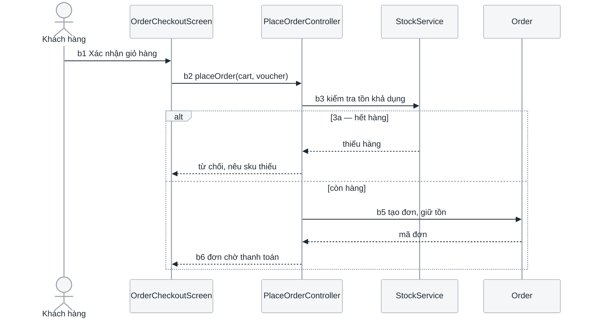

# 3.2 Biểu đồ trình tự cho từng use case

**Phase 3 · Phân tích.** Second of four: [3.1 lớp phân tích](3.1-analysis-classes.md) → **3.2** → [3.3 biểu đồ lớp](3.3-class-diagrams.md) → [3.4 luồng dữ liệu](3.4-data-flow.md). Numbering and the phân hệ axis: [0.1](0.1-visual-style.md#section-numbering-and-subsystem-tiers).

Where the use case's activity diagram ([2.3](2.3-use-case-specs.md)) answers *in what order and by whom*, a sequence diagram answers **who calls whom, who waits, and what crosses the boundary**. It is the notation that most directly precedes an API contract: every arrow here becomes a row in the interface inventory of [4.3](4.3-detailed-design.md) and an endpoint in [4.4](4.4-api-contract.md).

**Một use case một mục con, một sơ đồ** — kể cả use case ngắn, kể cả hai use case trông giống nhau. Sơ đồ vẽ **luồng chính**; một luồng thay thế chỉ được sơ đồ riêng khi nó đổi *ai gọi ai*, còn khi chỉ đổi kết cục thì vẽ bằng `alt` ngay trong sơ đồ đó.

Bốn cách bỏ mục con hay gặp, và cả bốn đều làm mất đúng thứ tài liệu này sinh ra để có:

| Đường tắt | Thứ bị mất |
|---|---|
| Chỉ vẽ những use case "chính" | Use case bị bỏ không có ai kiểm bảng lớp của nó — và nó là ca hay thiếu boundary của hệ thống ngoài nhất |
| Gộp hai use case vào một sơ đồ | Nếu gộp được thật thì chúng là một use case, và chỗ phải sửa là bảng use case ở [2.1](2.1-actors-and-use-cases.md) |
| Một sơ đồ "tổng quát" cho cả phân hệ | Không còn đối chiếu được lượt gọi nào thuộc use case nào |
| **Ca quản lý chỉ vẽ thao tác *tạo*** | Sửa, xoá và đổi trạng thái không có hình nào — và [4.4](4.4-api-contract.md) sinh ra từ những hình này, nên hợp đồng cũng thiếu đúng ba endpoint đó |

## Ca nhiều thao tác vẽ mấy sơ đồ

Dòng cuối bảng trên là đường tắt tốn kém nhất của cả phase 3, vì nó không để lại dấu vết: một sơ đồ của thao tác *tạo* là một sơ đồ hoàn toàn hợp lệ, và chỉ đếm ngược từ **bảng thao tác** ở [2.3](2.3-use-case-specs.md) mới thấy còn thiếu bốn.

Luật: **mỗi `T<n>` của bảng thao tác phải nhìn thấy được trong tài liệu này**, ở một trong hai mức, và mức nào thì do câu hỏi (3) của phép thử tách quyết định — *hai thao tác có khác nhau ở ai gọi ai không* ([0.7](0.7-operations.md#phép-thử-tách-khi-nào-một-thao-tác-được-đứng-riêng)):

| Thao tác so với thao tác đã vẽ | Mức biểu diễn | Ví dụ |
|---|---|---|
| Cùng chuỗi lượt gọi, chỉ khác dữ liệu và kết cục | Một fragment `alt`/`opt` mang **mã thao tác** trong guard: `alt T2 — xem chi tiết` | *Xem danh sách* vs *xem chi tiết* |
| Khác chuỗi lượt gọi — thêm một lifeline, thêm một lượt kiểm, gọi hệ thống ngoài, phát sự kiện | **Sơ đồ riêng**, H3 phụ đề `— T<n> <tên thao tác>` dưới cùng use case | *Tạo* (kiểm trùng SKU) vs *sửa* (kiểm phiên bản) vs *xoá* (kiểm tham chiếu) vs *duyệt* (thêm một vai) |

*Tạo* và *sửa* trông giống nhau và gần như không bao giờ là một sơ đồ: tạo kiểm trùng và sinh mã, sửa đọc bản ghi cũ, kiểm quyền trên chính bản ghi đó, kiểm lạc hậu phiên bản và ghi một dòng lịch sử. Đó là hai chuỗi lượt gọi khác nhau, hai tập ngoại lệ khác nhau và — hệ quả cuối cùng — hai endpoint với hai bảng mã lỗi khác nhau.

Ngược lại, đừng chẻ những thao tác thật sự cùng một chuỗi: bốn kiểu lọc của một màn danh sách là **một** sơ đồ với một `alt`, không phải bốn.

Một bảng dưới mỗi mục con use case đóng vòng lặp — đây là chỗ đếm được, và là đầu vào trực tiếp của [4.3.5](4.3-detailed-design.md#interface-inventory-the-contract-index):

| Thao tác | Vẽ ở | Thông điệp qua biên | `I<n>` |
|---|---|---|---|
| T1 Xem danh sách | sơ đồ *Đọc*, `alt T1` | `listProducts(filter, page)` | I1 |
| T3 Tạo | sơ đồ *Tạo* | `createProduct(payload)` | I3 |
| T6 Xoá | sơ đồ *Xoá* | `softDeleteProduct(id)` | I6 |

**Mỗi mũi tên phải trả lời được năm câu hỏi cơ chế trước khi được vẽ** — ai khởi xướng, người gọi có chờ không, cái gì thực sự đi qua, thành vĩnh viễn ở đâu, hỏng thì sao ([0.6](0.6-mechanism.md#năm-câu-hỏi-cơ-chế)). Đây là ký pháp mà một phỏng đoán gây thiệt hại lớn nhất: một lượt poll vẽ thành push, hay một lượt publish vào hàng đợi vẽ thành `->>`, sẽ được FE, QA và bên tích hợp cùng xây theo. Kiểm bằng cách đọc ngược từng cạnh thành một câu có bằng chứng ([0.6](0.6-mechanism.md#đọc-ngược)).

Two altitudes use this notation, and they are not the same diagram. Here the lifelines are **analysis classes** realising one use case, and the messages carry responsibilities. Later, in design and operations, the lifelines are **deployed components** and the messages carry protocols, timeouts and retries. Everything below applies to both; failure, asynchrony and timeouts start mattering at the second altitude.

## Template

```markdown
# <Hệ thống> — 3.2 Biểu đồ trình tự cho từng use case

<metadata table>

<plain-language summary paragraph>

## 3.2.1 Quy ước đọc sơ đồ

<ký pháp mũi tên, cách đánh số bước, thứ tự các phân hệ — 5–8 dòng>

## 3.2.2 <Phân hệ Bán hàng> (UC-U01 … UC-U05)

### UC-U01 — <Tên use case>
<sequence diagram>
<caption>

| Bước | Thông điệp | Người gọi → người nhận | Đồng bộ | Payload | Trả về | Lỗi có thể trả | I<n> |
|---|---|---|---|---|---|---|---|

### UC-A03 — <Tên use case quản lý> — T3 Tạo mới
<sequence diagram của riêng thao tác T3>
<caption>
<bảng thông điệp>

### UC-A03 — <Tên use case quản lý> — T4 Sửa
<một sơ đồ cho mỗi thao tác khác nhau ở "ai gọi ai"; các thao tác còn lại là
fragment alt mang mã T<n> ngay trong sơ đồ gần nó nhất>

| Thao tác | Vẽ ở | Thông điệp qua biên | I<n> |
|---|---|---|---|

<lặp cho TỪNG use case — không gộp, không bỏ ca đơn giản>

## 3.2.<n> Sơ đồ trình tự xuyên phân hệ

<chỉ khi có luồng đi qua nhiều phân hệ; vẽ SAU, không vẽ THAY>

## Câu hỏi mở
## Changelog
```

Phân hệ và thứ tự use case **trùng với [3.1](3.1-analysis-classes.md)** — cùng số, cùng tên, cùng thứ tự — nên hai tài liệu mở cạnh nhau là đọc được.

## Notation

**The lifelines are exactly the classes from [3.1](3.1-analysis-classes.md)** — the binding rule of this document. A lifeline not in that table means the table is incomplete; a class in the table appearing in no diagram was invented.



Hiện thực hoá UC-U01: boundary chỉ nhận thao tác rồi giao cho control, control quyết định và gọi entity, entity không gọi ngược ai. Nhánh `alt` mang đúng số hiệu `3a` của luồng thay thế trong đặc tả use case. Timeout, retry và hàng đợi thuộc tầng thiết kế và các mục dưới đây.

- **Mỗi thông điệp mang số bước của luồng** (`b3`, `3a`) — mối nối giữa lời văn ở [2.1](2.1-actors-and-use-cases.md) và hình ở đây.
- **Tên thông điệp là trách nhiệm, không phải câu lệnh.** *"kiểm tra tồn khả dụng"* đúng ở mức phân tích; `SELECT … FOR UPDATE` khoá chặt một quyết định chưa đến lúc phải chốt.
- **Combined fragment cho nhánh, không phải mũi tên rời**: `alt` · `opt` · `loop` · `par` · `ref`. Guard viết trong `[…]` và phải trùng điều kiện đã ghi ở luồng.
- **Reply message không phải trang trí** — thiếu nó thì người đọc không biết control lấy đâu ra dữ liệu để quyết định ở bước sau.

At the design altitude, participants are the containers from the C4 diagram in [4.1](4.1-design.md), **named identically** and prefixed with the owning team:

| Convention | Rule |
|---|---|
| `->>` / `-->>` / `--)` | Synchronous call / its response / fire-and-forget. The visual difference between *waits* and *does not wait* is the single most useful thing this notation conveys — never draw an async emission as a plain arrow |
| `autonumber` | Always, at the design altitude. It gives reviewers something to point at |
| Participant names | Identical to the C4 container name, prefixed with the team |
| Participant count | Eight maximum; beyond that, split by phase rather than shrinking |

## What every arrow must carry

An arrow labelled *"gets the score"* documents nothing — it is a paraphrase of a call whose shape is exactly the thing two teams need to agree on. Every arrow crossing a team boundary carries four things:

1. **The real interface** — endpoint path, event name, or method: `POST /score`, `application.scored`.
2. **The interface number** — `(I2)` — tying the picture to the contract index in [4.3](4.3-detailed-design.md), so a reader can move between the diagram and the field-level contract without guessing.
3. **What actually goes in the payload**, when it is small enough to fit: `{score, confidence}`. Not the full schema — that is [4.4](4.4-api-contract.md)'s job — but enough that a reader can tell whether the receiver has what it needs.
4. **Cách nó hỏng** — mũi tên trả lời không phải chỉ có một hình dạng. Nhánh lỗi vẽ bằng `alt` với guard là **điều kiện thật** (`alt SKU đã tồn tại`), và tên đó là thứ [4.4](4.4-api-contract.md) biến thành `409 sku_duplicated`. Một sơ đồ chỉ có mũi tên trả lời thành công là một hợp đồng trong đó client tự nghĩ ra cách xử lý lỗi.

The third one is where design defects surface: an arrow whose payload cannot be written because the caller does not have that data is a missing lookup nobody had noticed. The fourth is where the contract's error table comes from: **mỗi guard của một fragment lỗi là một mã lỗi ở [4.4](4.4-api-contract.md)**, và chuỗi đó — luồng ngoại lệ 2.3 → guard ở đây → ngoại lệ của phương thức ở [4.1.3](4.1-design.md#413-thiết-kế-chi-tiết-lớp) → mã lỗi ở 4.4 → thông báo ở [4.5](4.5-ui-design.md) → ca kiểm thử ở [6.1](6.1-test-plan.md) — không được đứt ở chặng nào ([0.7](0.7-operations.md#ngoại-lệ-thành-mã-lỗi)).

Sơ đồ nào có ≥ 3 thông điệp qua biên thì **kèm một bảng thông điệp** dưới nó, cột như trong template: bước · thông điệp · người gọi → người nhận · đồng bộ hay không · payload · trả về · lỗi có thể trả · `I<n>`. Bảng đó là thứ đọc được bằng mắt thường khi hình đã đủ chật, và là dạng thô của một mục endpoint ở [4.4](4.4-api-contract.md).

## Failure

Every diagram makes a claim about failure whether or not it means to. Choose deliberately:

| Divergence | Approach |
|---|---|
| Small — one different response, same shape | `alt` inside the diagram |
| Large — compensation, rollback, a different actor | A separate diagram under its own heading (`Scoring service unavailable`), cross-referencing the failure row `F<n>` in [4.3](4.3-detailed-design.md) |
| Silent-wrong — the call succeeds and returns plausible nonsense | Not a diagram at all; a row in the failure table. Say in the caption that it is not drawn |

The third is the one teams skip and the one that hurts most, because nothing alerts and the damage accumulates.

## Asynchrony

Three things the notation cannot express on its own, stated in the caption or as `Note over`:

- **When the event is emitted** relative to the transaction — after commit, or inside it. A consumer that reads back and finds nothing is almost always hitting a before-commit emission.
- **What the consumer may observe in between.** A client that gets `201` and immediately polls will find the record in an intermediate state. This is where FE and BE most often disagree, and the sentence that prevents it costs nothing to write.
- **What happens on redelivery**, since at-least-once is the norm and the diagram draws each arrow exactly once.

## Timeouts and retries

Put the numbers on the diagram, not in a paragraph below it: `Note over BE,AI: timeout 400ms, 1 retry, then rule-only fallback`. Three rules keep them honest:

- A caller's timeout is **derived from the performance budget** in [4.3](4.3-detailed-design.md#performance-budget), not chosen independently. Independently chosen timeouts are how retry storms start.
- A retry needs an idempotency story on the receiving side, or it is a duplicate-creation bug drawn as a feature. If the arrow carries `Idempotency-Key`, show it.
- Keep notes rare — three or four per diagram at most, or they become the diagram.

## AI and model calls

Model calls behave differently from ordinary service calls, and the diagram should show the differences rather than hiding them behind one arrow:

- **The fallback branch is always drawn**, never described in prose. A diagram showing only a successful inference describes a system that does not exist.
- **Show the timeout and what happens after it** — degrade, queue, or fail.
- **Show where output is validated.** Model output crossing a boundary without a validation step is a contract violation waiting to happen; if BE parses a model response into a typed structure, that parse is a step in the diagram.
- **Show caching**, since it changes both latency and reproducibility. A cached score is not a fresh decision, and someone will eventually need to know which they are looking at.
- **Show human review as a participant** when it exists. Escalation to a person is part of the system's behaviour, and leaving it out makes the flow look faster and simpler than it is.
- **Draw agentic loops with `loop` and state the bound** — maximum iterations, tokens, or wall-clock. An unbounded loop in a diagram is an unbounded loop in production.

## What the caption must state

The caption is where the diagram's silence gets converted into a decision. Name what is deliberately not shown — auth, logging, timeouts if they are not on the arrows, the retry policy — so a reader does not conclude those were forgotten rather than omitted. Two or three sentences, and one of them should say which arrow is the one that matters.

## Self-check before publishing

| # | Check | Fails when |
|---|---|---|
| 1 | **Đếm**: số sơ đồ = số mục con của [3.1](3.1-analysis-classes.md) = số dòng bảng use case của [2.1](2.1-actors-and-use-cases.md) | A use case with no realization |
| 2 | Every lifeline appears in that use case's class table | The class table is incomplete |
| 3 | Every message carries a step number from the use case flow | The two documents agree only by coincidence |
| 4 | No boundary talks to an entity; no entity calls a control first | Business logic in the screen; domain objects that know about screens |
| 5 | Mọi luồng ngoại lệ đã đánh số ở [2.1](2.1-actors-and-use-cases.md) xuất hiện dưới dạng `alt`, hoặc có sơ đồ riêng | Sequence diagram of the happy path only |
| 6 | Phân hệ và thứ tự trùng [3.1](3.1-analysis-classes.md) | Two documents that cannot be read side by side |
| 7 | **Đếm**: mọi `T<n>` của bảng thao tác ở [2.3](2.3-use-case-specs.md) có mặt — hoặc là sơ đồ riêng, hoặc là `alt` mang mã đó | Ca quản lý được vẽ bằng đúng thao tác *tạo*, và [4.4](4.4-api-contract.md) thiếu ba endpoint theo |
| 8 | Thao tác khác nhau ở **ai gọi ai** có sơ đồ riêng, không phải một `alt` gộp | *Tạo* và *sửa* dùng chung một hình, rồi ngoại lệ của hai bên trộn vào nhau |
| 9 | Mỗi fragment lỗi có guard là **điều kiện thật**, không phải chữ *"lỗi"* | Không có gì để [4.4](4.4-api-contract.md) đặt tên mã lỗi theo |
| 10 | Sơ đồ có ≥ 3 thông điệp qua biên đều có bảng thông điệp kèm `I<n>` | Hợp đồng phải đọc lại từ hình, và hai người đọc ra hai payload |
