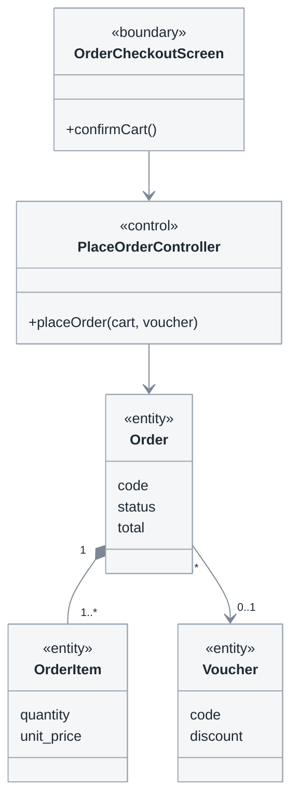

# 3.3 Biểu đồ lớp cho từng use case

**Phase 3 · Phân tích.** Third of four: [3.1 lớp phân tích](3.1-analysis-classes.md) → [3.2 trình tự](3.2-sequence-diagrams.md) → **3.3** → [3.4 luồng dữ liệu](3.4-data-flow.md). Numbering and the phân hệ axis: [0.1](0.1-visual-style.md#section-numbering-and-subsystem-tiers).

The same realization as 3.2, frozen: **who knows about whom, and how many.** 3.2 shows the calls in time; this shows the structure that has to exist for those calls to be possible. It is written after the sequence and never before — a class diagram drawn first documents the associations you imagined, not the ones the flow used.

**Một use case một mục con, một sơ đồ**, cùng phân hệ và cùng thứ tự với 3.1 và 3.2.

| Standard | Taken from it |
|---|---|
| UML 2.5.1 | Class diagram: association, multiplicity, composition, aggregation, stereotypes |
| Jacobson, *OOSE* → RUP | Use-case realization: the diagram covers one use case, not the domain |

## Template

```markdown
# <Hệ thống> — 3.3 Biểu đồ lớp cho từng use case

<metadata table>

<plain-language summary paragraph>

## 3.3.1 Quy ước đọc sơ đồ

<ký hiệu liên kết, bội số, hợp thành vs liên kết — 5–8 dòng>

## 3.3.2 <Phân hệ Bán hàng> (UC-U01 … UC-U05)

### UC-U01 — <Tên use case>
<class diagram — chỉ các lớp use case này dùng>
<caption>

### UC-U02 — <Tên use case>
<class diagram>
<caption>

<lặp cho TỪNG use case>

## 3.3.<n> Biểu đồ lớp phân tích tổng hợp

<chỉ vẽ SAU khi đã có đủ các sơ đồ theo use case; không thay thế chúng>
<caption>

| Lớp | Loại | Use case dùng nó | Thuộc tính nghiệp vụ | Bội số đáng chú ý | Dự kiến thành bảng |
|---|---|---|---|---|---|

## Câu hỏi mở
## Changelog
```

Bảng cuối là đầu vào trực tiếp của ERD ở [4.2](4.2-data-model.md): mỗi `<<entity>>` cộng bội số của nó quyết định cái gì thành cột, cái gì thành bảng. Cột `Dự kiến thành bảng` để trống lúc viết và điền ngược khi [4.1.2](4.1-design.md#412-thiết-kế-cơ-sở-dữ-liệu) chốt xong — một `<<entity>>` không tới được bảng nào là một thứ hệ thống được bảo phải nhớ mà giờ không nhớ.

## Notation



Lớp phân tích của UC-U01. `Order` sở hữu `OrderItem` (hợp thành — xoá đơn là xoá dòng đơn), còn `Voucher` chỉ được tham chiếu vì nó sống độc lập với đơn. Chưa có kiểu dữ liệu, khoá ngoại, repository hay service — tất cả thuộc [4.2](4.2-data-model.md) và [4.3](4.3-detailed-design.md).

- **Only what 3.2 used.** An operation appears only if a message lands on it; an association exists only if a message travelled along it.
- **Hộp rỗng không phải một lớp.** Mỗi `<<entity>>` mang đủ **thuộc tính nghiệp vụ** mà use case này đọc hoặc ghi — lấy thẳng từ bảng `Các trường dữ liệu` ở [2.1.4](2.1-use-cases.md#214-đặc-tả-sử-dụng), cùng tên, không thêm không bớt. Một `Order` vẽ trần không nói được cái gì thành cột, nên [4.2](4.2-data-model.md) lại phải đi đoán từ đầu.
- **`<<control>>` của một ca nhiều thao tác có một thao tác cho mỗi `T<n>`** của bảng thao tác ([2.1.4](2.1-use-cases.md#214-đặc-tả-sử-dụng), [0.7](0.7-operations.md)): `+create()`, `+update()`, `+softDelete()` — không phải một `+manage()`. Đây là chỗ đầu tiên trong cả bộ tài liệu mà số thao tác **đếm được trên hình**, và cũng là chỗ một thao tác bị quên hiện ra thành một ô trống thay vì một sự im lặng. Chữ ký đầy đủ thì để [4.1.3](4.1-design.md#413-thiết-kế-chi-tiết-lớp) viết; ở đây chỉ cần tên và tham số nghiệp vụ.
- **Multiplicity on both ends, always** — `1`, `0..1`, `1..*`, `0..*`. This is the most expensive missing detail in the whole phase: it decides whether something is a column, a table, or a bug report about duplicates. Bội số không suy ra được từ hình; nó phải được **hỏi**, mỗi đầu một câu, tối thiểu và tối đa tách nhau ([0.5 K5](0.5-derivation.md#k5--hai-câu-hỏi-bội-số)) — hỏi gộp thì câu trả lời luôn ra `1..*` kể cả khi sự thật là `0..*`.
- **Composition (`*--`) versus association (`-->`)**: composition means the part dies with the whole. Getting it wrong here produces orphan rows two phases later.
- **No design vocabulary.** `OrderRepository`, `OrderDTO`, `OrderServiceImpl` hide the domain behind plumbing. A class name that only makes sense to a programmer does not belong here.
- **Attributes are business facts, not columns.** `status` belongs here; `status_id smallint NOT NULL DEFAULT 0` belongs in [4.2](4.2-data-model.md). An entity whose lifecycle has named states gets its state machine from [3.5](3.5-state-machines.md), drawn once and referenced, not redrawn per use case.

## Biểu đồ tổng hợp vẽ SAU, không vẽ THAY

Khi nhiều use case dùng chung phần lớn lớp, thêm một sơ đồ hợp nhất ở cuối tài liệu làm bản đồ toàn cảnh. Nó không thay được các sơ đồ theo use case vì nó gộp mọi lớp lại, nên câu hỏi duy nhất tài liệu này sinh ra để trả lời — *use case này dùng lớp nào và không dùng lớp nào* — không còn đọc được từ nó.

Một tài liệu chỉ có sơ đồ tổng hợp là một tài liệu chưa phân tích use case nào cả. Nó trông đầy đủ hơn và chứa ít thông tin hơn, đó là lý do đường tắt này hấp dẫn.

Sơ đồ tổng hợp quá ~15 lớp thì cắt theo phân hệ chứ đừng thu nhỏ hộp: một bản đồ không đọc được không phải là một bản đồ.

## Self-check before publishing

| # | Check | Fails when |
|---|---|---|
| 1 | **Đếm**: số sơ đồ = số mục con của [3.1](3.1-analysis-classes.md) và [3.2](3.2-sequence-diagrams.md) | A use case with no structure behind its flow |
| 2 | Sơ đồ theo use case có trước, tổng hợp có sau | Nobody can tell which classes a given use case uses |
| 3 | Every class appears in ≥ 1 sequence diagram of [3.2](3.2-sequence-diagrams.md) | A class nobody needs |
| 4 | Every association has multiplicity at both ends | The most expensive missing detail in the phase |
| 5 | Hợp thành và liên kết dùng đúng chỗ | Orphan rows two phases later |
| 6 | Không có kiểu dữ liệu, khoá ngoại, chỉ mục, **không có ERD** | Design decisions taken a phase early |
| 7 | Phân hệ và thứ tự trùng [3.1](3.1-analysis-classes.md) và [3.2](3.2-sequence-diagrams.md) | Three documents that cannot be read side by side |
| 8 | Mọi `<<entity>>` có thuộc tính, và mọi thuộc tính có trong bảng trường dữ liệu của [2.1.4](2.1-use-cases.md#214-đặc-tả-sử-dụng) | Hộp rỗng, rồi [4.2](4.2-data-model.md) phải đoán lại cột từ đầu |
| 9 | `<<control>>` của ca nhiều thao tác có **một thao tác cho mỗi `T<n>`** | Một `+manage()` không ai cài được, và ba endpoint biến mất theo |

## Common mistakes

| Mistake | Instead |
|---|---|
| Một biểu đồ lớp tổng hợp thay cho các biểu đồ theo use case | Theo use case trước, tổng hợp thêm vào cuối |
| Class diagram drawn before the sequence | Sequence first, then freeze what it used |
| Vẽ ERD ở đây | `<<entity>>` ở đây; ERD đúng một lần, ở [4.2](4.2-data-model.md) |
| Bội số chỉ ghi một đầu | Hai đầu, luôn luôn |
| Thêm getter/setter cho đủ | Chỉ thao tác mà một thông điệp ở [3.2](3.2-sequence-diagrams.md) gọi tới |
| Một `+manage()` trên control của ca quản lý | Một thao tác cho mỗi `T<n>` của bảng thao tác |
| Hộp `<<entity>>` chỉ có tên | Thuộc tính nghiệp vụ, lấy từ bảng trường dữ liệu của use case |
| Vẽ lại vòng đời trạng thái trong mỗi sơ đồ | Một máy trạng thái, ở [3.5](3.5-state-machines.md), rồi tham chiếu |
