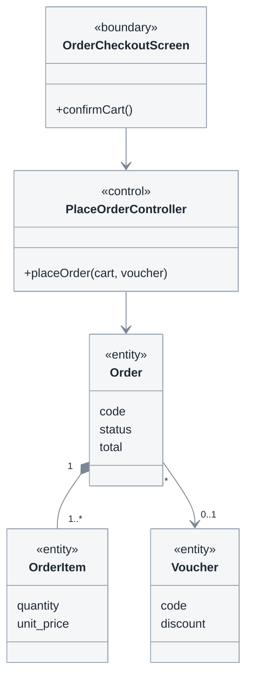

# 3.3 Class diagrams for each use case

**Phase 3 · Analysis.** Third of four: [3.1 analysis classes](3.1-analysis-classes.md) → [3.2 sequences](3.2-sequence-diagrams.md) → **3.3** → [3.4 data flow](3.4-data-flow.md). Numbering and the subsystem axis: [0.1](0.1-visual-style.md#section-numbering-and-subsystem-tiers).

The same realization as 3.2, frozen: **who knows about whom, and how many.** 3.2 shows the calls in time; this shows the structure that has to exist for those calls to be possible. It is written after the sequence and never before — a class diagram drawn first documents the associations you imagined, not the ones the flow used.

**One subsection and one diagram per use case**, using the same subsystems and order as 3.1 and 3.2.

| Standard | Taken from it |
|---|---|
| UML 2.5.1 | Class diagram: association, multiplicity, composition, aggregation, stereotypes |
| Jacobson, *OOSE* → RUP | Use-case realization: the diagram covers one use case, not the domain |

## Template

```markdown
# <System> — 3.3 Class diagrams for each use case

<metadata table — required: Status and Last updated; add other fields only when known>

<plain-language summary paragraph>

## 3.3.1 Diagram conventions

<association notation, multiplicity, composition versus association — 5–8 lines>

## 3.3.2 <Sales subsystem> (UC-U01 … UC-U05)

### UC-U01 — <Use case name>
<class diagram — only the classes used by this use case>
<caption>

### UC-U02 — <Use case name>
<class diagram>
<caption>

<repeat for EVERY use case>

## 3.3.<n> Consolidated analysis class diagram

<draw only AFTER all per-use-case diagrams exist; this does not replace them>
<caption>

| Class | Type | Use cases using it | Business attributes | Notable multiplicities | Expected table mapping |
|---|---|---|---|---|---|

## Open questions
## Changelog
```

The final table is direct input to the ERD in [4.2](4.2-data-model.md): every `<<entity>>` and its multiplicities determine what becomes a column and what becomes a table. Leave `Expected table mapping` blank while drafting and backfill it when [4.1.2](4.1-design.md#412-database-design) is settled. An `<<entity>>` that reaches no table represents something the system was told to remember but now does not.

## Notation



Analysis classes for UC-U01. `Order` owns `OrderItem` through composition — deleting an order deletes its items — while `Voucher` is only referenced because it exists independently of the order. Data types, foreign keys, repositories, and services do not appear yet; they belong in [4.2](4.2-data-model.md) and [4.3](4.3-detailed-design.md).

- **Only what 3.2 used.** An operation appears only if a message lands on it; an association exists only if a message travelled along it.
- **An empty box is not a class.** Every `<<entity>>` carries all **business attributes** that this use case reads or writes, copied directly from the `Data fields` table in [2.3](2.3-use-case-specs.md) with identical names and no additions or omissions. A bare `Order` box does not reveal what becomes a column, forcing [4.2](4.2-data-model.md) to guess again from scratch.
- **The `<<control>>` for a multi-operation use case has one operation per `T<n>`** in its operation matrix ([2.3](2.3-use-case-specs.md), [0.7](0.7-operations.md)): `+create()`, `+update()`, and `+softDelete()`, not one `+manage()`. This is the first place in the documentation set where the operation count is **visible in the diagram**, and where a forgotten operation becomes an empty slot instead of silence. Full signatures belong in [4.1.3](4.1-design.md#413-detailed-class-design); here, names and business parameters are sufficient.
- **Multiplicity on both ends, always** — `1`, `0..1`, `1..*`, `0..*`. This is the most expensive missing detail in the phase because it determines whether something becomes a column, a table, or a duplicate-related defect. Multiplicity cannot be inferred from the drawing; it must be **asked**, one question per end, with minimum and maximum separated ([0.5 K5](0.5-derivation.md#k5-the-two-multiplicity-questions)). A combined question tends to produce `1..*` even when the truth is `0..*`.
- **Composition (`*--`) versus association (`-->`)**: composition means the part dies with the whole. Getting it wrong here produces orphan rows two phases later.
- **No design vocabulary.** `OrderRepository`, `OrderDTO`, `OrderServiceImpl` hide the domain behind plumbing. A class name that only makes sense to a programmer does not belong here.
- **Attributes are business facts, not columns.** `status` belongs here; `status_id smallint NOT NULL DEFAULT 0` belongs in [4.2](4.2-data-model.md). An entity whose lifecycle has named states gets its state machine from [3.5](3.5-state-machines.md), drawn once and referenced, not redrawn per use case.

## Draw the consolidated diagram AFTERWARD, not INSTEAD

When many use cases share most classes, add a consolidated diagram at the end as an overview map. It cannot replace the per-use-case diagrams because combining all classes makes the document's central question — *which classes does this use case use, and which does it not use?* — impossible to answer from the picture.

A document containing only the consolidated diagram has not analyzed any individual use case. It looks more complete while carrying less information, which is why this shortcut is attractive.

If the consolidated diagram exceeds roughly 15 classes, split it by subsystem rather than shrinking the boxes; an unreadable map is not a map.

## Self-check before publishing

| # | Check | Fails when |
|---|---|---|
| 1 | **Count**: number of diagrams = number of subsections in [3.1](3.1-analysis-classes.md) and [3.2](3.2-sequence-diagrams.md) | A use case with no structure behind its flow |
| 2 | Per-use-case diagrams come first; the consolidated diagram comes last | Nobody can tell which classes a given use case uses |
| 3 | Every class appears in ≥ 1 sequence diagram of [3.2](3.2-sequence-diagrams.md) | A class nobody needs |
| 4 | Every association has multiplicity at both ends | The most expensive missing detail in the phase |
| 5 | Composition and association are used correctly | Orphan rows two phases later |
| 6 | No data types, foreign keys, indexes, and **no ERD** | Design decisions taken one phase too early |
| 7 | Subsystems and order match [3.1](3.1-analysis-classes.md) and [3.2](3.2-sequence-diagrams.md) | Three documents that cannot be read side by side |
| 8 | Every `<<entity>>` has attributes, and every attribute appears in a [2.3](2.3-use-case-specs.md) data-field table | Empty boxes force [4.2](4.2-data-model.md) to guess the columns again |
| 9 | The `<<control>>` of a multi-operation use case has **one operation per `T<n>`** | An unimplementable `+manage()` causes three endpoints to disappear |

## Common mistakes

| Mistake | Instead |
|---|---|
| One consolidated class diagram instead of per-use-case diagrams | Draw per-use-case diagrams first, then add the consolidated view at the end |
| Class diagram drawn before the sequence | Sequence first, then freeze what it used |
| Draw the ERD here | Draw `<<entity>>` classes here; draw the ERD once in [4.2](4.2-data-model.md) |
| Multiplicity on only one end | Both ends, always |
| Add getters and setters for completeness | Include only operations called by a [3.2](3.2-sequence-diagrams.md) message |
| One `+manage()` on the control of a management use case | One operation per `T<n>` in the operation matrix |
| An `<<entity>>` box containing only a name | Business attributes from the use case's data-field table |
| Redraw the state lifecycle in every diagram | Define one state machine in [3.5](3.5-state-machines.md) and reference it |
