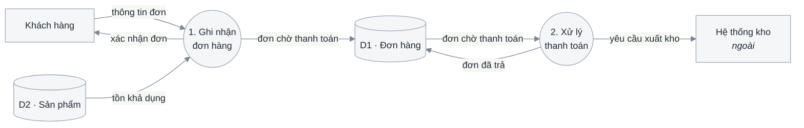
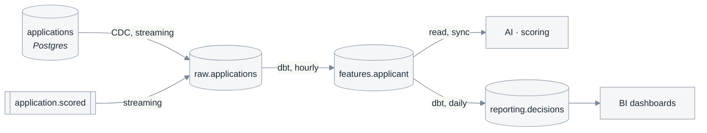

# 3.4 Biểu đồ luồng dữ liệu

**Phase 3 · Phân tích.** Last of four: [3.1 lớp phân tích](3.1-analysis-classes.md) → [3.2 trình tự](3.2-sequence-diagrams.md) → [3.3 biểu đồ lớp](3.3-class-diagrams.md) → **3.4**. Numbering and the phân hệ axis: [0.1](0.1-visual-style.md#section-numbering-and-subsystem-tiers).

3.1–3.3 look at one use case at a time. This one looks at the whole system from the only angle that makes gaps visible: **data that moves, and data that rests.** It is written last because it is a *check* on the other three as much as a picture.

**Không chia theo phân hệ.** Đây là tài liệu duy nhất của phase 3 vẽ cho cả hệ thống một lần — chia đôi theo phân hệ thì không mức nào cân bằng được, và luật cân bằng là thứ duy nhất trong phase này mà một người không biết nghiệp vụ vẫn kiểm được. Bộ tài liệu chia theo hệ thống (`-admin`, `-user`) vẫn dùng chung **một** file 3.4.

Two altitudes, and which one a system needs is not a matter of taste:

| Độ cao | Câu hỏi | Ký pháp | Vẽ khi |
|---|---|---|---|
| **Nghiệp vụ** — DeMarco / Gane–Sarson | Chức năng nào chạm dữ liệu nào, dữ liệu đọng ở kho nào | Tiến trình · luồng · kho · tác nhân ngoài, phân rã theo mức | Luôn luôn |
| **Lan truyền** — lineage | Một sự kiện đi từ nơi sinh ra tới mọi nơi phụ thuộc, và có thể cũ đến mức nào | Nguồn → biến đổi → consumer, mỗi cạnh mang cơ chế và nhịp | Hệ thống có pipeline, kho phân tích, bản sao, cache hay mô hình — tức bất cứ khi nào một consumer có thể đang nhìn bản cũ |

A levelled DFD says a store is written and read, and says nothing about how long the reader waits or how wrong they may be meanwhile. That is what the second altitude adds. Đừng vẽ độ cao thứ hai khi chỉ có một database, và đừng bỏ nó khi có nhiều hơn một.

| Standard | Taken from it |
|---|---|
| DeMarco (1978) · Gane & Sarson (1977) | Four elements, levelled decomposition, the balancing rule |
| ISO/IEC/IEEE 29148:2018 | Traceability: every process back to a use case |

## Template

```markdown
# <Hệ thống> — 3.4 Biểu đồ luồng dữ liệu

<metadata table>

<plain-language summary paragraph>

## 3.4.1 Quy ước và quy tắc đánh số mức

<nêu rõ "mức khung cảnh" đánh số 0 hay 1 — người đọc hiểu khác là lệch mọi số>

## 3.4.2 Mức khung cảnh
<context diagram>
<caption>

## 3.4.3 Mức đỉnh
<level 1 diagram>
<caption>

| Tiến trình | Use case tương ứng | Đọc kho | Ghi kho |
|---|---|---|---|

| Kho | Lớp `<<entity>>` tương ứng | Tiến trình ghi | Tiến trình đọc |
|---|---|---|---|

## 3.4.4 Mức dưới đỉnh

### Phân rã tiến trình <n>
<chỉ cho tiến trình thực sự phức tạp; mỗi sơ đồ phải cân bằng với cha của nó>

## 3.4.5 Sơ đồ lan truyền dữ liệu
<chỉ khi có pipeline, kho phân tích, bản sao, cache hay mô hình>
<caption>

| Consumer | Đọc | Được cũ tối đa | Quá hạn thì sao |
|---|---|---|---|

## Câu hỏi mở
## Changelog
```

## Bốn phần tử

| Phần tử | Là gì | Luật đặt tên |
|---|---|---|
| **Tiến trình** · process | Biến đổi dữ liệu | **Động từ + bổ ngữ**: *"Ghi nhận đơn hàng"*. Đánh số theo mức (`1`, `2` → `1.1`, `1.2`). Không bao giờ đặt tên bằng phòng ban hay màn hình |
| **Luồng dữ liệu** · data flow | Dữ liệu đang di chuyển | **Danh từ**: *"thông tin đơn"*. Mũi tên không tên là một thoả thuận chưa ai viết ra |
| **Kho** · data store | Dữ liệu đứng yên giữa các lượt | `D1`, `D2`… Mỗi kho ứng với ≥ 1 lớp `<<entity>>` ở [3.1](3.1-analysis-classes.md) |
| **Tác nhân ngoài** · external entity | Nguồn hoặc đích **ngoài biên** | Đúng bằng bảng tác nhân ở [2.1.1](2.1-use-cases.md#211-xác-định-tác-nhân), không thêm không bớt. Service của chính sản phẩm là **tiến trình**, DB của nó là **kho** — vẽ chúng thành tác nhân ngoài là tuyên bố hệ thống gửi dữ liệu ra ngoài chính nó, và mọi phép cân bằng mức dưới sẽ khớp trên một biên sai |

Three levels — **pick one numbering convention and state it in the document**, because a reader who thinks "mức 0" means the context diagram reads every number off by one:

| Mức | Nội dung | Số tiến trình |
|---|---|---|
| Khung cảnh · context | Cả hệ thống là **một** tiến trình; chỉ còn tác nhân ngoài và luồng qua biên | 1 |
| Đỉnh · level 1 | Các nhóm chức năng chính, thường trùng nhánh mức 1 của cây chức năng ở [1.1](1.1-problem-survey.md) | 5–9 |
| Dưới đỉnh · level 2 | Phân rã **một** tiến trình mức đỉnh | Chỉ cho tiến trình thực sự phức tạp |



Mức đỉnh, rút gọn còn hai tiến trình để đọc được ở đây. Vòng tròn là tiến trình, hình trụ là kho, chữ nhật là tác nhân ngoài. Sơ đồ **không** nói thứ tự thời gian và **không** nói điều kiện rẽ nhánh — hai thứ đó ở biểu đồ hoạt động của từng use case. Lưu ý `D2` chỉ có mũi tên đọc vì tiến trình quản lý danh mục đã bị lược bỏ cho gọn: trong sơ đồ đầy đủ, kho không có tiến trình nào ghi là **lỗi**, và thường là một nhóm use case quản trị chưa ai tìm ra.

**Cân bằng (balancing)**: mọi luồng vào và ra của một tiến trình mức trên phải xuất hiện đủ ở sơ đồ phân rã của chính nó. Thiếu một luồng nghĩa là một trong hai mức sai.

Ba lỗi có tên riêng. Hai lỗi đầu kiểm được bằng cách đếm mũi tên quanh mỗi hình; lỗi thứ ba phải đọc tên luồng mới thấy:

| Lỗi | Hình dạng | Nghĩa thật |
|---|---|---|
| **Hố đen** · black hole | Có vào, không có ra | Dữ liệu vào rồi biến mất — thiếu luồng ra, hoặc tiến trình này không tồn tại |
| **Phép màu** · miracle | Có ra, không có vào | Kết quả sinh từ hư không — luôn là một luồng vào hoặc một kho bị bỏ quên |
| **Lỗ xám** · grey hole | Đầu ra không suy được từ đầu vào | Thiếu dữ liệu ở giữa; chỗ hay lộ ra một bảng chưa ai nghĩ tới |

- **Danh sách tiến trình mức đỉnh được suy ra, không nhớ ra**: mỗi sự kiện — ngoài, theo thời gian, theo trạng thái — sinh đúng một phản ứng, và mỗi phản ứng là một tiến trình ([0.5 K1](0.5-derivation.md#k1--phân-rã-theo-sự-kiện)). Đó cũng là lý do danh sách này cân với danh sách use case chứ không phải trùng hợp. Kho nào ghi/đọc bởi ca nào thì đọc thẳng từ ma trận CRUD ([K4](0.5-derivation.md#k4--ma-trận-crud)).
- **Mỗi tiến trình truy được về ≥ 1 use case, mỗi use case xuất hiện trong ≥ 1 tiến trình.** Đây là **lượt kiểm phủ thứ ba** cho danh sách use case, sau hai lượt ở [2.1](2.1-use-cases.md#tìm-cho-đủ-không-dừng-ở-những-ca-hiển-nhiên), và là lượt duy nhất đi từ phía dữ liệu — nên nó bắt đúng những ca hai lượt kia bỏ sót: nhập liệu ban đầu, đối soát, báo cáo định kỳ, dọn dữ liệu.
- **Mỗi kho ứng với ≥ 1 lớp `<<entity>>` ở [3.1](3.1-analysis-classes.md)**, và ngược lại. Một kho không có lớp là thực thể chưa được phân tích; một `<<entity>>` không nằm trong kho nào là thứ hệ thống nhớ mà không ai nói nhớ ở đâu.
- **Không vẽ luồng điều khiển.** Mũi tên mang *dữ liệu*, không mang quyết định hay thứ tự. `"nếu hợp lệ"` trên một mũi tên là dấu hiệu người vẽ đang vẽ lại biểu đồ hoạt động.
- **Kho không nói chuyện với kho, tác nhân không nói chuyện với kho.** Mũi tên nối thẳng hai kho là một tiến trình bị bỏ quên — thường là một job đồng bộ không ai coi là chức năng.

## Từ sơ đồ nghiệp vụ sang sơ đồ lan truyền

The two altitudes are drawn from the same material, so start from the levelled diagram rather than from a blank page. One data store there becomes a **chain** here, and the chain is where the questions live:

| Ở sơ đồ mức đỉnh | Ở sơ đồ lan truyền |
|---|---|
| Một kho `D3 · Đơn hàng` | `orders` (ứng dụng ghi) → `raw.orders` (CDC) → `reporting.orders` (dbt, hằng giờ) |
| Một mũi tên "ghi" | Cơ chế và nhịp: đồng bộ, CDC, batch lúc 02:00 |
| Một mũi tên "đọc" | Consumer nào, chấp nhận cũ tối đa bao lâu, quá hạn thì làm gì |

A store that turns out to be a chain of three is worth noticing at analysis time: every extra hop is a place where two readers can disagree about the same fact, and the disagreement is invisible in the levelled diagram because it draws the store once.

Source → transform → consumer, left to right, with the mechanism and cadence written on every edge:



Cùng dữ liệu, độ cao khác: kho `applications` ở mức đỉnh là một hộp, ở đây là một chuỗi ba chặng với hai nhịp khác nhau. Shapes stay consistent with [4.1](4.1-design.md): `[()]` a datastore, `[[]]` a queue or topic, `[]` a service or job. Sơ đồ **không** nói ai được đọc gì — phân quyền ở [4.4](4.4-api-contract.md).

**Every edge carries mechanism and cadence.** This is the whole point of the diagram, and the reason it replaces a recurring question in chat:

| Edge label | Tells the consumer |
|---|---|
| `CDC, streaming` | Changes arrive continuously; lag is seconds |
| `dbt, hourly` | Up to an hour stale, and a failed run means longer |
| `export, daily 02:00 UTC` | One version per day; do not build a live feature on it |
| `read, sync` | No copy at all — the consumer sees the current value |

An unlabelled edge is a promise nobody made. Add volume (`~2M rows/day`) where it changes what someone would build.

## Authoritative versus derived

Mark clearly which stores are written directly by an application and which are computed from something else. Consumers routinely assume every table is authoritative, then write to a derived one or reconcile against it.

For each derived store, the diagram plus one row: what it is derived from, by what job, and **what happens to it on a rebuild** — some are recomputed from scratch, some are appended to, and the difference determines whether a consumer may hold references into it.

The sharpest question this diagram answers: **if two stores disagree, which one is right?** Write the answer down. A system where nobody can name the winner has a reconciliation bug that has not surfaced yet.

## The freshness contract

Every consumer edge gets a stated staleness bound, because a consumer will assume one either way:

| Consumer | Reads | May be stale by | On breach |
|---|---|---|---|
| AI · scoring | `features.applicant` | 1 hour | Block scoring, route to manual review |
| BI dashboards | `reporting.decisions` | 24 hours | Banner on the dashboard |

`On breach` is what makes this a contract rather than an aspiration. A freshness bound with no detection and no defined behaviour is folklore — it belongs in the failure table of [4.3](4.3-detailed-design.md) as a named row.

## Where personal data crosses a boundary

Mark the edges where personal, financial or regulated data leaves the system that collected it — an export, a warehouse copy, a third-party call, a log sink. This diagram is the only place in the whole set where those crossings are visible at once, which makes it the cheapest place to notice that a field is being copied somewhere with a different retention policy.

For each marked edge: which fields, why they are needed downstream, whether they are masked or pseudonymised in transit, and what deletes them when the subject asks. Tie the answers back to the security table in [1.1.7](1.1-problem-survey.md#117-ràng-buộc-kỹ-thuật-và-bảo-mật) rather than re-deciding them here.

For anything feeding a model, draw the **training path** and the **serving path** as separate lines even when they start from the same store, and say whether they share transformation code. When they do not, training/serving skew is a live risk and belongs in the failure table as a named row rather than as folklore.

## Self-check before publishing

| # | Check | Fails when |
|---|---|---|
| 1 | Every process traces to ≥ 1 use case, and every use case to ≥ 1 process | The third coverage check — run it, do not assume it |
| 2 | Every store maps to ≥ 1 `<<entity>>` in [3.1](3.1-analysis-classes.md), and every `<<entity>>` sits in a store | Something remembered with nowhere stated to remember it |
| 3 | Every level-2 diagram balances with its parent | One of the two levels is wrong |
| 4 | No black hole, no miracle, no grey hole | Data that vanishes, or results from nowhere |
| 5 | Quy ước đánh số mức nêu rõ ở mục 3.4.1 | Every number read off by one |
| 6 | Không có mũi tên mang điều kiện hay thứ tự | A DFD that is really an activity diagram |
| 7 | Mọi cạnh của sơ đồ lan truyền có cơ chế và nhịp | A promise nobody made |
| 8 | Mỗi consumer có ngưỡng cũ và hành vi khi quá hạn | Freshness as folklore |

## Common mistakes

| Mistake | Instead |
|---|---|
| A DFD that is really an activity diagram | Data on the arrows; ordering stays in [2.1.4](2.1-use-cases.md#214-đặc-tả-sử-dụng) |
| Processes named after departments or screens | Verb + object, naming what happens to the data |
| Level 2 drawn for every process | Only where a process is genuinely complex |
| Chia sơ đồ theo phân hệ cho khớp 3.1–3.3 | Một sơ đồ cho cả hệ thống — chia là mất luật cân bằng |
| Vẽ sơ đồ lan truyền khi chỉ có một database | Bỏ hẳn mục đó, và nói rõ là bỏ |
