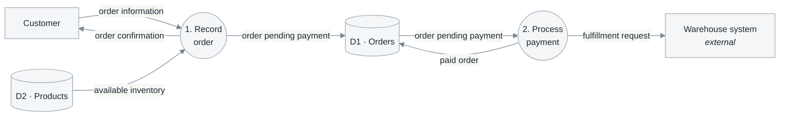
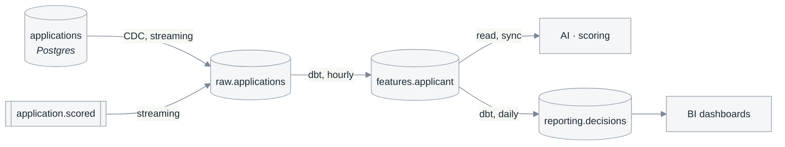

# 3.4 Data-flow diagrams

**Phase 3 · Analysis.** Last of four: [3.1 analysis classes](3.1-analysis-classes.md) → [3.2 sequences](3.2-sequence-diagrams.md) → [3.3 class diagrams](3.3-class-diagrams.md) → **3.4**. Numbering and the subsystem axis: [0.1](0.1-visual-style.md#section-numbering-and-subsystem-tiers).

3.1–3.3 look at one use case at a time. This one looks at the whole system from the only angle that makes gaps visible: **data that moves, and data that rests.** It is written last because it is a *check* on the other three as much as a picture.

**Do not split by subsystem.** This is the only phase 3 document drawn once for the entire system. Splitting it by subsystem makes level balancing impossible, and balancing is the only phase 3 rule that a reviewer without domain knowledge can verify. Even a documentation set split by system (`-admin`, `-user`) shares **one** 3.4 file.

Two altitudes, and which one a system needs is not a matter of taste:

| Altitude | Question | Notation | Draw when |
|---|---|---|---|
| **Business** — DeMarco / Gane–Sarson | Which functions touch which data, and in which stores data rests | Processes · flows · stores · external entities, decomposed by level | Always |
| **Propagation** — lineage | How an event travels from its origin to every dependent consumer, and how stale it may become | Source → transform → consumer, with mechanism and cadence on every edge | The system has a pipeline, analytical store, replica, cache, or model — whenever a consumer may see an old value |

A levelled DFD says a store is written and read but nothing about how long the reader waits or how stale the value may be meanwhile. The second altitude adds that information. Do not draw it when there is only one database, and do not omit it when there is more than one copy.

| Standard | Taken from it |
|---|---|
| DeMarco (1978) · Gane & Sarson (1977) | Four elements, levelled decomposition, the balancing rule |
| ISO/IEC/IEEE 29148:2018 | Traceability: every process back to a use case |

## Template

```markdown
# <System> — 3.4 Data-flow diagrams

<metadata table — required: Status and Last updated; add other fields only when known>

<plain-language summary paragraph>

## 3.4.1 Conventions and level-numbering rules

<state whether the context level is numbered 0 or 1 — otherwise every number is ambiguous>

## 3.4.2 Context level
<context diagram>
<caption>

## 3.4.3 Top level
<level 1 diagram>
<caption>

| Process | Corresponding use case | Reads store | Writes store |
|---|---|---|---|

| Store | Corresponding `<<entity>>` class | Writing process | Reading process |
|---|---|---|---|

## 3.4.4 Lower levels

### Decompose process <n>
<only for genuinely complex processes; every diagram must balance with its parent>

## 3.4.5 Data-propagation diagram
<only when the system has a pipeline, analytical store, replica, cache, or model>
<caption>

| Consumer | Reads | Maximum staleness | Behavior on breach |
|---|---|---|---|

## Open questions
## Changelog
```

## The four elements

| Element | What it is | Naming rule |
|---|---|---|
| **Process** | Transforms data | **Verb + object**: *"Record order."* Number by level (`1`, `2` → `1.1`, `1.2`). Never name it after a department or screen |
| **Data flow** | Data in motion | **Noun**: *"order information."* An unnamed arrow is an agreement nobody documented |
| **Data store** | Data at rest between interactions | `D1`, `D2`… Every store maps to at least one `<<entity>>` class in [3.1](3.1-analysis-classes.md) |
| **External entity** | A source or destination **outside the boundary** | Exactly matches the actor table in [2.1.1](2.1-actors-and-use-cases.md#211-identify-actors), with no additions or omissions. A product-owned service is a **process** and its database is a **store**; drawing either as external says the system sends data outside itself, and every lower-level balance will match the wrong boundary |

Three levels — **choose one numbering convention and state it in the document**, because readers who interpret "level 0" differently will read every number one level off:

| Level | Content | Process count |
|---|---|---|
| Context | The entire system is **one** process; only external entities and cross-boundary flows remain | 1 |
| Top · level 1 | Main functional groups, usually matching level-1 branches of the [1.1](1.1-problem-survey.md) function tree | 5–9 |
| Lower · level 2 | Decomposes **one** top-level process | Only for genuinely complex processes |



Top level, reduced to two processes for readability. Circles are processes, cylinders are stores, and rectangles are external entities. The diagram says **nothing** about temporal order or branch conditions; those belong in each use case's activity diagram. `D2` has only a read arrow because catalog management was omitted for brevity. In the complete diagram, a store with no writing process is a **defect** and usually reveals a missing family of administrative use cases.

**Balancing**: every input and output of a higher-level process must appear in its decomposition diagram. A missing flow means one of the two levels is wrong.

Three defects have names. The first two are found by counting arrows around each shape; the third requires reading the flow labels:

| Defect | Shape | Meaning |
|---|---|---|
| **Black hole** | Has input, no output | Data enters and disappears — an output is missing or the process should not exist |
| **Miracle** | Has output, no input | A result appears from nowhere — an input flow or store was omitted |
| **Grey hole** | Output cannot be derived from input | Intermediate data is missing; this often reveals an undiscovered table |

- **Derive the top-level process list; do not recall it from memory**: every external, temporal, or state event produces exactly one response, and each response becomes a process ([0.5 K1](0.5-derivation.md#k1-event-partitioning)). That is why this list balances with the use case list. Read which use case writes or reads each store directly from the CRUD matrix ([K4](0.5-derivation.md#k4-the-crud-matrix)).
- **Every process traces to at least one use case, and every use case appears in at least one process.** This is the **third coverage pass** over the use case list, after the two in [2.1](2.1-actors-and-use-cases.md#finding-the-complete-set-not-stopping-at-obvious-cases), and the only pass from the data perspective. It catches what the other two miss: initial data entry, reconciliation, scheduled reporting, and data cleanup.
- **Every store maps to at least one `<<entity>>` class in [3.1](3.1-analysis-classes.md)**, and vice versa. A store without a class is an unanalyzed entity; an `<<entity>>` in no store is something the system remembers without saying where.
- **Do not draw control flow.** Arrows carry *data*, not decisions or order. `"if valid"` on an arrow means the author is redrawing an activity diagram.
- **Stores do not communicate with stores, and actors do not communicate with stores.** A direct arrow between two stores omits a process — usually a synchronization job nobody recognized as functionality.

## From the business DFD to the propagation diagram

The two altitudes are drawn from the same material, so start from the levelled diagram rather than from a blank page. One data store there becomes a **chain** here, and the chain is where the questions live:

| In the top-level DFD | In the propagation diagram |
|---|---|
| One store `D3 · Orders` | `orders` (application writes) → `raw.orders` (CDC) → `reporting.orders` (dbt, hourly) |
| One "write" arrow | Mechanism and cadence: synchronous, CDC, or batch at 02:00 |
| One "read" arrow | Which consumer, maximum acceptable staleness, and behavior on breach |

A store that turns out to be a chain of three is worth noticing at analysis time: every extra hop is a place where two readers can disagree about the same fact, and the disagreement is invisible in the levelled diagram because it draws the store once.

Source → transform → consumer, left to right, with the mechanism and cadence written on every edge:



The same data at a different altitude: the top-level `applications` store is one box, while here it is a three-stage chain with two cadences. Shapes stay consistent with [4.1](4.1-design.md): `[()]` is a datastore, `[[]]` a queue or topic, and `[]` a service or job. The diagram says **nothing** about read permissions; authorization belongs in [4.4](4.4-api-contract.md).

**Every edge carries mechanism and cadence.** This is the whole point of the diagram, and the reason it replaces a recurring question in chat:

| Edge label | Tells the consumer |
|---|---|
| `CDC, streaming` | Changes arrive continuously; lag is seconds |
| `dbt, hourly` | Up to an hour stale, and a failed run means longer |
| `export, daily 02:00 UTC` | One version per day; do not build a live feature on it |
| `read, sync` | No copy at all — the consumer sees the current value |

An unlabelled edge is a promise nobody made. Add volume (`~2M rows/day`) where it changes what someone would build.

## Authoritative versus derived

Mark clearly which stores are written directly by an application and which are computed from something else. Consumers routinely assume every table is authoritative, then write to a derived one or reconcile against it.

For each derived store, the diagram plus one row: what it is derived from, by what job, and **what happens to it on a rebuild** — some are recomputed from scratch, some are appended to, and the difference determines whether a consumer may hold references into it.

The sharpest question this diagram answers: **if two stores disagree, which one is right?** Write the answer down. A system where nobody can name the winner has a reconciliation bug that has not surfaced yet.

## The freshness contract

Every consumer edge gets a stated staleness bound, because a consumer will assume one either way:

| Consumer | Reads | May be stale by | On breach |
|---|---|---|---|
| AI · scoring | `features.applicant` | 1 hour | Block scoring, route to manual review |
| BI dashboards | `reporting.decisions` | 24 hours | Banner on the dashboard |

`On breach` is what makes this a contract rather than an aspiration. A freshness bound with no detection and no defined behaviour is folklore — it belongs in the failure table of [4.3](4.3-detailed-design.md) as a named row.

## Where personal data crosses a boundary

Mark the edges where personal, financial or regulated data leaves the system that collected it — an export, a warehouse copy, a third-party call, a log sink. This diagram is the only place in the whole set where those crossings are visible at once, which makes it the cheapest place to notice that a field is being copied somewhere with a different retention policy.

For each marked edge, state which fields cross, why they are needed downstream, whether they are masked or pseudonymized in transit, and what deletes them when the subject asks. Link the answers to the security table in [1.1.7](1.1-problem-survey.md#117-technical-and-security-constraints) rather than deciding them again here.

For anything feeding a model, draw the **training path** and the **serving path** as separate lines even when they start from the same store, and say whether they share transformation code. When they do not, training/serving skew is a live risk and belongs in the failure table as a named row rather than as folklore.

## Self-check before publishing

| # | Check | Fails when |
|---|---|---|
| 1 | Every process traces to ≥ 1 use case, and every use case to ≥ 1 process | The third coverage check — run it, do not assume it |
| 2 | Every store maps to ≥ 1 `<<entity>>` in [3.1](3.1-analysis-classes.md), and every `<<entity>>` sits in a store | Something remembered with nowhere stated to remember it |
| 3 | Every level-2 diagram balances with its parent | One of the two levels is wrong |
| 4 | No black hole, no miracle, no grey hole | Data that vanishes, or results from nowhere |
| 5 | The level-numbering convention is explicit in 3.4.1 | Every number read off by one |
| 6 | No arrow carries a condition or ordering | A DFD that is really an activity diagram |
| 7 | Every propagation edge states mechanism and cadence | A promise nobody made |
| 8 | Every consumer has a staleness bound and breach behavior | Freshness as folklore |

## Common mistakes

| Mistake | Instead |
|---|---|
| A DFD that is really an activity diagram | Data on the arrows; ordering stays in [2.3](2.3-use-case-specs.md) |
| Processes named after departments or screens | Verb + object, naming what happens to the data |
| Level 2 drawn for every process | Only where a process is genuinely complex |
| Split the diagram by subsystem to match 3.1–3.3 | One diagram for the entire system; splitting destroys the balancing rule |
| Draw a propagation diagram for a single database | Omit the section and state explicitly that it does not apply |
