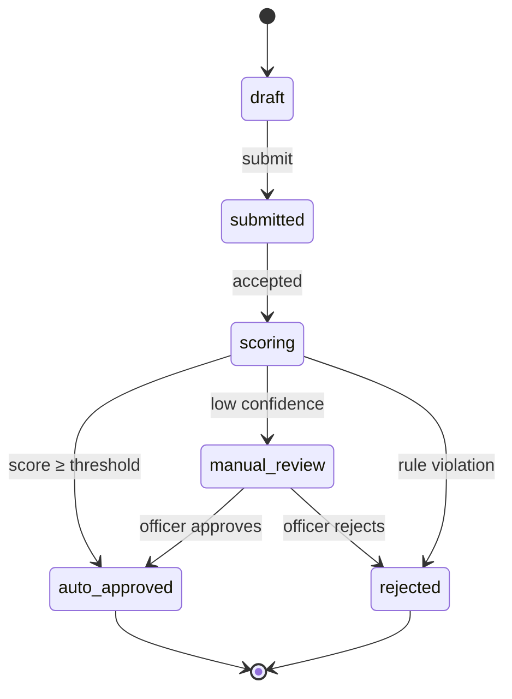

# 3.5 State machines

**Phase 3 · Phân tích** — notation, not a document of its own: it covers the lifecycle of an entity identified in [3.1](3.1-analysis-classes.md), drawn once and referenced from [3.3](3.3-class-diagrams.md) and from the table description in [4.2](4.2-data-model.md). Beside it: [3.2 sequence](3.2-sequence-diagrams.md) · [3.4 data flow](3.4-data-flow.md).

**Anything with a status column has a state machine, whether or not anyone drew it.** Draw it — invalid transitions reaching production are almost always the result of the machine living only in people's heads, where each team keeps a slightly different copy.

Tập trạng thái được nhặt từ bốn chỗ đã viết sẵn — enum trong mã, tính từ hoàn thành trong luồng, hậu điều kiện mỗi use case, chỗ kết thúc của mỗi luồng ngoại lệ — rồi dựng lưới (trạng thái × sự kiện) để lộ ra ô chưa ai quyết: [0.5 K7](0.5-derivation.md#k7--tìm-trạng-thái).

## Contents

- [Diagram](#diagram)
- [The transition table is the contract](#the-transition-table-is-the-contract)
- [The six rules that prevent a class of defects](#the-six-rules-that-prevent-a-class-of-defects)
- [Concurrency](#concurrency)
- [User-visible labels](#user-visible-labels)
- [Testing a state machine](#testing-a-state-machine)

## Diagram

State names are **the values that actually appear in the database column**, in the same case and spelling. A diagram using prettier names than the code is a translation layer that exists only in someone's head.

## The transition table is the contract

The diagram orients; the table is what engineers and testers work from, because it carries the four things the picture cannot show:

| From | Event | To | Guard | Side effects | Triggered by |
|---|---|---|---|---|---|
| `submitted` | `score_returned` | `auto_approved` | `confidence ≥ 0.8` and no rule violation | Emit `application.scored`; send email | BE |
| `manual_review` | `officer_decision` | `rejected` | Officer has `credit_officer` role | Emit `application.scored`; notify applicant | BE |

- **Guard** is the condition under which this transition, rather than another one from the same state and event, is taken. Two rows with the same `From` + `Event` and no distinguishing guard is a genuine ambiguity, not a formatting slip.
- **Side effects** are what else happens — emissions, notifications, stock movements, money. This column is why the table beats the diagram: side effects are the part that must not fire twice, and they are invisible in the picture.
- **Triggered by** names who is allowed to cause it. A transition anyone can trigger is a permission decision made by omission.

## The six rules that prevent a class of defects

State these explicitly under the table. Each one closes off a defect that otherwise ships:

| # | Question | Why it must be written |
|---|---|---|
| 1 | Which states are **terminal**? | Code that reopens a terminal state is the most common data-integrity bug in this class |
| 2 | What happens to an **event arriving in a state that does not handle it** — ignored, error, or dead-lettered? | Pick one and say so. Three teams will otherwise pick three |
| 3 | Are transitions **recorded in an audit trail**, and with what — actor, timestamp, reason? | Retrofitting history is impossible; the rows are already gone |
| 4 | Which transitions are **reversible**, and by whom? | "Cancel" that works from three states and not the fourth needs to be written down, not discovered |
| 5 | What is the **initial state**, and can a row be created in any other? | Systems that import data usually can, and that path skips every guard |
| 6 | Is there a **timeout** on any state? | A state nothing leaves without human action is a queue; say what happens when nobody acts |

## Concurrency

Two actors acting on the same entity at the same time is normal, not exotic. Say which strategy applies:

- **Optimistic** — the second write fails on a version check and the caller retries with fresh state. Then the API contract needs the version field and the `409`, which is exactly the kind of thing that gets added late and breaks clients.
- **Locked** — the entity is claimed, and then the claim needs an expiry, or an operator eventually needs a way to break it.
- **Last write wins** — a legitimate choice, but only if written down, because the losing side's side effects may already have fired.

The row to check is any transition whose side effects touch money or stock: those must be idempotent under redelivery, and the transition table is where that requirement is stated.

## User-visible labels

Add the label the user actually sees for each state, in the document's language, alongside the internal value:

| State | User sees | Where |
|---|---|---|
| `manual_review` | "Đang thẩm định" | Application list, detail header |
| `auto_approved` | "Đã duyệt" | Everywhere |

This keeps the wireframe ([4.5](4.5-ui-design.md)) and the backend using the same vocabulary, which they otherwise drift out of within one sprint — and it exposes states that have no label, which are states the user can be in without being told.

## Testing a state machine

The table is directly executable as a test plan, and this is the cheapest coverage in the whole document set. Three lists, generated from the table rather than invented:

1. **Every row** — the legal transitions, each with its guard satisfied.
2. **Every guard falsified** — the same transition attempted when the condition does not hold, asserting it is refused.
3. **The illegal grid** — every (state, event) pair *not* in the table, asserting rule 2's answer. This is the list nobody writes by hand, and it is where the defects are.

Cite these as `TC-<area>-<n>` in [6.1](6.1-test-plan.md) so the traceability table can show that a transition with no test is a transition nobody has checked.
