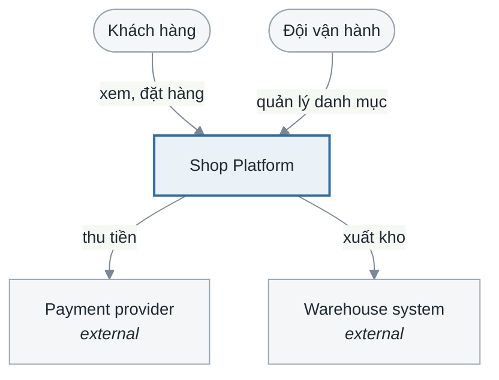
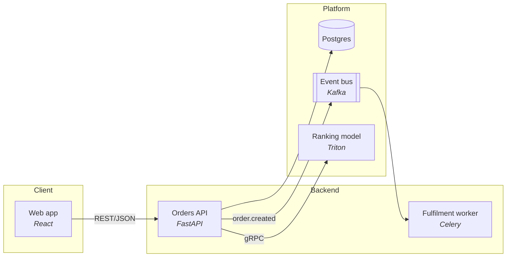
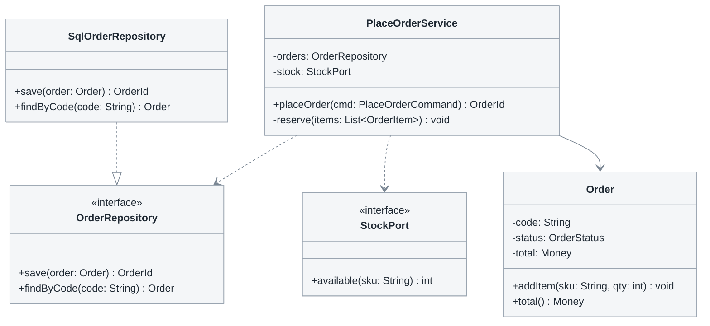

# 4.1 Thiết kế — System design

**Phase 4 · Thiết kế.** Phase 3 said which objects realise each use case without choosing a technology. This is where the choices get made: what runs, what is stored, what each class looks like, what the user sees. Everything here is *decidable* once the constraints in [1.1](1.1-problem-survey.md) and the NFRs in [2.1.5](2.1-use-cases.md#215-yêu-cầu-phi-chức-năng) are known — which is why it is written down rather than settled in four heads independently.

**The four sections and their headings are mandatory**, in this order:

| Mục | Section | Answers | Form | Deep reference |
|---|---|---|---|---|
| 4.1.1 | Kiến trúc hệ thống — C4 | Hệ thống gồm những gì chạy được, cái nào nói chuyện với cái nào | Context + container diagrams, container table | here |
| 4.1.2 | Thiết kế cơ sở dữ liệu | Dữ liệu nằm ở bảng nào, kiểu gì, ràng buộc gì | ERD + data dictionary | [4.2](4.2-data-model.md) |
| 4.1.3 | Thiết kế chi tiết lớp | Mỗi lớp có thuộc tính, phương thức, quan hệ nào | Design class diagram + per-class tables | here |
| 4.1.4 | Thiết kế giao diện | Có những màn hình nào, đi lại ra sao, mỗi màn chứa gì | Screen flow + screen specs + wireframes | [4.5](4.5-ui-design.md) |

The order is a dependency chain, not a preference: the architecture decisions decide which containers exist, containers decide where data can live, the schema decides what the classes hold, and the classes decide what a screen can ask for. Writing 4.1.4 first produces screens that need data no interface returns.

| Standard | Taken from it |
|---|---|
| **C4 model** (Simon Brown) | The four levels — System Context · Container · Component · Code — plus landscape, dynamic and deployment views. Notation-independent by design |
| **ISO/IEC/IEEE 42010** · **IEEE 1016-2009** | Design as *views* answering stated *concerns*. These four sections are four of 1016's twelve viewpoints: context and composition (4.1.1), information (4.1.2), logical (4.1.3), interface and interaction (4.1.4) |
| **UML 2.5.1** | Class diagram at design level: visibility, typed attributes, operation signatures, interfaces, packages |
| Gamma et al., *Design Patterns* (1994) | Naming a pattern instead of describing it — 1016's *patterns use* viewpoint |
| **ISO 9241-110:2020** · **ISO 9241-143:2012** · **WCAG 2.2 AA** | What a screen must decide before it is buildable — see [4.5](4.5-ui-design.md) |

**What this document is not.** When the work crosses BE / FE / AI / Data, the SDD ([4.3](4.3-detailed-design.md)) and the API contract ([4.4](4.4-api-contract.md)) are separate deliverables, not sections here. Write them when there is a boundary to agree; do not fold them in, and do not skip them because this chapter exists.

## Template

```markdown
# <Hệ thống> — Thiết kế

<metadata table>

<plain-language summary paragraph>

## 4.1.1 Kiến trúc hệ thống

### Mức khung cảnh (context)
<diagram>
<caption>

| Tác nhân / hệ thống ngoài | Vai trò | Trao đổi gì với hệ thống |
|---|---|---|

### Quyết định kiến trúc
| # | Quyết định | Lý do | Phương án đã loại |
|---|---|---|---|

### Mức container
<diagram>
<caption>

| Container | Trách nhiệm | Công nghệ | Chủ sở hữu | Thay thế được |
|---|---|---|---|---|

| Từ | Đến | Giao thức | Đồng bộ | Mục đích |
|---|---|---|---|---|

## 4.1.2 Thiết kế cơ sở dữ liệu

### Biểu đồ thực thể liên kết
<ERD>
<caption>

### Mô tả chi tiết các bảng
<một khối cho MỖI bảng, mở đầu bằng bảng tiêu đề bốn dòng>

**`product`** — <một câu: bảng này giữ cái gì>

| | |
|---|---|
| **Bắt nguồn từ** | `<<entity>>` Product (3.1) · UC-A03 |
| **Chủ sở hữu** | catalog-service |
| **Khoá chính · khoá tự nhiên** | `id` uuid · `sku` unique |
| **Xoá · lưu trữ** | Xoá mềm `deleted_at`; giữ 5 năm — BR14 |

| Cột | Kiểu | Null | Mặc định | Khoá | Ràng buộc | Đơn vị · định dạng | Ý nghĩa nghiệp vụ | Ai ghi |
|---|---|---|---|---|---|---|---|---|

### Ràng buộc và chỉ mục
| Bảng | Chỉ mục / ràng buộc | Cột | Phục vụ truy vấn nào | Vì sao |
|---|---|---|---|---|

### Quan hệ
| Từ | Đến | Bội số | Khoá ngoại | ON DELETE | ON UPDATE | Bắt nguồn từ |
|---|---|---|---|---|---|---|

## 4.1.3 Thiết kế chi tiết lớp

### Biểu đồ lớp thiết kế
<class diagram>
<caption>

### Đặc tả từng lớp
| Lớp | Gói / tầng | Trách nhiệm | Bắt nguồn từ lớp phân tích | Use case |
|---|---|---|---|---|

**`<ClassName>`** — <stereotype phân tích> · gói `<package>` · mẫu thiết kế nếu có

| Thuộc tính | Kiểu | Phạm vi | Bắt buộc | Mặc định | Bất biến · ràng buộc | Ý nghĩa |
|---|---|---|---|---|---|---|

| Phương thức | Chữ ký đầy đủ | Thao tác | Tiền điều kiện | Hậu điều kiện | Luật | Ngoại lệ | Giao dịch |
|---|---|---|---|---|---|---|---|

| Tham số | Kiểu | Bắt buộc | Ràng buộc | Ý nghĩa |
|---|---|---|---|---|
<chỉ khi tham số là một object nghiệp vụ; tham số vô hướng đã nằm trong chữ ký>

## 4.1.4 Thiết kế giao diện

### Danh sách màn hình
| # | Mã | Tên màn hình | Phân hệ | Tác nhân | Use case | Mục đích |
|---|---|---|---|---|---|---|

### Biểu đồ chuyển giữa các giao diện
<screen flow diagram>
<caption>

### Đặc tả chi tiết màn hình
<một khối bảy phần cho mỗi màn hình — xem 4.5>

### Wireframe
<wireframe per screen>

## Câu hỏi mở
## Changelog
```

Numbering continues the document number and **stops at three** ([0.1](0.1-visual-style.md#section-numbering-and-subsystem-tiers)): mục là H2 `4.1.<n>`, mục con là H3 mang tên, không số, không H4.

**Hai chỗ trong mục lục trên là thứ tự phụ thuộc, không phải thói quen** ([0.1](0.1-visual-style.md#thứ-tự-các-mục)):

- **Quyết định kiến trúc đứng trước sơ đồ container**, không phải sau. Chính các quyết định — một khối hay nhiều service, mua hay tự xây, đồng bộ hay hàng đợi — quyết định trong sơ đồ có những hộp nào. Đặt bảng quyết định xuống dưới thì người đọc thấy hình trước khi biết vì sao, còn người vẽ thì đã chốt ngầm những quyết định đó mà không viết ra. Sơ đồ khung cảnh vẫn đứng đầu vì nó chỉ vẽ ranh giới ngoài, thứ không quyết định nào ở đây đổi được.
- **Danh sách màn hình đứng trước biểu đồ chuyển màn hình.** Không vẽ được đường đi giữa những màn chưa liệt kê; [4.5](4.5-ui-design.md) chạy sáu lượt rà để đóng danh sách đó, và bản vẽ là hệ quả.

**Chạm tới một tầng thứ tư là tín hiệu tách tài liệu.** Mục 4.1.3 và 4.1.4 là hai mục lớn theo số use case, nên là hai mục duy nhất muốn chia theo phân hệ — mà chia thì đã hết chỗ đánh số. Đó là lúc chuyển chúng sang [4.3](4.3-detailed-design.md) và [4.5](4.5-ui-design.md), nơi phân hệ nằm gọn ở `4.3.<n>` và `4.5.<n>`. 4.1 giữ lại một mục tóm tắt trỏ sang.

**Split by system, not by section**: 4.1.3 and 4.1.4 split per system, 4.1.1 and 4.1.2 stay whole — two C4 diagrams of one platform, or two ERDs of one database, are two truths about one thing.

## 4.1.1 Kiến trúc hệ thống

| Level | Shows | Write it |
|---|---|---|
| 1 — Context | The system as one box, plus users and external systems | Always |
| 2 — Container | Deployable units: web app, API, worker, DB, model server | Always |
| 3 — Component | Inside one container | Only when a container is complex enough that people get lost in it |
| 4 — Code | Classes | Practically never — 4.1.3 and the code cover it |

An unmaintained component diagram is worse than none, because people trust it. A **standalone** C4 file is written instead of an inline section when the architecture has readers who will never open the rest of the design, or when level 3 diagrams start arriving; it keeps the same shape plus `Cross-cutting concerns` (authn/authz · observability · configuration and secrets · failure handling) and a `Contract` column linking each communication row to the relevant API contract — the single most useful link in the set.

Context level — the system is one box, everything else is a person or an external system:



**Sơ đồ khung cảnh và bảng tác nhân [2.1.1](2.1-use-cases.md#211-xác-định-tác-nhân) là cùng một ranh giới nhìn từ hai phía, và phải kiểm chéo hai chiều**: mọi người/hệ thống ngoài ở đây là một dòng của 2.1.1, và **không cái tên nào ở đây được xuất hiện lại trong sơ đồ container**. `Orders API` là container thì nó không bao giờ là tác nhân; `Payment provider` là tác nhân thì nó không bao giờ là container. Một cái tên nằm ở cả hai chỗ là một cái tên đứng hai bên ranh giới cùng lúc — và trong thực tế thì lỗi gần như luôn nằm ở 2.1.1, vì lúc viết use case người ta mô tả kiến trúc mình biết chứ không mô tả hộp mình chọn.

Container level — group by boundary, and keep the label pattern `Name<br/><i>tech</i>` so the technology never crowds the name:



Shape vocabulary, used consistently: `[]` service or application, `[()]` datastore, `[[]]` queue or bus, `([])` person, `{{}}` external boundary.

**Mỗi mũi tên ở mức container là một phát biểu về cơ chế lúc chạy**, không phải một nét nối cho đẹp: nó nói ai gọi ai, bằng giao thức nào, có chờ hay không. Hai chỗ hay sai và cả hai đều đọc như đúng — hai service dùng chung một database vẽ thành mũi tên gọi nhau (thực ra chúng ghép nhau qua schema, không có lượt gọi nào), và một lượt publish vào hàng đợi vẽ thành mũi tên thẳng tới consumer (mất cả hàng đợi lẫn khả năng phát lại). Năm câu hỏi phải trả lời trước khi vẽ: [0.6](0.6-mechanism.md#năm-câu-hỏi-cơ-chế).

**Detail in proportion.** An architecture document is meant to be uneven — spend words where the reader could not recover the information by reading code: a permanent component gets its own subsection (what it assumes about the rest of the system, what depends on those assumptions, and what its absence looks like in user-visible terms); an expensive one gets a container row plus an ADR link plus its interface contract; a cheap one gets one row.

**AI and data containers** extend the vocabulary rather than being forced into "service": model serving is a container and its name **and version** go in the table, because "which model version was live" is the first question when output quality changes; training and batch pipelines get a `Trigger` column (`hourly`, `on merge to main`, `manual`) instead of a scale trigger; feature stores and warehouses are datastores and get an entry in [4.2](4.2-data-model.md).

### One-way doors

Most architectural choices can be undone. A few cannot, and those are what an architecture document exists to record — not because they are biggest, but because they are the only ones where a wrong assumption is unrecoverable.

| # | Decision | Baked into | Replacing it costs | Would only change if | Decided by |
|---|---|---|---|---|---|
| D1 | One database per service, no shared schema | Every query, every migration, the ownership model | Rewrite of both services' data access; a migration with no rollback | Cross-service joins became a hard requirement | Arch review, 2026-03 |
| D2 | Order ID is a UUID minted by BE | URLs, exported files, the partner integration, every log line | Every stored ID and every external reference already handed out | Never, realistically | BE lead |
| D3 | Prices stored in minor units as integers | Pricing engine, API contracts, all reports | Re-deriving history; rounding differences visible to finance | A currency with different minor units was added | Arch review |

- **`Baked into`** turns "we could swap it later" into a testable claim, and usually ends the conversation.
- **`Replacing it costs`** in work and risk, not adjectives. "A migration with no rollback" is information; "difficult" is not.
- **`Would only change if`** is the trigger. A decision with a stated trigger gets revisited when the trigger fires; one without gets revisited when someone is annoyed, or never.
- **`Decided by`** — without it the decision has the authority of whoever last edited the file.

Six rows is a lot. If the honest answer to `Replacing it costs` is "a week for one team", it is not a one-way door and belongs in the decisions table or an ADR. Every container marked `permanent` in the container table has a row here or is missing one.

## 4.1.2 Thiết kế cơ sở dữ liệu

**This is where the ERD lives, and it is the only place it lives.** Phase 3 produced the input: the `<<entity>>` classes of [3.1](3.1-analysis-classes.md), their multiplicity in [3.3](3.3-class-diagrams.md), and the data stores of [3.4](3.4-data-flow.md).

Start from one default and treat every deviation as a decision: **one `<<entity>>` class becomes one table.**

| Deviation | Khi nào chính đáng | Phải ghi lại |
|---|---|---|
| Một lớp → nhiều bảng | Thuộc tính tách theo vòng đời hoặc tần suất đọc | Bảng nào là chủ, join bằng khoá nào |
| Nhiều lớp → một bảng | Kế thừa, hoặc hai lớp thực chất là một thứ | Cột phân biệt kiểu, ràng buộc nào chỉ áp cho một kiểu |
| Bảng không có lớp nào | Bảng kỹ thuật: nhật ký, hàng đợi, khoá phiên bản | Nó phục vụ yêu cầu phi chức năng nào |
| Phi chuẩn hoá có chủ ý | Đã đo và biết truy vấn nào chậm | Ai giữ hai bản đồng bộ, lệch thì bên nào đúng |

What the section must decide, and analysis deliberately did not:

- **Khoá chính**: surrogate (`uuid`, `bigserial`) hay khoá nghiệp vụ. Khoá nghiệp vụ đẹp cho tới ngày nghiệp vụ đổi — mã sản phẩm bị đánh lại là chuyện thường, và khi đó mọi khoá ngoại đi theo.
- **Khoá ngoại và `ON DELETE`**: mỗi quan hệ hợp thành (`*--`) ở [3.3](3.3-class-diagrams.md) phải trả lời xoá cha thì con ra sao. Bỏ trống là chọn `NO ACTION` mà không biết mình đang chọn.
- **Kiểu, `NULL`, mặc định** cho từng cột, cộng đơn vị cho tiền và múi giờ cho thời gian.
- **Bảng nào thuộc service nào**, khi 4.1.1 có nhiều hơn một database. Một bảng hai chủ sở hữu là một sự cố chưa xảy ra.
- **Lưu bao lâu, xoá theo nghĩa vụ nào** — rẻ nhất là quyết ở đây, đắt nhất là quyết sau khi đã có dữ liệu thật.

**Chín cột của bảng mô tả là chín quyết định, không phải chín ô để điền cho đủ.** Bốn cột hay bị bỏ nhất là bốn cột đắt nhất về sau:

| Cột | Bỏ trống thì | Viết thế nào |
|---|---|---|
| `Ràng buộc` | Luật nghiệp vụ chỉ sống trong mã ứng dụng, và dữ liệu sai đi vào qua đường nhập liệu hay script | `CHECK (price >= 0)` · `UNIQUE (sku) WHERE deleted_at IS NULL` · trích `BR<n>` |
| `Đơn vị · định dạng` | Tiền lệch 100 lần, thời gian lệch múi giờ, và cả hai chỉ lộ ra ở báo cáo | *"đồng, số nguyên"* · *"UTC, độ mịn giây"* · *"ISO 4217"* |
| `Ai ghi` | Ba đường ghi vào cùng một cột và không ai biết bên nào đúng | Tên thao tác `UC-A03.T3`, tên job, hoặc *"chỉ DB sinh"* |
| `Ý nghĩa nghiệp vụ` | Data dictionary lặp lại đúng cái kiểu đã viết ở cột bên cạnh | Nói *cái gì*, không nói *kiểu gì*: *"Số tiền khách thực trả sau mọi khuyến mãi"* |

**Bốn cột kỹ thuật phải được quyết một lần cho cả schema**, ở phần đầu mục, chứ không quyết lại từng bảng: khoá chính là gì · thời gian lưu kiểu nào và múi nào · **xoá mềm hay xoá cứng** (và nếu mềm thì mọi `UNIQUE` phải tính tới `deleted_at`, mọi truy vấn phải lọc, và [0.7](0.7-operations.md) có thêm một thao tác *khôi phục*) · **cột audit** (`created_at`, `created_by`, `updated_at`, `updated_by`) có hay không. Bảng nào lệch khỏi quyết định chung thì nói rõ vì sao ngay trong khối tiêu đề của nó.

**Ma trận CRUD là lượt kiểm phủ của mục này**, chạy giữa bảng ở đây và bảng thao tác ở [2.1.4](2.1-use-cases.md#214-đặc-tả-sử-dụng) ([0.5 K4](0.5-derivation.md#k4--ma-trận-crud)): hàng không có `C` là dữ liệu không biết từ đâu ra, hàng chỉ có `R` là bảng tra cứu hoặc là cả một nhóm thao tác quản trị bị quên, hàng không có `D` và không có chính sách lưu trữ là giữ mãi mãi do bỏ sót.

[4.2](4.2-data-model.md) carries the ERD template and the data dictionary rules. Write section 2 inline while the schema is small; split it out the moment the field tables outgrow the design document, which happens sooner than expected.

## 4.1.3 Thiết kế chi tiết lớp

Analysis said what each object is responsible for. Design says what a developer types. The mapping is mechanical enough to start from, and each row is where a decision gets made rather than discovered:

**Đầu vào là đặc tả use case, không phải trí nhớ.** Mở [2.1.4](2.1-use-cases.md#214-đặc-tả-sử-dụng) cạnh tài liệu này và đọc từng use case: mỗi **tiền điều kiện** thành một phép kiểm ở đầu phương thức, mỗi **bước luồng chính** thành một lệnh gọi, mỗi **luồng ngoại lệ đã đánh số** thành một `Ngoại lệ` trong bảng phương thức, mỗi **hậu điều kiện** thành thứ phương thức phải bảo đảm khi trả về, và mỗi **luật nghiệp vụ** được trích mã (`BR3`) chứ không chép lại. Một phương thức không có ngoại lệ nào trong khi use case của nó có ba luồng thay thế là một phương thức chưa đọc use case của mình.

| Lớp phân tích | Thường thành gì | Quyết định thật nằm ở |
|---|---|---|
| `<<boundary>>` với tác nhân người | Màn hình / component + controller hoặc route handler | Cắt ở đâu giữa hiển thị và điều phối |
| `<<boundary>>` với hệ thống ngoài | Adapter / client, sau một interface | Interface đó thuộc về mình hay nhà cung cấp |
| `<<control>>` | Service hoặc use-case class | Giao dịch bắt đầu và kết thúc ở đâu |
| `<<entity>>` | Lớp miền + repository (hoặc ORM model) | Luật nghiệp vụ nằm trong lớp miền hay trong service |



Lớp thiết kế của UC-01. `PlaceOrderService` là hiện thân của lớp `<<control>>` cùng tên ở phân tích; nó phụ thuộc vào **interface** `OrderRepository` và `StockPort`, bản cài đặt SQL nằm ở tầng ngoài — nhờ vậy đổi kho lưu trữ không chạm vào luồng đặt hàng. Sơ đồ không vẽ getter/setter và không vẽ thân phương thức.

- **Mọi lớp đều có phạm vi và kiểu.** `+` public · `-` private · `#` protected · `~` package; phương thức viết đủ chữ ký `+placeOrder(cmd: PlaceOrderCommand) OrderId`. Chữ ký chính là hợp đồng — thiếu kiểu trả về thì hai người gọi sẽ giả định hai thứ khác nhau.
- **Phụ thuộc trỏ vào interface, không trỏ vào bản cài đặt** — ở đúng những chỗ bên kia có thể thay (kho lưu trữ, cổng thanh toán, hệ thống ngoài, mô hình). Một interface có đúng một bản cài đặt và mãi như thế là gián tiếp không mua được gì.
- **Gọi tên mẫu thiết kế thay vì mô tả nó**: *"`OrderRepository` là Repository; `PricingStrategy` là Strategy"* — một dòng, và người đọc biết ngay cấu trúc lẫn chỗ mở rộng.
- **Phụ thuộc giữa các gói chỉ đi một chiều.** Một chu trình là lỗi thiết kế, không phải chi tiết cài đặt: hai gói đó không build, test hay thay thế độc lập được. Vẽ sơ đồ gói riêng từ bốn gói trở lên.
- **Mọi thuộc tính nói được sáu thứ**: kiểu · phạm vi · bắt buộc hay không · mặc định · bất biến hay ràng buộc còn đúng suốt vòng đời · ý nghĩa nghiệp vụ. Cột `Bất biến · ràng buộc` là cột hay trống nhất và là cột duy nhất nói được *khi nào một đối tượng ở trạng thái không hợp lệ* — `total ≥ 0`, `status ∈ {draft, active, archived}`, `deleted_at chỉ đặt một lần`. Thiếu nó thì luật đó sẽ được viết lại ba lần ở ba tầng, mỗi lần một kiểu.
- **Chi tiết theo tỉ lệ — theo *lớp*, không theo *cột*.** Lớp mang luật nghiệp vụ được một khối đầy đủ; lớp CRUD thuần được **một dòng** ở bảng tổng. Nhưng lớp nào đã được một khối thì khối đó điền đủ cột: bỏ bớt cột không tiết kiệm được gì cho người đọc, nó chỉ chuyển câu hỏi sang lúc code. Một tài liệu đặc tả mọi lớp cùng độ sâu đã không nói được chỗ nào không được làm sai.
- **Mỗi lớp thiết kế truy được về một lớp phân tích, hoặc được khai là lớp kỹ thuật** kèm yêu cầu phi chức năng nó phục vụ. Lớp không truy được về đâu cả là phạm vi tự đến.

- **Lớp hiện thực một use case nhiều thao tác có một phương thức public cho mỗi `T<n>`** của bảng thao tác ([2.1.4](2.1-use-cases.md#214-đặc-tả-sử-dụng), [0.7](0.7-operations.md)). `ProductService` có `create`, `update`, `changeStatus`, `softDelete`, `restore` — không có `manage`. Cột `Thao tác` của bảng phương thức mang chính mã đó, và đó là chỗ đếm được: **số phương thức public ≥ số `T<n>` đã khai**, thiếu một là một thao tác không có chỗ nào cài.

Bảng phương thức có tám cột, và mỗi cột chặn một câu hỏi mà người gọi nếu không đọc được sẽ tự trả lời sai:

| Phương thức | Chữ ký đầy đủ | Thao tác | Tiền điều kiện | Hậu điều kiện | Luật | Ngoại lệ | Giao dịch |
|---|---|---|---|---|---|---|---|
| `create` | `+create(cmd: CreateProductCommand): ProductId` | T3 | Người gọi có `product:write` | Bản ghi `draft` đã commit; `sku` là duy nhất | BR3, BR7 | `SkuDuplicated`, `ValidationFailed` | Mở ở đây, một giao dịch |
| `softDelete` | `+softDelete(id: ProductId, reason: String): void` | T6 | Không đơn mở nào tham chiếu | `deleted_at` đã đặt; biến khỏi mọi truy vấn danh sách | BR12 | `ProductReferenced`, `ProductNotFound` | Mở ở đây |
| `reserve` | `-reserve(items: List~OrderItem~): void` | — | Đang trong giao dịch của `create` | Tồn đã bị giữ | BR9 | `OutOfStock` | Tham gia giao dịch của bên gọi |

- **Cột `Ngoại lệ` là cột bị bỏ nhiều nhất và là cột người gọi cần nhất**: một thao tác không nói được nó hỏng kiểu gì là một thao tác mà mỗi người gọi xử lý một kiểu. Mỗi tên ngoại lệ ở đây phải là **một** luồng ngoại lệ đã đánh số ở [2.1.4](2.1-use-cases.md#214-đặc-tả-sử-dụng) và trở thành **một** mã lỗi ở [4.4](4.4-api-contract.md) — chuỗi đó không được đứt ([0.7](0.7-operations.md#ngoại-lệ-thành-mã-lỗi)). Gom hết vào một `Exception` chung là làm tầng trên mất khả năng phân biệt, và mọi lỗi hiện ra thành cùng một câu.
- **Cột `Giao dịch` nói ranh giới, không nói công nghệ**: mở ở đây · tham gia giao dịch của bên gọi · không cần giao dịch · phải chạy ngoài giao dịch (gửi mail, gọi hệ ngoài). Hai phương thức cùng mở giao dịch mà gọi lồng nhau là một lỗi chỉ lộ ra khi rollback.
- **`Tiền điều kiện` và `Hậu điều kiện` chép từ use case, không nghĩ lại**: tiền điều kiện thành phép kiểm ở đầu phương thức, hậu điều kiện thành thứ phương thức bảo đảm khi trả về. Một phương thức không có ngoại lệ nào trong khi use case của nó có ba luồng thay thế là một phương thức chưa đọc use case của mình.
- **Thao tác lặp lại được thì nói rõ**: `create` gọi hai lần có tạo hai bản ghi không, và nếu không thì khoá idempotency là gì. Đây là chỗ rẻ nhất để quyết, và [4.4](4.4-api-contract.md) chỉ chép lại.
- Where a method implements a business rule, cite it (`BR3`) instead of restating the logic.

## 4.1.4 Thiết kế giao diện

| Mục | Nội dung | Trả lời | Hình thức |
|---|---|---|---|
| Mục con | Nội dung | Trả lời | Hình thức |
|---|---|---|---|
| 1 | Danh sách màn hình | Có những màn nào, của ai, phục vụ use case nào | Một bảng, đóng bằng sáu lượt rà của [4.5](4.5-ui-design.md) |
| 2 | Biểu đồ chuyển giữa các giao diện | Đi từ màn nào tới màn nào, bằng thao tác gì | Một sơ đồ mỗi luồng lớn |
| 3 | Đặc tả chi tiết màn hình | Mỗi màn chứa gì, lấy dữ liệu từ đâu, hỏng thì hiện gì | Khối bảy phần mỗi màn |
| 4 | Wireframe / mockup | Bố cục thực tế trông ra sao | Một hình mỗi màn, độ chi tiết thấp |

**Nghĩ ra đủ màn hình là việc khó nhất của mục này**, và nó có cùng dạng với việc tìm đủ use case: danh sách hiển nhiên luôn thiếu đúng những màn không ai demo — đăng nhập, trạng thái rỗng, xác nhận trước khi xoá, mất mạng, màn hình một tác nhân chỉ vào một lần trong đời. [4.5](4.5-ui-design.md) carries the six discovery passes, the screen specification template and the standards; this section is where their output lands.

**Đầu vào cũng là đặc tả use case.** Với mỗi use case ở [2.1.4](2.1-use-cases.md#214-đặc-tả-sử-dụng): mỗi bước luồng chính mà **tác nhân** thực hiện cần một chỗ để thực hiện nó, mỗi bước **hệ thống** thực hiện cần một trạng thái hiển thị (đang chạy, xong, hỏng), mỗi luồng ngoại lệ cần một thông báo cụ thể chứ không phải một toast chung, và mỗi tiền điều kiện cần một câu trả lời cho *"khách chưa thoả thì thấy gì"*. Đó là cách một danh sách màn hình được **suy ra** thay vì được nhớ ra.

Three rules belong here because they are about the *seam* with the rest of the design:

- **Mỗi màn hình truy về ≥ 1 use case, mỗi use case có ≥ 1 màn hình** — trừ use case chạy bằng lịch hoặc do hệ thống ngoài gọi, và những ca đó phải được liệt kê chứ không im lặng bỏ qua.
- **Mỗi phần tử hiển thị dữ liệu phải nêu nguồn**: một field của một endpoint ở [4.4](4.4-api-contract.md), một cột ở 4.1.2, hoặc một biểu thức viết đủ. Phần tử không có nguồn là chỗ rẻ nhất để phát hiện hợp đồng còn thiếu field.
- **Wireframe không phải mockup.** Wireframe quyết định *có gì và ở đâu*; mockup quyết định *trông thế nào*. Trộn hai thứ làm review lệch sang thẩm mỹ trước khi hành vi được chốt.

## Self-check before publishing

| # | Check | Fails when |
|---|---|---|
| 0 | **Không cái tên nào có mặt ở cả bảng khung cảnh lẫn bảng container**, và bảng khung cảnh trùng [2.1.1](2.1-use-cases.md#211-xác-định-tác-nhân) | Một cái tên đứng hai bên ranh giới cùng lúc |
| 1 | Every container has an owner, a technology and a `Thay thế được` value | An architecture picture nobody is accountable for |
| 2 | Every arrow names a protocol and appears in the communication table | A dependency that exists in the drawing and nowhere else |
| 3 | Every `<<entity>>` class maps to a table, or its absence is explained | Schema and analysis have drifted apart |
| 4 | Every column has a type, nullability, unit/format, a business-terms description **and who writes it** | A data dictionary that only repeats the type |
| 5 | Every foreign key states its `ON DELETE` behaviour | Orphan rows, or a delete that fails in production first |
| 6 | Every design class traces to an analysis class or is declared technical with its NFR | Scope that arrived without being asked for |
| 7 | Every operation has a full signature — parameter types, return type, exceptions | Two callers assuming two different contracts |
| 7b | **Đếm**: số phương thức public ≥ số `T<n>` của bảng thao tác ở [2.1.4](2.1-use-cases.md#214-đặc-tả-sử-dụng) | Một `manage()` thay cho năm thao tác, và năm endpoint biến mất theo |
| 7c | Mọi phương thức ghi đã quyết ranh giới giao dịch và có lặp lại được không | Rollback lồng nhau, hoặc một lần retry thành hai bản ghi |
| 7d | Xoá mềm hay xoá cứng đã quyết một lần cho cả schema, và mọi `UNIQUE` tính tới nó | Trùng khoá sau khi xoá, hoặc không xoá lại tạo lại được |
| 8 | No dependency cycle between packages | Packages that cannot be built or replaced independently |
| 9 | Every screen maps to ≥ 1 use case and every use case to ≥ 1 screen or a stated reason | A screen nobody asked for, or a use case with no way to perform it |
| 10 | Every displayed element names its data source | A contract gap found during implementation instead of review |
| 11 | Depth is uneven — full detail on what cannot be undone, one row on what can | A document that spent its words evenly and said nothing about risk |
| 12 | Every NFR is designed for here or cited to [4.3](4.3-detailed-design.md) | Quality requirements agreed in phase 2 and never designed for |
| 13 | Mỗi luồng ngoại lệ đã đánh số ở [2.1.4](2.1-use-cases.md#214-đặc-tả-sử-dụng) xuất hiện dưới dạng một ngoại lệ của phương thức **và** một thông báo trên màn hình | Thiết kế viết từ trí nhớ chứ không từ đặc tả use case |
| 14 | Số hiệu dừng ở `4.1.<n>`; mục con là H3 mang tên, không số, không H4 | Numbering that no longer says where in the set a section lives |
| 15 | Bảng quyết định kiến trúc đứng **trước** sơ đồ container; danh sách màn hình đứng **trước** biểu đồ chuyển màn hình | A picture published above the thing that decided its shape |

## Common mistakes

| Mistake | Instead |
|---|---|
| Redrawing the analysis class diagram with types added | Interfaces, packages, patterns, signatures — what analysis deliberately left open |
| A second ERD, different from [4.2](4.2-data-model.md)'s | One ERD, here, referenced everywhere else |
| Component diagrams for every container | Level 3 only where a container is genuinely hard to navigate |
| An interface per class | Interfaces where the other side can actually be swapped |
| Screens invented while writing wireframes | Derive from use cases, then run the passes in [4.5](4.5-ui-design.md) |
| Wireframes drawn at mockup fidelity | Low fidelity on purpose; the mockup comes after behaviour is agreed |
| Technology chosen and never justified | The decisions table above the container diagram, and one-way doors for the irreversible few |
