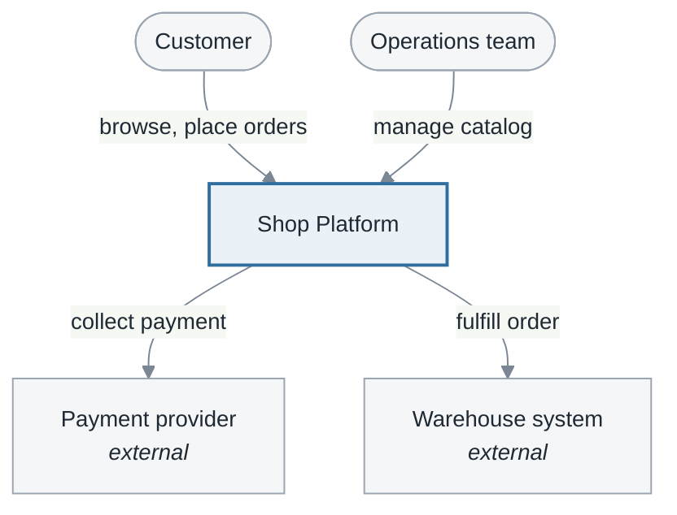
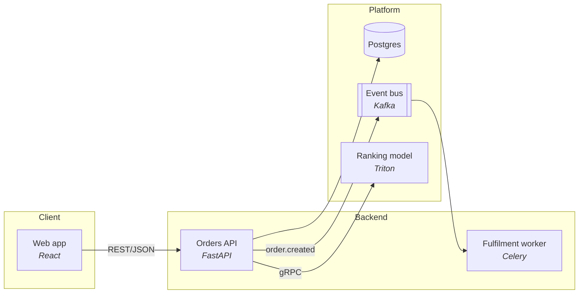
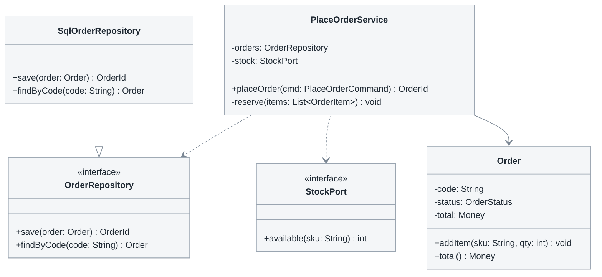

# 4.1 System design

**Phase 4 · Design.** Phase 3 said which objects realize each use case without choosing a technology. This is where the choices get made: what runs, what is stored, what each class looks like, and what the user sees. Everything here is *decidable* once the constraints in [1.1](1.1-problem-survey.md) and the NFRs in [2.4](2.4-nfr.md) are known—which is why it is written down rather than settled independently in four people's heads.

**The four sections and their headings are mandatory**, in this order:

| No. | Section | Answers | Form | Deep reference |
|---|---|---|---|---|
| 4.1.1 | System architecture — C4 | Which deployable units the system contains and which communicate | Context + container diagrams, container table | here |
| 4.1.2 | Database design | Which tables hold the data, with what types and constraints | ERD + data dictionary | [4.2](4.2-data-model.md) |
| 4.1.3 | Detailed class design | Which attributes, methods, and relationships each class has | Design class diagram + per-class tables | here |
| 4.1.4 | Interface design | Which screens exist, how users navigate, and what each screen contains | Screen flow + screen specs + wireframes | [4.5](4.5-ui-design.md) |

The order is a dependency chain, not a preference: the architecture decisions decide which containers exist, containers decide where data can live, the schema decides what the classes hold, and the classes decide what a screen can ask for. Writing 4.1.4 first produces screens that need data no interface returns.

| Standard | Taken from it |
|---|---|
| **C4 model** (Simon Brown) | The four levels — System Context · Container · Component · Code — plus landscape, dynamic and deployment views. Notation-independent by design |
| **ISO/IEC/IEEE 42010** · **IEEE 1016-2009** | Design as *views* answering stated *concerns*. These four sections are four of 1016's twelve viewpoints: context and composition (4.1.1), information (4.1.2), logical (4.1.3), interface and interaction (4.1.4) |
| **UML 2.5.1** | Class diagram at design level: visibility, typed attributes, operation signatures, interfaces, packages |
| Gamma et al., *Design Patterns* (1994) | Naming a pattern instead of describing it — 1016's *patterns use* viewpoint |
| **ISO 9241-110:2020** · **ISO 9241-143:2012** · **WCAG 2.2 AA** | What a screen must decide before it is buildable — see [4.5](4.5-ui-design.md) |

**What this document is not.** When the work crosses BE / FE / AI / Data, the SDD ([4.3](4.3-detailed-design.md)) and the API contract ([4.4](4.4-api-contract.md)) are separate deliverables, not sections here. Write them when there is a boundary to agree; do not fold them in, and do not skip them because this chapter exists.

## Template

```markdown
# <System> — Design

<metadata table>

<plain-language summary paragraph>

## 4.1.1 System architecture

### Context level
<diagram>
<caption>

| Actor / external system | Role | Exchange with the system |
|---|---|---|

### Architecture decisions
| # | Decision | Rationale | Rejected alternatives |
|---|---|---|---|

### Container level
<diagram>
<caption>

| Container | Responsibility | Technology | Owner | Replaceability |
|---|---|---|---|---|

| From | To | Protocol | Synchronous | Purpose |
|---|---|---|---|---|

## 4.1.2 Database design

### Entity-relationship diagram
<ERD>
<caption>

### Detailed table descriptions
<one block for EVERY table, starting with a four-row header table>

**`product`** — <one sentence: what this table stores>

| | |
|---|---|
| **Derived from** | `<<entity>>` Product (3.1) · UC-A03 |
| **Owner** | catalog-service |
| **Primary key · natural key** | `id` uuid · `sku` unique |
| **Deletion · retention** | Soft-delete with `deleted_at`; retain for 5 years — BR14 |

| Column | Type | Null | Default | Key | Constraint | Unit · format | Business meaning | Writer |
|---|---|---|---|---|---|---|---|---|

### Constraints and indexes
| Table | Index / constraint | Columns | Query served | Rationale |
|---|---|---|---|---|

### Relationships
| From | To | Multiplicity | Foreign key | ON DELETE | ON UPDATE | Derived from |
|---|---|---|---|---|---|---|

## 4.1.3 Detailed class design

### Design class diagram
<class diagram>
<caption>

### Per-class specifications
| Class | Package / layer | Responsibility | Derived from analysis class | Use case |
|---|---|---|---|---|

**`<ClassName>`** — <analysis stereotype> · package `<package>` · design pattern, if any

| Attribute | Type | Visibility | Required | Default | Invariant · constraint | Meaning |
|---|---|---|---|---|---|---|

| Method | Full signature | Operation | Preconditions | Postconditions | Rules | Exceptions | Transaction |
|---|---|---|---|---|---|---|---|

| Parameter | Type | Required | Constraint | Meaning |
|---|---|---|---|---|
<only when the parameter is a business object; scalar parameters already appear in the signature>

## 4.1.4 Interface design

### Screen inventory
| # | ID | Screen name | Subsystem | Actor | Use case | Purpose |
|---|---|---|---|---|---|---|

### Screen-flow diagram
<screen flow diagram>
<caption>

### Detailed screen specifications
<one seven-part block per screen—see 4.5>

### Wireframe
<wireframe per screen>

## Open questions
## Changelog
```

Numbering continues the document number and **stops at three** ([0.1](0.1-visual-style.md#section-numbering-and-subsystem-tiers)): sections are H2 headings numbered `4.1.<n>`; subsections are named, unnumbered H3 headings; do not use H4.

**Two placements in the outline above express dependency order, not convention** ([0.1](0.1-visual-style.md#section-order)):

- **Architecture decisions appear before the container diagram**, not after it. Those decisions—monolith or services, buy or build, synchronous calls or queues—determine which boxes appear in the diagram. Placing the decision table below makes readers see the result before its rationale, while the author silently commits to unwritten choices. The context diagram remains first because it shows only the external boundary, which none of these decisions changes.
- **The screen inventory appears before the screen-flow diagram.** You cannot draw navigation among screens that have not been listed; [4.5](4.5-ui-design.md) runs six discovery passes to close that inventory, and the diagram follows from it.

**Reaching a fourth level signals that the document should be split.** Sections 4.1.3 and 4.1.4 grow with the number of use cases, so they are the only sections likely to require subsystem splits—and no numbering depth remains. Move them to [4.3](4.3-detailed-design.md) and [4.5](4.5-ui-design.md), where subsystems fit naturally under `4.3.<n>` and `4.5.<n>`. Keep only a linked summary in 4.1.

**Split by system, not by section**: 4.1.3 and 4.1.4 split per system, 4.1.1 and 4.1.2 stay whole — two C4 diagrams of one platform, or two ERDs of one database, are two truths about one thing.

## 4.1.1 System architecture

| Level | Shows | Write it |
|---|---|---|
| 1 — Context | The system as one box, plus users and external systems | Always |
| 2 — Container | Deployable units: web app, API, worker, DB, model server | Always |
| 3 — Component | Inside one container | Only when a container is complex enough that people get lost in it |
| 4 — Code | Classes | Practically never — 4.1.3 and the code cover it |

An unmaintained component diagram is worse than none, because people trust it. A **standalone** C4 file is written instead of an inline section when the architecture has readers who will never open the rest of the design, or when level 3 diagrams start arriving; it keeps the same shape plus `Cross-cutting concerns` (authn/authz · observability · configuration and secrets · failure handling) and a `Contract` column linking each communication row to the relevant API contract — the single most useful link in the set.

Context level — the system is one box, everything else is a person or an external system:



**The context diagram and the [2.1.1](2.1-actors-and-use-cases.md#211-identify-actors) actor table show the same boundary from opposite sides and must be cross-checked in both directions**: every person or external system here is a row in 2.1.1, and **no name here may reappear in the container diagram**. If `Orders API` is a container, it is never an actor; if `Payment provider` is an actor, it is never a container. A name in both places stands on both sides of the boundary at once. In practice, the error is almost always in 2.1.1 because use case authors describe the architecture they know rather than the box they selected.

Container level — group by boundary, and keep the label pattern `Name<br/><i>tech</i>` so the technology never crowds the name:



Shape vocabulary, used consistently: `[]` service or application, `[()]` datastore, `[[]]` queue or bus, `([])` person, `{{}}` external boundary.

**Every container-level arrow asserts a runtime mechanism**, not a decorative connection: it says who calls whom, through which protocol, and whether the caller waits. Two common errors both look plausible: drawing an arrow between two services that share a database, even though they are coupled through the schema and no call occurs; and drawing a queue publication directly to the consumer, which hides both the queue and replay behavior. Answer the [five mechanism questions](0.6-mechanism.md#the-five-mechanism-questions) before drawing.

**Detail in proportion.** An architecture document is meant to be uneven — spend words where the reader could not recover the information by reading code: a permanent component gets its own subsection (what it assumes about the rest of the system, what depends on those assumptions, and what its absence looks like in user-visible terms); an expensive one gets a container row plus an ADR link plus its interface contract; a cheap one gets one row.

**AI and data containers** extend the vocabulary rather than being forced into "service": model serving is a container and its name **and version** go in the table, because "which model version was live" is the first question when output quality changes; training and batch pipelines get a `Trigger` column (`hourly`, `on merge to main`, `manual`) instead of a scale trigger; feature stores and warehouses are datastores and get an entry in [4.2](4.2-data-model.md).

### One-way doors

Most architectural choices can be undone. A few cannot, and those are what an architecture document exists to record — not because they are biggest, but because they are the only ones where a wrong assumption is unrecoverable.

| # | Decision | Baked into | Replacing it costs | Would only change if | Decided by |
|---|---|---|---|---|---|
| D1 | One database per service, no shared schema | Every query, every migration, the ownership model | Rewrite of both services' data access; a migration with no rollback | Cross-service joins became a hard requirement | Arch review, 2026-03 |
| D2 | Order ID is a UUID minted by BE | URLs, exported files, the partner integration, every log line | Every stored ID and every external reference already handed out | Never, realistically | BE lead |
| D3 | Prices stored in minor units as integers | Pricing engine, API contracts, all reports | Re-deriving history; rounding differences visible to finance | A currency with different minor units was added | Arch review |

- **`Baked into`** turns "we could swap it later" into a testable claim, and usually ends the conversation.
- **`Replacing it costs`** in work and risk, not adjectives. "A migration with no rollback" is information; "difficult" is not.
- **`Would only change if`** is the trigger. A decision with a stated trigger gets revisited when the trigger fires; one without gets revisited when someone is annoyed, or never.
- **`Decided by`** — without it the decision has the authority of whoever last edited the file.

Six rows is a lot. If the honest answer to `Replacing it costs` is "a week for one team", it is not a one-way door and belongs in the decisions table or an ADR. Every container marked `permanent` in the container table has a row here or is missing one.

## 4.1.2 Database design

**This is where the ERD lives, and it is the only place it lives.** Phase 3 produced the input: the `<<entity>>` classes of [3.1](3.1-analysis-classes.md), their multiplicity in [3.3](3.3-class-diagrams.md), and the data stores of [3.4](3.4-data-flow.md).

Start from one default and treat every deviation as a decision: **one `<<entity>>` class becomes one table.**

| Deviation | When justified | What to record |
|---|---|---|
| One class → many tables | Attributes have different lifecycles or read frequencies | Which table is authoritative and which key joins them |
| Many classes → one table | Inheritance, or two classes are actually one concept | Type discriminator and constraints specific to each type |
| A table with no class | Technical table: log, queue, or version lock | Which non-functional requirement it serves |
| Intentional denormalization | Measurement identified a slow query | Who synchronizes the copies and which one wins when they diverge |

What the section must decide, and analysis deliberately did not:

- **Primary key**: surrogate (`uuid`, `bigserial`) or business key. Business keys look elegant until the business changes—product codes are reassigned routinely, and every foreign key then follows.
- **Foreign keys and `ON DELETE`**: every composition relationship (`*--`) in [3.3](3.3-class-diagrams.md) must state what happens to children when the parent is deleted. Leaving it blank silently selects `NO ACTION`.
- **Type, `NULL`, and default** for every column, plus units for money and time zones for timestamps.
- **Which service owns each table** when 4.1.1 contains more than one database. A table with two owners is an incident waiting to happen.
- **Retention period and deletion obligation**—cheapest to decide here and most expensive after real data exists.

**The description table's nine columns represent nine decisions, not nine cells to fill mechanically.** The four most often omitted are the four most expensive later:

| Column | If left blank | How to write it |
|---|---|---|
| `Constraint` | Business rules live only in application code, allowing invalid data through imports or scripts | `CHECK (price >= 0)` · `UNIQUE (sku) WHERE deleted_at IS NULL` · cite `BR<n>` |
| `Unit · format` | Money is off by 100×, timestamps use the wrong time zone, and both errors surface only in reports | *"VND, integer"* · *"UTC, second precision"* · *"ISO 4217"* |
| `Writer` | Three paths write the same column and nobody knows which is authoritative | Operation ID `UC-A03.T3`, job name, or *"database-generated only"* |
| `Business meaning` | The data dictionary merely repeats the type in the adjacent column | Say *what it means*, not *what type it is*: *"Amount the customer actually pays after all promotions"* |

**Four technical conventions must be decided once for the entire schema** at the start of the section, not table by table: primary-key strategy; timestamp type and time zone; **soft or hard deletion** (with soft deletion, every `UNIQUE` must account for `deleted_at`, every query must filter it, and [0.7](0.7-operations.md) gains a *restore* operation); and whether **audit columns** (`created_at`, `created_by`, `updated_at`, `updated_by`) are required. Explain any table-level deviation in that table's header block.

**The CRUD matrix is this section's coverage check**, comparing the tables here against the operation matrices in [2.3](2.3-use-case-specs.md) ([0.5 K4](0.5-derivation.md#k4-the-crud-matrix)). A row without `C` represents data with no known origin; an `R`-only row is either reference data or a forgotten set of administration operations; a row with neither `D` nor a retention policy is retained forever by omission.

[4.2](4.2-data-model.md) carries the ERD template and the data dictionary rules. Write section 2 inline while the schema is small; split it out the moment the field tables outgrow the design document, which happens sooner than expected.

## 4.1.3 Detailed class design

Analysis said what each object is responsible for. Design says what a developer types. The mapping is mechanical enough to start from, and each row is where a decision gets made rather than discovered:

**The input is the use case specification, not memory.** Open [2.3](2.3-use-case-specs.md) beside this document and read every use case: each **precondition** becomes a check at the start of a method, each **main-flow step** becomes a call, each **numbered exception flow** becomes an `Exception` in the method table, each **postcondition** becomes something the method guarantees on return, and each **business rule** is cited by ID (`BR3`) rather than repeated. A method with no exception when its use case has three alternative flows has not read its own use case.

| Analysis class | Usually becomes | The real decision is |
|---|---|---|
| `<<boundary>>` with a human actor | Screen / component + controller or route handler | Where presentation ends and orchestration begins |
| `<<boundary>>` with an external system | Adapter / client behind an interface | Whether the interface belongs to us or the provider |
| `<<control>>` | Service or use-case class | Where the transaction begins and ends |
| `<<entity>>` | Domain class + repository (or ORM model) | Whether business rules live in the domain class or the service |



Design classes for UC-01. `PlaceOrderService` realizes the analysis `<<control>>` class of the same name; it depends on the `OrderRepository` and `StockPort` **interfaces**, while the SQL implementation lives in the outer layer. This lets the storage technology change without touching the order-placement flow. The diagram omits getters, setters, and method bodies.

- **Every class has visibility and types.** `+` public · `-` private · `#` protected · `~` package; write full method signatures such as `+placeOrder(cmd: PlaceOrderCommand) OrderId`. The signature is the contract—without a return type, two callers will assume different things.
- **Dependencies point to interfaces, not implementations**—at the points where the other side can change: storage, payment gateway, external system, or model. An interface that will always have exactly one implementation buys nothing.
- **Name a design pattern instead of describing it**: *"`OrderRepository` is a Repository; `PricingStrategy` is a Strategy"*. One line tells readers both the structure and extension point.
- **Dependencies between packages flow in one direction.** A cycle is a design defect, not an implementation detail: those packages cannot be built, tested, or replaced independently. Draw a separate package diagram when there are four or more packages.
- **Every attribute states six things**: type, visibility, whether it is required, default, invariant or lifetime constraint, and business meaning. `Invariant · constraint` is the column most often left blank and the only one that explains *when an object is invalid*—`total ≥ 0`, `status ∈ {draft, active, archived}`, or `deleted_at can be set only once`. Without it, the rule will be rewritten differently in three layers.
- **Detail in proportion—by *class*, not by *column*.** A class containing business rules gets a complete block; a pure CRUD class gets **one row** in the summary table. Once a class receives a block, fill every column: omitting columns saves readers nothing and merely defers questions to implementation. A document that specifies every class to the same depth fails to show where mistakes are costly.
- **Every design class traces to an analysis class or is declared technical** with the non-functional requirement it serves. A class that traces nowhere is scope that arrived unrequested.

- **A class realizing a multi-operation use case has one public method per `T<n>`** in the operation matrix ([2.3](2.3-use-case-specs.md), [0.7](0.7-operations.md)). `ProductService` has `create`, `update`, `changeStatus`, `softDelete`, and `restore`—not `manage`. The method table's `Operation` column carries the same ID, making coverage countable: **public method count ≥ declared `T<n>` count**. If one is missing, an operation has nowhere to be implemented.

The method table has eight columns, each preventing a question that callers would otherwise answer incorrectly:

| Method | Full signature | Operation | Preconditions | Postconditions | Rules | Exceptions | Transaction |
|---|---|---|---|---|---|---|---|
| `create` | `+create(cmd: CreateProductCommand): ProductId` | T3 | Caller has `product:write` | `draft` record committed; `sku` is unique | BR3, BR7 | `SkuDuplicated`, `ValidationFailed` | Starts here; one transaction |
| `softDelete` | `+softDelete(id: ProductId, reason: String): void` | T6 | No open order references it | `deleted_at` set; absent from all list queries | BR12 | `ProductReferenced`, `ProductNotFound` | Starts here |
| `reserve` | `-reserve(items: List~OrderItem~): void` | — | Inside `create` transaction | Inventory reserved | BR9 | `OutOfStock` | Joins caller's transaction |

- **`Exceptions` is the most frequently omitted column and the one callers need most**: an operation that does not state how it fails will be handled differently by every caller. Every exception name here must correspond to **one** numbered exception flow in [2.3](2.3-use-case-specs.md) and become **one** error code in [4.4](4.4-api-contract.md); that chain must not break ([0.7](0.7-operations.md#exceptions-become-error-codes)). Collapsing everything into a generic `Exception` prevents the upper layer from distinguishing failures and renders every error as the same message.
- **`Transaction` describes the boundary, not the technology**: starts here, joins the caller's transaction, requires no transaction, or must run outside the transaction (send email, call an external system). Two methods that both open transactions and call each other expose the defect only during rollback.
- **Copy `Preconditions` and `Postconditions` from the use case; do not reinvent them**: a precondition becomes a check at method entry, while a postcondition becomes what the method guarantees on return. A method with no exception when its use case has three alternative flows has not read its own use case.
- **State whether an operation is idempotent**: does calling `create` twice create two records, and if not, what is the idempotency key? This is the cheapest place to decide; [4.4](4.4-api-contract.md) merely carries the decision forward.
- Where a method implements a business rule, cite it (`BR3`) instead of restating the logic.

## 4.1.4 Interface design

| Item | Content | Answers | Form |
|---|---|---|---|
| Subsection | Content | Answers | Form |
|---|---|---|---|
| 1 | Screen inventory | Which screens exist, who uses them, and which use cases they serve | One table, closed through the six discovery passes in [4.5](4.5-ui-design.md) |
| 2 | Screen-flow diagram | Which screen leads to which, through what action | One diagram per major flow |
| 3 | Detailed screen specifications | What each screen contains, where its data comes from, and what failures display | One seven-part block per screen |
| 4 | Wireframe / mockup | What the actual layout looks like | One low-fidelity image per screen |

**Discovering the complete screen set is this section's hardest task**, and it resembles discovering the complete use case set: the obvious list always omits the screens nobody demos—sign-in, empty states, confirmation before deletion, offline states, or a screen an actor visits only once. [4.5](4.5-ui-design.md) provides the six discovery passes, the screen-specification template, and the standards; this section receives their output.

**The use case specification is also the input here.** For every use case in [2.3](2.3-use-case-specs.md): each main-flow step performed by the **actor** needs a place to perform it; each step performed by the **system** needs a visible state (running, complete, failed); each exception flow needs a specific message rather than a generic toast; and each precondition needs an answer to *"what does the user see when it is not satisfied?"* This is how the screen inventory is **derived** instead of recalled from memory.

Three rules belong here because they are about the *seam* with the rest of the design:

- **Every screen traces to ≥ 1 use case, and every use case has ≥ 1 screen**—except scheduled or externally invoked use cases, which must be listed explicitly rather than silently omitted.
- **Every data-displaying element identifies its source**: an endpoint field in [4.4](4.4-api-contract.md), a column in 4.1.2, or a fully stated expression. An element with no source is the cheapest place to discover a missing contract field.
- **A wireframe is not a mockup.** A wireframe decides *what exists and where*; a mockup decides *how it looks*. Mixing them shifts review toward aesthetics before behavior is settled.

## Self-check before publishing

| # | Check | Fails when |
|---|---|---|
| 0 | **No name appears in both the context table and the container table**, and the context table matches [2.1.1](2.1-actors-and-use-cases.md#211-identify-actors) | A name stands on both sides of the boundary at once |
| 1 | Every container has an owner, a technology, and a `Replaceability` value | An architecture picture nobody is accountable for |
| 2 | Every arrow names a protocol and appears in the communication table | A dependency that exists in the drawing and nowhere else |
| 3 | Every `<<entity>>` class maps to a table, or its absence is explained | Schema and analysis have drifted apart |
| 4 | Every column has a type, nullability, unit/format, a business-terms description **and who writes it** | A data dictionary that only repeats the type |
| 5 | Every foreign key states its `ON DELETE` behaviour | Orphan rows, or a delete that fails in production first |
| 6 | Every design class traces to an analysis class or is declared technical with its NFR | Scope that arrived without being asked for |
| 7 | Every operation has a full signature — parameter types, return type, exceptions | Two callers assuming two different contracts |
| 7b | **Count**: public method count ≥ `T<n>` count in the [2.3](2.3-use-case-specs.md) operation matrices | One `manage()` method replaces five operations, and five endpoints disappear with them |
| 7c | Every write method defines its transaction boundary and whether it is idempotent | Nested rollbacks, or one retry creates two records |
| 7d | Soft or hard deletion is decided once for the entire schema, and every `UNIQUE` accounts for it | Duplicate keys after deletion, or an item cannot be deleted and recreated |
| 8 | No dependency cycle between packages | Packages that cannot be built or replaced independently |
| 9 | Every screen maps to ≥ 1 use case and every use case to ≥ 1 screen or a stated reason | A screen nobody asked for, or a use case with no way to perform it |
| 10 | Every displayed element names its data source | A contract gap found during implementation instead of review |
| 11 | Depth is uneven — full detail on what cannot be undone, one row on what can | A document that spent its words evenly and said nothing about risk |
| 12 | Every NFR is designed for here or cited to [4.3](4.3-detailed-design.md) | Quality requirements agreed in phase 2 and never designed for |
| 13 | Every numbered exception flow in [2.3](2.3-use-case-specs.md) appears as a method exception **and** a screen message | Design written from memory instead of the use case specification |
| 14 | Numbering stops at `4.1.<n>`; subsections are named, unnumbered H3 headings; no H4 | Numbering that no longer says where in the set a section lives |
| 15 | The architecture decision table appears **before** the container diagram; the screen inventory appears **before** the screen-flow diagram | A picture published above the thing that decided its shape |

## Common mistakes

| Mistake | Instead |
|---|---|
| Redrawing the analysis class diagram with types added | Interfaces, packages, patterns, signatures — what analysis deliberately left open |
| A second ERD, different from [4.2](4.2-data-model.md)'s | One ERD, here, referenced everywhere else |
| Component diagrams for every container | Level 3 only where a container is genuinely hard to navigate |
| An interface per class | Interfaces where the other side can actually be swapped |
| Screens invented while writing wireframes | Derive from use cases, then run the passes in [4.5](4.5-ui-design.md) |
| Wireframes drawn at mockup fidelity | Low fidelity on purpose; the mockup comes after behaviour is agreed |
| Technology chosen and never justified | The decisions table above the container diagram, and one-way doors for the irreversible few |
