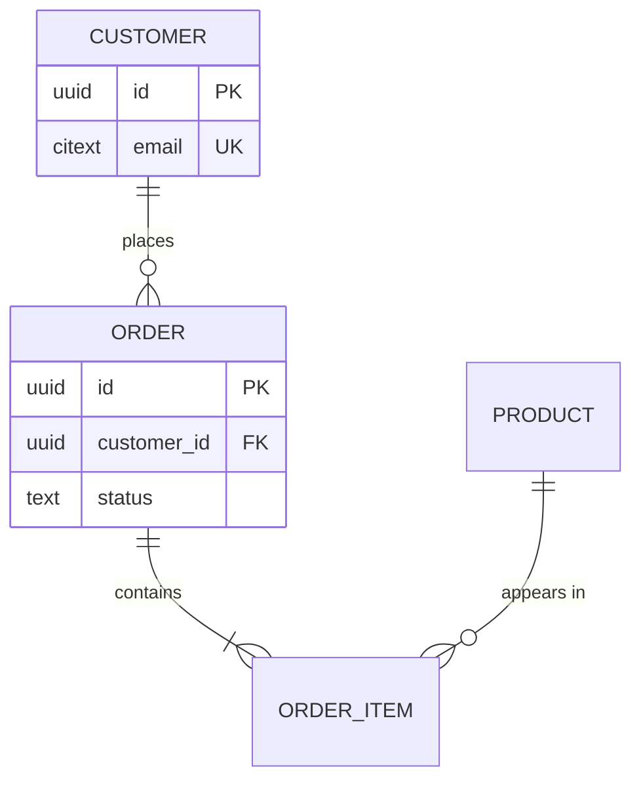

# 4.2 Data model (ERD)

**Phase 4 · Design** — the deep reference for section 2 of [4.1](4.1-design.md): what is stored, how it relates, and what each field actually means.

The diagram is for orientation; the field tables are the contract, and they are what backend, data and analytics engineers all build against.

**This is the only ERD in the set, and that is deliberate.** Phase 3 stops at `<<entity>>` classes ([3.1](3.1-analysis-classes.md) and [3.3](3.3-class-diagrams.md)) and data stores ([3.4](3.4-data-flow.md)); it does not draw an entity-relationship diagram, because two ERDs one phase apart provide two answers about one table with no way to tell which is current. Start from those classes rather than from scratch: one class becomes one table by default, and every deviation — split, merge, lookup table, or deliberate denormalization — is recorded as a design decision with its reason. The multiplicities in [3.3](3.3-class-diagrams.md) determine the remaining mechanics: which side holds the foreign key, when to create a junction table, when to use an enum or lookup table, how far to normalize, and how to record every deliberate denormalization ([0.5 K9](0.5-derivation.md#k9-from-classes-to-tables)). A table that appears here but in no use case is a table nobody requested; a class that maps to no table represents information the system was told to remember but now does not.

## Contents

- [Document template](#erd-document-template)
- [Data dictionary rules](#data-dictionary-rules)
- [Derived tables and lineage](#derived-tables-and-lineage)

## ERD document template

````markdown
# <Domain> — Data model

<metadata table>

<plain-language summary paragraph>

## 4.2.1 Scope
<which database/schema; which service owns it>

## 4.2.2 Diagram
```mermaid
erDiagram
```
<caption paragraph>

## 4.2.3 Shared conventions
<make these six schema-wide decisions once: primary-key type · timestamp type and
timezone · money representation · soft or hard deletion · audit columns · naming
rules. Explain every table-level deviation in that table's header block.>

## 4.2.4 Entities
One H3 per entity: a one-line purpose, the four-row header table, then the field table.

**`product`**

| | |
|---|---|
| **Derived from** | `<<entity>>` Product (3.1) · UC-A03 |
| **Owner** | catalog-service |
| **Primary key · natural key** | `id` uuid · `sku` unique |
| **Deletion · retention** | Soft delete with `deleted_at`; retain for 5 years — BR14 |

| Column | Type | Null | Default | Key | Constraint | Unit · format | Business meaning | Written by |
|---|---|---|---|---|---|---|---|---|

## 4.2.5 Relationships
| From | To | Cardinality | Foreign key | On delete | On update | Derived from | Notes |
|---|---|---|---|---|---|---|---|

## 4.2.6 Indexes and constraints
| Table | Index / constraint | Columns | Query served | Why |
|---|---|---|---|---|

## 4.2.7 Lifecycle and retention
| Entity | Created by | Updated by | Deleted / archived | Retention | PII |
|---|---|---|---|---|---|

## 4.2.8 CRUD matrix
| Table | UC-A03.T1 | UC-A03.T3 | UC-A03.T6 | … |
|---|---|---|---|---|

## Open questions
## Changelog
````

Mermaid `erDiagram` shows relationships well but is poor at showing every column, so put only keys and 2–3 identifying fields in the diagram and let the field tables carry the full definition. The diagram is for orientation; the tables are the contract.



Split the diagram once it passes roughly 12 entities — one per bounded context, with a small overview diagram showing only the links between contexts.

## Data dictionary rules

Field table columns, in this order every time — nine, and each one is a decision rather than a box to fill:

| Column | Type | Null | Default | Key | Constraint | Unit · format | Business meaning | Written by |
|---|---|---|---|---|---|---|---|---|
| `sku` | `varchar(32)` | No | — | UK | `UNIQUE (sku) WHERE deleted_at IS NULL` | uppercase letters + digits, `^[A-Z0-9-]{4,32}$` | Product code printed on the label and readable by customers | UC-A03.T3; immutable after creation |
| `price` | `bigint` | No | `0` | — | `CHECK (price >= 0)` — BR3 | VND, integer, no fractional part | Listed price before any discount | UC-A03.T4 · price-import job |
| `deleted_at` | `timestamptz` | Yes | `NULL` | — | Set once; cannot return to `NULL` except through T7 | UTC, second precision | Time removed from the catalog; `NULL` means still for sale | UC-A03.T6 |

- **`Business meaning` says *what*, not *what type*** — "Amount the customer actually pays after every discount, in the smallest currency unit and always paired with `currency`" is better than "the total." Repeating the `Type` column here indicates that the table was filled mechanically rather than usefully.
- **Enumerations list every allowed value inline**: `pending \| paid \| shipped \| cancelled`, and state whether new values may be added. An enum documented as "one of several statuses" creates a future bug. A lifecycle field links to its [3.5](3.5-state-machines.md) state machine instead of restating transitions.
- **`Unit · format` is both the cheapest and the most expensive column**: a 100× money error and a timezone error may surface only in reports months later. Money gets units and currency, timestamps get timezone and precision, and IDs get generator and format.
- **`Written by` prevents three write paths from disagreeing about which one is authoritative.** Fill it with an operation ID (`UC-A03.T3`), job name, or *"database generated only."* A column nobody writes is dead; a column written from three places is a conflict waiting to happen.
- **`Constraint` uses executable forms**, not prose: `CHECK`, `UNIQUE`, `FOREIGN KEY`, or an expression. Business rules that live only in application code can be bypassed by imports, data-repair scripts, and migrations.
- **With soft deletion, every `UNIQUE` must account for it** (`WHERE deleted_at IS NULL`), every list query must filter it, and [0.7](0.7-operations.md) gains a *restore* operation. These three consequences belong together; choosing soft deletion while omitting one is a classic defect in this section.
- Mark PII and anything with a deletion obligation directly in the `Business meaning` cell — **PII**. Whoever builds an export or analytics job will read this table and no other.

**The CRUD matrix closes this section** ([0.5 K4](0.5-derivation.md#k4-the-crud-matrix)): rows are tables and columns are [2.3](2.3-use-case-specs.md) **operations** `T<n>`, not entire use cases. At use case granularity, nearly every cell contains `CRUD` and the matrix detects nothing. A row without `C` describes data with no known origin; a row containing only `R` is either a lookup table or a forgotten group of administrative operations; a row without `D` and without an entry under *Lifecycle and retention* retains data forever by omission.

## Derived tables and lineage

When a table is derived rather than written directly by an application, say so and draw it — consumers otherwise assume every table is authoritative. A short `flowchart LR` of source → transform → table belongs in this document; the fuller treatment of pipelines, freshness and training-versus-serving paths is in [3.4](3.4-data-flow.md).

Record retention and PII obligations per entity here rather than leaving them to the design document. Whoever builds an export or an analytics job will read this table and no other.
