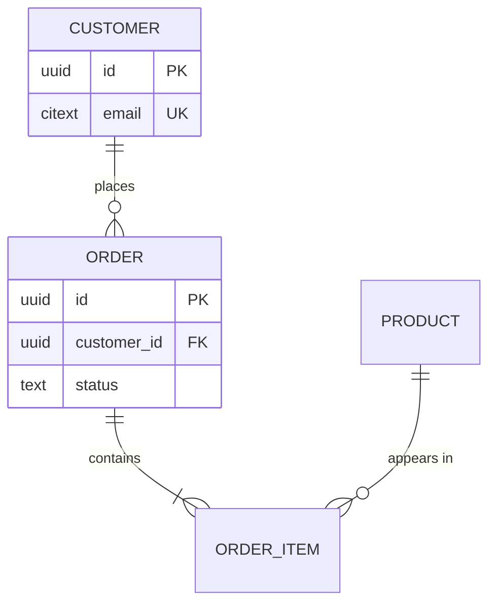

# 4.2 Data model (ERD)

**Phase 4 · Thiết kế** — the deep reference for section 2 of [4.1](4.1-design.md). What is stored, how it relates, and what each field actually means.

The diagram is for orientation; the field tables are the contract, and they are what backend, data and analytics engineers all build against.

**This is the only ERD in the set, and that is deliberate.** Phase 3 stops at `<<entity>>` classes ([3.1](3.1-analysis-classes.md) and [3.3](3.3-class-diagrams.md)) and data stores ([3.4](3.4-data-flow.md)); it does not draw an entity-relationship diagram, because two ERDs one phase apart give two answers about one table and no way to tell which is current. Start here from those classes rather than from scratch: one class becomes one table by default, and every deviation — a split, a merge, a lookup table, a deliberate denormalisation — is a design decision written down with its reason. Bội số của [3.3](3.3-class-diagrams.md) quyết phần còn lại một cách máy móc — khoá ngoại ở bên nào, khi nào sinh bảng nối, khi nào enum và khi nào bảng tra cứu, chuẩn hoá tới đâu rồi lệch chuẩn có nhật ký: [0.5 K9](0.5-derivation.md#k9--từ-lớp-sang-bảng). A table that appears here and in no use case is a table nobody asked for; a class that reaches no table is something the system was told to remember and now does not.

## Contents

- [Document template](#erd-document-template)
- [Data dictionary rules](#data-dictionary-rules)
- [Derived tables and lineage](#derived-tables-and-lineage)

## ERD document template

````markdown
# <Domain> — Data model

<metadata table>

<plain-language summary paragraph>

## 4.2.1 Scope
<which database/schema; which service owns it>

## 4.2.2 Diagram
```mermaid
erDiagram
```
<caption paragraph>

## 4.2.3 Quy ước chung
<sáu quyết định áp cho cả schema, quyết một lần: kiểu khoá chính · kiểu và múi
giờ của thời gian · cách biểu diễn tiền · xoá mềm hay cứng · bộ cột audit ·
quy tắc đặt tên. Bảng nào lệch thì nói rõ trong khối tiêu đề của nó.>

## 4.2.4 Entities
One H3 per entity: a one-line purpose, the four-row header table, then the field table.

**`product`**

| | |
|---|---|
| **Bắt nguồn từ** | `<<entity>>` Product (3.1) · UC-A03 |
| **Chủ sở hữu** | catalog-service |
| **Khoá chính · khoá tự nhiên** | `id` uuid · `sku` unique |
| **Xoá · lưu trữ** | Xoá mềm `deleted_at`; giữ 5 năm — BR14 |

| Cột | Kiểu | Null | Mặc định | Khoá | Ràng buộc | Đơn vị · định dạng | Ý nghĩa nghiệp vụ | Ai ghi |
|---|---|---|---|---|---|---|---|---|

## 4.2.5 Relationships
| From | To | Cardinality | Foreign key | On delete | On update | Bắt nguồn từ | Notes |
|---|---|---|---|---|---|---|---|

## 4.2.6 Indexes and constraints
| Table | Index / constraint | Columns | Phục vụ truy vấn nào | Why |
|---|---|---|---|---|

## 4.2.7 Lifecycle and retention
| Entity | Created by | Updated by | Deleted / archived | Retention | PII |
|---|---|---|---|---|---|

## 4.2.8 Ma trận CRUD
| Bảng | UC-A03.T1 | UC-A03.T3 | UC-A03.T6 | … |
|---|---|---|---|---|

## Open questions
## Changelog
````

Mermaid `erDiagram` shows relationships well but is poor at showing every column, so put only keys and 2–3 identifying fields in the diagram and let the field tables carry the full definition. The diagram is for orientation; the tables are the contract.



Split the diagram once it passes roughly 12 entities — one per bounded context, with a small overview diagram showing only the links between contexts.

## Data dictionary rules

Field table columns, in this order every time — nine, and each one is a decision rather than a box to fill:

| Cột | Kiểu | Null | Mặc định | Khoá | Ràng buộc | Đơn vị · định dạng | Ý nghĩa nghiệp vụ | Ai ghi |
|---|---|---|---|---|---|---|---|---|
| `sku` | `varchar(32)` | No | — | UK | `UNIQUE (sku) WHERE deleted_at IS NULL` | chữ hoa + số, `^[A-Z0-9-]{4,32}$` | Mã sản phẩm in trên tem, khách đọc được | UC-A03.T3, không đổi sau khi tạo |
| `price` | `bigint` | No | `0` | — | `CHECK (price >= 0)` — BR3 | đồng, số nguyên, không có phần lẻ | Giá niêm yết trước mọi khuyến mãi | UC-A03.T4 · job nhập giá |
| `deleted_at` | `timestamptz` | Yes | `NULL` | — | Đặt một lần, không quay lại `NULL` trừ T7 | UTC, độ mịn giây | Thời điểm bị gỡ khỏi danh mục; `NULL` là còn bán | UC-A03.T6 |

- **`Ý nghĩa nghiệp vụ` nói *cái gì*, không nói *kiểu gì*** — "Số tiền khách thực trả sau mọi khuyến mãi, đơn vị nhỏ nhất, luôn theo `currency`" beats "the total". Cột này lặp lại cột `Kiểu` là dấu hiệu cả bảng được điền cho đủ.
- **Enumerations list every allowed value inline**: `pending \| paid \| shipped \| cancelled`, và nói rõ giá trị mới có được thêm không. An enum documented as "one of several statuses" is the origin of a future bug. Cột có vòng đời thì trỏ sang máy trạng thái ở [3.5](3.5-state-machines.md) thay vì kể lại chuyển đổi.
- **`Đơn vị · định dạng` là cột rẻ nhất và đắt nhất**: tiền lệch 100 lần và thời gian lệch múi giờ đều chỉ lộ ra ở báo cáo, hàng tháng sau. Money gets units and currency, timestamps get timezone and precision, IDs get generator and format.
- **`Ai ghi` chặn cột có ba đường ghi vào mà không ai biết bên nào đúng.** Điền bằng mã thao tác (`UC-A03.T3`), tên job, hoặc *"chỉ DB sinh"*. Cột không ai ghi là cột chết; cột ba nơi ghi là một cuộc xung đột chưa xảy ra.
- **`Ràng buộc` viết bằng thứ chạy được**, không bằng lời: `CHECK`, `UNIQUE`, `FOREIGN KEY`, một biểu thức. Luật nghiệp vụ chỉ sống trong mã ứng dụng sẽ bị đi vòng qua đường nhập liệu, script sửa dữ liệu và migration.
- **Xoá mềm thì mọi `UNIQUE` phải tính tới nó** (`WHERE deleted_at IS NULL`), mọi truy vấn danh sách phải lọc, và [0.7](0.7-operations.md) có thêm một thao tác *khôi phục*. Ba hệ quả đó đi cùng nhau; chọn xoá mềm mà bỏ một trong ba là lỗi kinh điển của mục này.
- Mark PII and anything with a deletion obligation directly in the `Ý nghĩa nghiệp vụ` cell — **PII**. Whoever builds an export or an analytics job will read this table and no other.

**Ma trận CRUD đóng mục này** ([0.5 K4](0.5-derivation.md#k4--ma-trận-crud)): hàng là bảng, cột là **thao tác** `T<n>` của [2.1.4](2.1-use-cases.md#214-đặc-tả-sử-dụng) chứ không phải use case — ở mức use case thì ô nào cũng có đủ `CRUD` và ma trận không bắt được gì. Hàng không có `C` là dữ liệu không biết từ đâu ra; hàng chỉ có `R` là bảng tra cứu hoặc là một nhóm thao tác quản trị bị quên; hàng không có `D` và không có dòng nào ở *Lifecycle and retention* là giữ mãi mãi do bỏ sót.

## Derived tables and lineage

When a table is derived rather than written directly by an application, say so and draw it — consumers otherwise assume every table is authoritative. A short `flowchart LR` of source → transform → table belongs in this document; the fuller treatment of pipelines, freshness and training-versus-serving paths is in [3.4](3.4-data-flow.md).

Record retention and PII obligations per entity here rather than leaving them to the design document. Whoever builds an export or an analytics job will read this table and no other.
