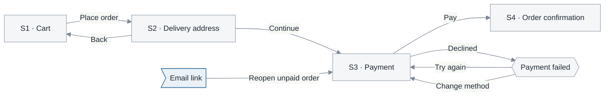

# 4.5 Interface design

**Phase 4 · Design**—the deep reference for section 4 of [4.1](4.1-design.md). Beside it: [4.2](4.2-data-model.md) for what the screens read, [4.4](4.4-api-contract.md) for how they read it.

Four questions in a fixed order: **which screens exist**, **how the user moves between them**, **what is on each one and where it comes from**, and **what it looks like when things are not ideal**. The picture is the smallest part — the tables are what FE and BE build against, and they are why this document lives in the design phase rather than in a design tool.

| Standard | Taken from it |
|---|---|
| **ISO 9241-110:2020** — seven interaction principles | What a screen must decide before it is buildable: suitability for the task · self-descriptiveness · conformity with expectations · learnability · controllability · use error robustness · user engagement |
| **ISO 9241-143:2012** — Forms | The field table: labels, required marking, defaults, validation, error recovery |
| **WCAG 2.2 Level AA** (W3C Recommendation, 2023-10-05) | The accessibility floor, checked while the screen is still a drawing |
| **Garrett** — *Visual Vocabulary* (2000) · *The Elements of User Experience* | Screen-flow notation; the skeleton plane (what is where, how it behaves) versus the surface plane (what it looks like) |
| **UML 2.5.1** state machine | The alternative notation when a screen has modes rather than destinations |

The seven principles are not decoration: each names a class of decision a specification is incomplete without. *Self-descriptiveness* is why every state has a message. *Controllability* is why every action has a way back. *Use error robustness* is why the field table has an error-message column. When a spec feels thin, check it against those seven — the missing block is usually obvious.

## 4.5.2 Screen inventory — finding the complete set

The list is written before any screen is drawn, and the obvious list is always short in a predictable way: it holds the screens someone would demo and misses the ones a user reaches only when something goes wrong, when they arrive from outside, or when it is their first day. Run all six passes and record that you ran them.

| # | Discovery pass | What it finds |
|---|---|---|
| 1 | **Use case × actor** | Every pair in the [2.1](2.1-actors-and-use-cases.md) use case table needs at least one screen. This is the only pass most documents perform |
| 2 | **Complete CRUD set** | For every user-facing entity: list, detail, create, update, and confirmation before deletion. List and detail are separate screens even when early versions look alike |
| 3 | **Session and permission lifecycle** | Sign-in, forgotten password, mid-flow session expiry, authenticated but unauthorized, and locked account |
| 4 | **External entry points** | Deep links, email links, QR codes, and returns from a payment gateway. They open **without** state a previous screen would have established, which makes them distinct |
| 5 | **System screens** | 404, generic error, maintenance, and outdated client. No use case produces them, yet every system needs them |
| 6 | **Once-in-a-lifetime screens** | Onboarding, terms acceptance, initial setup, and a new user's empty state. Authors miss these because they already use a populated system |

Close the inventory with a bidirectional check, just like the use case list: **every use case has ≥ 1 screen, and every screen traces to ≥ 1 use case.** Scheduled or externally invoked use cases have no screens—list them as explicit exceptions rather than leaving a silent mismatch.

A screen is **distinct** when it has a different purpose, actor, or input data. It is only a *state* of another screen when the data and user remain the same and only the display changes; states belong in the state table, not separate sections.

## 4.5.3 Screen-flow diagram

Nodes are screens, edges are the actions that move between them.



Checkout flow. Screen IDs (`S1`…) are cited by every other table, so they precede names. `Email link` is an **external entry point**: it jumps directly to S3 without passing through S1–S2, so S3 must obtain everything it needs independently. The diagram does not state which screens require authentication; the screen inventory does.

| Rule | Why |
|---|---|
| Every edge carries a **user action**, not a function name | Designers and testers read this diagram |
| Draw every **back** and **failure** edge | A happy-path-only diagram hides exactly the cases that need design |
| Mark **external entry points** | They arrive without prior-screen state—the most common source of deep-link defects |
| Distinguish **screens** from **modals** | A modal has no separate URL and cannot be revisited with the Back button; these behaviors differ |
| One diagram per major flow, under ~10 nodes | Split by flow instead of shrinking boxes |

An edge here asserts that **a real user action leads to another screen**; it does not assert that the destination can obtain all required data. This is why external entry points require explicit marks ([0.6](0.6-mechanism.md#what-each-notation-asserts)).

**Use a state machine instead** when what changes is a *mode within one screen*, not navigation to another—for example, an editor's view/edit/preview modes or a table's multi-select mode. Follow [3.5](3.5-state-machines.md) and state in the caption that nodes are modes; drawing modes as screens creates “screens” nobody can navigate to.

## 4.5.4 Detailed screen specifications

**Use the same shape for every screen, without exception.** This consistency makes the document readable: readers learn the structure once and know where to look, while a missing block becomes visible. The order below is mandatory; write `—` when a block does not apply and **do not delete it**.

````markdown
# <System or area> — 4.5 Interface design

<metadata table — required: Status and Last updated; add other fields only when known>

<plain-language summary paragraph>

## 4.5.1 Scope and conventions
Which screens, platforms, and breakpoints are covered, and what is out of scope.
Screen-ID convention and subsystem axis—the same axis used in 2.1 and 3.2.

## 4.5.2 Screen inventory
| # | ID | Screen name | Subsystem | Actor | Use case | Authentication required | Purpose |
|---|---|---|---|---|---|---|---|

<one table for the entire system, closed through six discovery passes—this is where
use case coverage becomes countable and what the next two sections depend on>

## 4.5.3 Screen-flow diagram
### <Sales subsystem>
```mermaid
<flowchart>
```
<caption>

### <Inventory subsystem>
<one diagram per major flow; do not merge two subsystems into one diagram>

<4.5.4 detailed screen specifications live in separate files, as described below—the
4.5.4 number is therefore intentionally absent from this file>

## 4.5.5 Wireframe
<one image per screen, in the same order as the sections above>

## Open questions
## Changelog
````

**Detailed screen specifications live in separate files, not a section of this file**—`4.5.4-screen-specifications.md`, or one file per subsystem (`4.5.4.1-sales.md`, `4.5.4.2-inventory.md`), using the subsystem axis established in [2.1.2](2.1-actors-and-use-cases.md#212-identify-the-main-use-cases). The reason is structural: a screen has **seven fixed blocks** readers navigate to directly, so those blocks must be headings. They fit only when the screen is an H2, which requires this section to become its own file ([0.1](0.1-visual-style.md#what-appears-in-the-page-contents)):

```markdown
# 4.5.4 Detailed screen specifications — <Sales subsystem>
## S1 — <Screen name>
### Purpose
### Layout
### Elements
### Input fields
### Interactions
### States
### Data
### Accessibility
## S2 — <Screen name>
```

Seven blocks, **in exactly that order**, with none omitted: one-sentence `Purpose` · `Layout` as ASCII/SVG or a standard layout name · `Elements` `| # | Element | Type | Data source | Display rule | Behavior |` · `Input fields` `| # | Field | Control | Required | Validation | Error message | Default |` · `Interactions` `| Action | Condition | Call | Result | On error | Focus afterward |` · `States` `| State | Trigger | What the user sees | Available actions |` · `Data` `| Requirement | Source | Unused fields |` · `Accessibility` `| Element | Accessible name | Keyboard | Notes |`.

**The subsystem level is optional; the screen level is not**—every row in table 4.5.2 must have exactly one corresponding H2, and the counts must match. Keep roughly five screens per file before the in-page table of contents exceeds its budget.

**The inventory (4.5.2) precedes the screen-flow diagram (4.5.3)**, and that order is mandatory ([0.1](0.1-visual-style.md#section-order)): a diagram shows paths among screens and cannot be drawn before those screens are known. Drawing first reliably omits the screens the six passes were created to find—they do not lie on the happy path, so they do not appear in the initial diagram, and the subsequent inventory gets written to match it.

Number the elements `1`, `2`, `3` in the tables and mark the same numbers on the layout, so labels live in the tables where there is room to be precise and the picture stays uncluttered. A screen may be **short** when it is genuinely simple — three element rows, two states, no field table. Short because simple is right; short because a block was dropped is where two teams will understand it differently.

**Derive those seven blocks from the use case specification; do not invent them.** Open [2.3](2.3-use-case-specs.md) beside the screen being specified:

| In the use case specification | Becomes |
|---|---|
| Preconditions | **States**—what the screen shows and which actions remain available when the user does not satisfy them |
| Every actor step | One **Interaction** row and the element used to perform it |
| Every system step | One in-progress **State**, plus the interaction row's `On error` column |
| Every numbered exception flow | A specific **Error message**, not a generic toast |
| Data read by the use case | **Data source** column and **Data** block |
| Postconditions | The next screen and what the user sees to know the task is complete |

A screen with a complete interaction table but an entirely blank `On error` column has not read the exception flows of the use case it serves.

**Elements** are the screen's contract with the backend:

- **Every element names its source** — an API field with its endpoint, a static string, or a computed expression written out. "From the API" is not a source. An element whose source does not exist yet is the most valuable row in the document: a contract change discovered while it is still free. Raise it against [4.4](4.4-api-contract.md).
- **Every field in the response is either displayed or listed in `Unused fields`**—a field nobody displays is either a missing element or a field the contract does not need.
- **`Display rule` is where formatting is decided once**: truncation, rounding, time zone, thousands separators, and long-name behavior. Left unstated, each screen invents its own.

**Input fields**—validation is where FE and BE most reliably disagree, invisibly, until a user encounters it:

- **Client-side validation is a convenience, never the authority.** Every rule here also exists server-side; a rule that exists only on the client is a security defect described as a UX feature.
- **Say when validation fires** — on blur, on submit, or live — once for the screen rather than per field.
- **Error message text is content**, not a placeholder for engineering to invent. Under ISO 9241-143 a message that only says a field is wrong is incomplete: it has to name what is expected. Either write it or mark it `**TBD** (owner: …)`.
- **Map server-returned field errors**: `422 voucher_invalid` → under field 4. That is exactly what [4.4](4.4-api-contract.md#exceptions-and-error-design) requires `details` to make machine-readable.
- **Required is marked on the field**, and the convention is stated once in the scope section.

**Interactions**—one row per action, turning a picture into something buildable:

- **`Call` cites the interface number** from [4.3](4.3-detailed-design.md), so screen, sequence diagram, and contract point to the same row.
- **Say what is optimistic.** An optimistic update needs a defined rollback, and what the user sees during it is a state, not a footnote.
- **Double-submit is a decided behaviour** — disabled button, idempotency key, or both.
- **Every destructive action has a way back**: confirmation, undo, or an explicit "irreversible". ISO 9241-110 controllability, at the level where it is checkable.
- **`Focus afterward`** is the difference between a form completable by keyboard and one that is not.

**States**—work through this list explicitly; these are the states that reach production undesigned:

| State | Question |
|---|---|
| Loading | Initial load and reload of a screen that already has content |
| Empty | No data has ever existed, distinct from filters yielding no results—two messages, two actions |
| Error | Load failure, submit failure, or partial failure; is retry available? |
| Partial | Some blocks load and others do not—a real dashboard condition |
| Permission | Authenticated but unauthorized: hide the control, or show it disabled with a reason? |
| Validation | Field and form levels, when it runs, and whether it blocks submission |
| Long content | Long names, 200 rows, deep nesting—where does truncation or scrolling occur? |
| Offline / slow | Optimistic update or spinner; what happens if an optimistic action later fails? |
| Post-action | What appears immediately after success, and where does focus move? |
| Stale data | Underlying data changed—auto-refresh, warn, or silently show the old version? |

The `Available actions` column exists because an error state in which every button still works is an undesigned state. AI screens add their own states: streaming or partial results, low confidence, refusal, and latency beyond the contract's p95 threshold.

**Breakpoints** are defined once for the entire document; each screen then describes only what actually changes. Decide three things: what moves, **what disappears entirely** at the smallest size, and whether anything becomes unreachable. Content that disappears on mobile with no alternative route is a defect designed into the wireframe.

**Copy**: every on-screen string has an owner—mark it final, draft, or `**TBD**`, and state whether error text comes from the API's `message` or FE-owned copy keyed by `code`. The latter is almost always correct because API messages target developers. Write copy in the document language while keeping field names in English.

## Accessibility

**WCAG 2.2 Level AA** is the default — 2.2 has been the W3C Recommendation since 5 October 2023 and AA is what public-sector rules generally require. State the version: "WCAG AA" without a number is not checkable. Record it per screen, because a blanket sentence is never checked.

Four questions catch most defects while the wireframe is still a drawing: what a screen reader announces for each interactive element; what the tab order is and where focus goes after an action; whether any information is carried by colour alone; and whether an error message identifies the field it belongs to.

Four of WCAG 2.2's newer AA criteria are decided at wireframe stage rather than in code:

| Criterion | Wireframe-stage question |
|---|---|
| 2.4.11 Focus Not Obscured | Does a sticky header, cookie banner, or fixed action bar cover the focused element? |
| 2.5.7 Dragging Movements | Does every drag-and-drop action have a non-dragging alternative? |
| 2.5.8 Target Size (Minimum) | Is the target at least 24 × 24 CSS px, including icons in dense tables? |
| 3.3.7 Redundant Entry | Does a multi-step flow require re-entering information already entered earlier? |

## Wireframes and mockups

| | Wireframe | Mockup |
|---|---|---|
| Decides | Layout, hierarchy, content, behavior | Color, typography, imagery, spacing |
| Fidelity | Intentionally low—gray, boxes, real copy | High, close to the final product |
| Lives in | This document, as ASCII or SVG | The design tool, **linked** from the document |
| Review asks | "Can users complete their task?" | "Does it match the brand?" |

Approve the wireframe first, then build the mockup from the approved wireframe. **Never redraw a Figma design in the document**—link to it and specify behavior. A second copy will diverge within one sprint, with no reliable way to know which is newer.

Choose the format **per screen**: ASCII for forms, lists, settings, modals, and mobile screens (the default, because Git can diff it); SVG for dense layouts where relative position matters; an elements table alone when the design system standardizes the layout; a Figma link when a real design already exists.

```text
┌────────────────────────────────────────────────────────┐
│  ← Checkout                                    Step 2/3 │
├────────────────────────────────────────────────────────┤
│  Delivery address                                       │
│  ┌──────────────────────────────────────────────────┐  │
│  │ (1) Full name                                     │  │
│  ├──────────────────────────────────────────────────┤  │
│  │ (2) Street address                                │  │
│  ├──────────────────────────────────────────────────┤  │
│  │ (3) City            ▾   (4) Postcode              │  │
│  └──────────────────────────────────────────────────┘  │
│                                                         │
│  ☐ (5) Save this address                                │
│                                                         │
│  ┌──────────────┐              ┌──────────────────────┐ │
│  │   Back       │              │  (6) Continue        │ │
│  └──────────────┘              └──────────────────────┘ │
└────────────────────────────────────────────────────────┘
```

Notation: `▾` select · `☐` checkbox · `◉`/`○` radio · `[…]` input · `▓▓▓` image or chart · `⋯` truncated repeated content. Show **one** representative list row followed by `⋯`, never five rows of fake data—fake data shifts review toward discussing the data. Use a `text` fence and keep the block under ~40 lines.

### SVG layout

When SVG is justified, keep fidelity intentionally low so it reads as a wireframe: `#f4f6f8` background, 1px `#9aa5b1` borders, 13–14px `#1f2933` text, 4px corner radius, and one gray palette. Use no shadows, gradients, or brand colors—a finished-looking wireframe shifts feedback from behavior to aesthetics. Build on an 8px spacing grid, number regions to match the elements table, set an explicit `viewBox`, and embed the SVG directly in Markdown so the document remains self-contained.

## A worked example

One complete screen, at the length a real one should be. **Copy the shape, not the content.** (It is an H3 here because it sits inside a reference file; in a real document each screen is an unnumbered H3 under its subsystem section.)

---

### S2 — Delivery address

| | |
|---|---|
| **Actor** | Signed-in customer |
| **Use case** | UC-03 Place an order, step b3 |
| **Entry from** | S1 Cart · "Continue incomplete order" email link |

**Purpose**—The customer has selected the products and is entering the destination; this screen exists only to collect complete shipping information before payment.

**Layout**—Use the product's standard single-column form layout; see the ASCII block above.

**Elements**

| # | Element | Type | Data source | Display rule | Behavior |
|---|---|---|---|---|---|
| 1 | Step title | Text | Static | "Delivery address · Step 2/3" | — |
| 2 | Saved addresses | Selection list | `GET /me/addresses` → `items[]` | Up to 3 most recent addresses, each showing `name` + `line1` truncated to 40 characters | Selecting a row pre-fills fields 3–6 |
| 3–6 | Input fields | Form | — | See table below | — |
| 7 | Subtotal | Text | `GET /cart` → `subtotal` | VND, thousands separator, no decimal places | Not interactive |
| 8 | Continue | Button | — | Static | Disabled until all required fields are valid |

**Input fields**

| # | Field | Control | Required | Validation | Error message | Default |
|---|---|---|---|---|---|---|
| 3 | `recipient_name` | Text | Yes | 2–60 characters | "Enter the recipient's name" | Account name |
| 4 | `phone` | Tel | Yes | 10-digit Vietnamese mobile number | "Enter a valid phone number" | Previously used phone number |
| 5 | `province` | Select | Yes | Present in `GET /geo/provinces` catalog | "Select a province or city" | Empty |
| 6 | `note` | Textarea | No | ≤ 200 characters; show count from 180 | — | Empty |

Validation runs on blur and revalidates the entire form when Continue is selected. Every rule has an identical server-side version; displayed messages are client-owned except for field details returned with a server `422`.

**Interactions**

| Action | Condition | Call | Result | On error | Focus afterward |
|---|---|---|---|---|---|
| Select a saved address | ≥ 1 address exists | — | Pre-fill fields 3–6 | — | Field 3 |
| Continue | Required fields are valid | `PUT /cart/shipping` (I2) | Navigate to S3 Payment | Remain here; show errors below their fields and re-enable the button | First invalid field |
| Back | — | — | Return to S1 and preserve entered data | — | Back button |

**States**

| State | Trigger | What the user sees | Available actions |
|---|---|---|---|
| Loading | Screen opens | Gray placeholders replace blocks 2 and 7 | None |
| Empty | No saved address exists | Hide block 2 and show an empty form | Enter manually, Back |
| Cart-load error | `GET /cart` fails | Message + "Try again" button; hide Continue | Try again, Back |
| Cart changed | A product sells out while the form is open | Banner identifies the SKU and offers "Review cart" | Review cart |
| Submitting | After Continue is selected | Button shows progress and form locks | None |

**Data**

| Requirement | Source | Unused fields |
|---|---|---|
| Address list | `GET /me/addresses` | `created_at`, `is_billing` |
| Subtotal | `GET /cart` → `subtotal` | `items[].thumbnail_url` |

**Accessibility**

| Element | Accessible name | Keyboard | Notes |
|---|---|---|---|
| 2 | "Saved addresses, list of 3 items" | Up/down arrows, Enter to select | Selection is conveyed by text, not color alone |
| 8 | "Continue to payment" | Enter/Space; last in tab order | Disabled state and reason are announced |

---

Four details make this a specification rather than a description: every element names its **source**, every field provides a **real error message**, every action states **what happens on failure**, and the state table contains a *Cart changed* row that nobody would discover by looking only at the drawing.

## Self-check before publishing

| # | Check | Fails when |
|---|---|---|
| 1 | Every use case maps to ≥ 1 screen, every screen to ≥ 1 use case | A screen nobody asked for, or a use case with no way to perform it |
| 2 | All six discovery passes run, and the list recorded as closed | The list stops at the screens someone would demo |
| 3 | Every screen block has all seven parts, `—` where one does not apply | A missing block read as an oversight instead of a decision |
| 4 | Every element names a real source: endpoint + field, static, or a written expression | "From the API" — the sentence that hides a contract gap |
| 5 | Every required field has validation, a message and a default | A form the user cannot recover from |
| 6 | Every action states its failure behaviour and where focus goes | Each team invents a different answer |
| 7 | Every screen has loading, empty and error states written | The three states that reach production undesigned |
| 8 | Every destructive action has confirmation, undo, or a written "irreversible" | ISO 9241-110 controllability, where it is checkable |
| 9 | The flow diagram carries back edges, failure edges and external entry points | A diagram that only draws the happy path |
| 10 | WCAG version and level stated, four wireframe-stage criteria checked | "Accessible" as an adjective rather than a target |
| 11 | No brand colours, shadows or final imagery in any wireframe | Review shifts to aesthetics before behaviour is agreed |
