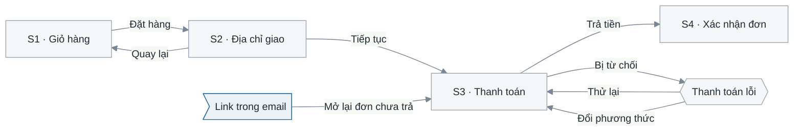

# 4.5 Thiết kế giao diện

**Phase 4 · Thiết kế** — the deep reference for section 4 of [4.1](4.1-design.md). Beside it: [4.2](4.2-data-model.md) for what the screens read, [4.4](4.4-api-contract.md) for how they read it.

Four questions in a fixed order: **which screens exist**, **how the user moves between them**, **what is on each one and where it comes from**, and **what it looks like when things are not ideal**. The picture is the smallest part — the tables are what FE and BE build against, and they are why this document lives in the design phase rather than in a design tool.

| Standard | Taken from it |
|---|---|
| **ISO 9241-110:2020** — seven interaction principles | What a screen must decide before it is buildable: suitability for the task · self-descriptiveness · conformity with expectations · learnability · controllability · use error robustness · user engagement |
| **ISO 9241-143:2012** — Forms | The field table: labels, required marking, defaults, validation, error recovery |
| **WCAG 2.2 Level AA** (W3C Recommendation, 2023-10-05) | The accessibility floor, checked while the screen is still a drawing |
| **Garrett** — *Visual Vocabulary* (2000) · *The Elements of User Experience* | Screen-flow notation; the skeleton plane (what is where, how it behaves) versus the surface plane (what it looks like) |
| **UML 2.5.1** state machine | The alternative notation when a screen has modes rather than destinations |

The seven principles are not decoration: each names a class of decision a specification is incomplete without. *Self-descriptiveness* is why every state has a message. *Controllability* is why every action has a way back. *Use error robustness* is why the field table has an error-message column. When a spec feels thin, check it against those seven — the missing block is usually obvious.

## 4.5.2 Danh sách màn hình — tìm cho đủ

The list is written before any screen is drawn, and the obvious list is always short in a predictable way: it holds the screens someone would demo and misses the ones a user reaches only when something goes wrong, when they arrive from outside, or when it is their first day. Run all six passes and record that you ran them.

| # | Lượt rà | Tìm ra cái gì |
|---|---|---|
| 1 | **Use case × tác nhân** | Mỗi cặp trong bảng use case của [2.1](2.1-actors-and-use-cases.md) cần ít nhất một màn hình. Đây là lượt duy nhất hầu hết tài liệu chạy |
| 2 | **Bộ CRUD đủ** | Với mỗi thực thể người dùng chạm tới: danh sách · chi tiết · tạo · sửa · xác nhận trước khi xoá. Danh sách và chi tiết là hai màn, kể cả khi bản đầu giống nhau |
| 3 | **Vòng đời phiên và quyền** | Đăng nhập, quên mật khẩu, hết phiên giữa chừng, đăng nhập rồi nhưng không đủ quyền, tài khoản bị khoá |
| 4 | **Điểm vào từ bên ngoài** | Deep link, link trong email, QR, quay lại từ cổng thanh toán. Chúng mở ra **không có** state mà màn trước lẽ ra đã đặt — đó là điều khiến chúng là màn riêng |
| 5 | **Màn hình của hệ thống** | 404, lỗi chung, đang bảo trì, client quá cũ. Không use case nào sinh ra chúng, và mọi hệ thống đều cần |
| 6 | **Màn hình một lần trong đời** | Onboarding, chấp nhận điều khoản, thiết lập lần đầu, màn rỗng của người dùng mới. Bị bỏ quên vì người viết tài liệu đã dùng hệ thống có dữ liệu |

Đóng danh sách bằng kiểm tra hai chiều, giống cách đóng danh sách use case: **mỗi use case có ≥ 1 màn hình, mỗi màn hình truy về ≥ 1 use case.** Use case chạy bằng lịch hoặc do hệ thống ngoài gọi thì không có màn hình — liệt kê chúng như một dòng ngoại lệ, đừng để im lặng không khớp.

Một màn hình là **màn riêng** khi nó có mục đích khác, tác nhân khác, hoặc dữ liệu vào khác. Nó chỉ là một *trạng thái* của màn khác khi cùng dữ liệu, cùng người, chỉ khác cái đang hiển thị — và trạng thái thuộc bảng trạng thái, không phải một mục riêng.

## 4.5.3 Biểu đồ chuyển giữa các giao diện

Nodes are screens, edges are the actions that move between them.



Luồng chốt đơn. Mã màn hình (`S1`…) là thứ mọi bảng khác trích dẫn nên nó đi trước tên. `Link trong email` là **điểm vào từ ngoài**: nó nhảy thẳng vào S3 mà không qua S1–S2, nên S3 phải tự lấy được mọi thứ nó cần. Sơ đồ không nói màn nào cần đăng nhập — điều đó ở bảng danh sách màn hình.

| Luật | Vì sao |
|---|---|
| Mỗi cạnh mang **thao tác của người dùng**, không phải tên hàm | Sơ đồ này để người thiết kế và người kiểm thử đọc |
| Vẽ đủ cạnh **quay lại** và cạnh **thất bại** | Sơ đồ chỉ có luồng thuận giấu đúng những ca cần thiết kế |
| Đánh dấu **điểm vào từ ngoài** | Chúng đến mà không mang state của màn trước — nguồn lỗi phổ biến nhất của deep link |
| Phân biệt **màn hình** với **modal** | Modal không có URL riêng, không quay lại được bằng nút back: hai hành vi khác nhau |
| Một sơ đồ cho một luồng lớn, dưới ~10 nút | Tách theo luồng, không thu nhỏ hộp |

Cạnh ở đây khẳng định **một thao tác có thật của người dùng dẫn tới màn kia**; nó không khẳng định màn kia tự lấy đủ dữ liệu — đó là lý do điểm vào từ ngoài phải được đánh dấu riêng ([0.6](0.6-mechanism.md#mỗi-ký-pháp-khẳng-định-điều-gì)).

**Dùng máy trạng thái thay cho sơ đồ này** khi thứ thay đổi là *chế độ của một màn hình* chứ không phải *đi sang màn khác* — trình soạn thảo có chế độ xem/sửa/xem trước, bảng có chế độ chọn nhiều dòng. Vẽ theo [3.5](3.5-state-machines.md) và nói rõ trong caption rằng các nút là chế độ; vẽ chế độ như màn hình sẽ sinh ra những "màn" không ai điều hướng tới được.

## 4.5.4 Đặc tả chi tiết màn hình

**Cùng một hình dạng cho mọi màn hình, không có ngoại lệ.** Đây là toàn bộ lý do tài liệu này đọc được: người đọc học một lần rồi biết chỗ để tìm, và một khối bị thiếu trở thành nhìn thấy được. Thứ tự dưới đây là bắt buộc; khối nào không áp dụng thì viết `—`, **không xoá khối**.

````markdown
# <Hệ thống hoặc khu vực> — 4.5 Thiết kế giao diện

<metadata table>

<plain-language summary paragraph>

## 4.5.1 Phạm vi và quy ước
Màn hình nào, nền tảng nào, breakpoint nào, cái gì ngoài phạm vi.
Quy ước mã màn hình, và trục chia phân hệ — cùng trục với 2.1 và 3.2.

## 4.5.2 Danh sách màn hình
| # | Mã | Tên màn hình | Phân hệ | Tác nhân | Use case | Cần đăng nhập | Mục đích |
|---|---|---|---|---|---|---|---|

<một bảng duy nhất cho cả hệ thống, đóng bằng sáu lượt rà — đây là chỗ đếm được
phủ đủ use case hay chưa, và là thứ hai mục dưới đều dựa vào>

## 4.5.3 Biểu đồ chuyển giữa các giao diện
### <Phân hệ Bán hàng>
```mermaid
<flowchart>
```
<caption>

### <Phân hệ Kho>
<một sơ đồ cho mỗi luồng lớn; đừng gộp hai phân hệ vào một sơ đồ>

<4.5.4 đặc tả chi tiết màn hình là (các) tệp riêng, xem dưới — số 4.5.4 vì thế
khuyết trong tệp này, và đó là chủ ý>

## 4.5.5 Wireframe
<một hình cho mỗi màn hình, xếp cùng thứ tự với các mục trên>

## Câu hỏi mở
## Changelog
````

**Đặc tả chi tiết màn hình là tệp riêng, không phải một mục của tệp này** — `4.5.4-dac-ta-man-hinh.md`, hoặc một tệp mỗi phân hệ (`4.5.4.1-…-ban-hang.md`, `4.5.4.2-…-kho.md`), cùng trục phân hệ đã chốt ở [2.1.2](2.1-actors-and-use-cases.md#212-xác-định-các-ca-sử-dụng-chính). Lý do là hình dạng: một màn hình có **bảy khối cố định** mà người đọc nhảy thẳng tới, nên bảy khối đó phải là heading — và heading chỉ đủ chỗ khi màn hình đứng ở H2, tức khi mục này là một tệp ([0.1](0.1-visual-style.md#cái-gì-lên-được-mục-lục-trong-trang)):

```markdown
# 4.5.4 Đặc tả chi tiết màn hình — <Phân hệ Bán hàng>
## S1 — <Tên màn hình>
### Mục đích
### Bố cục
### Phần tử
### Trường nhập
### Tương tác
### Trạng thái
### Dữ liệu
### Khả năng tiếp cận
## S2 — <Tên màn hình>
```

Bảy khối, **đúng thứ tự đó**, không bỏ khối nào: `Mục đích` một câu · `Bố cục` ASCII/SVG hoặc tên bố cục chuẩn · `Phần tử` `| # | Phần tử | Kiểu | Nguồn dữ liệu | Quy tắc hiển thị | Hành vi |` · `Trường nhập` `| # | Trường | Điều khiển | Bắt buộc | Kiểm tra | Thông báo lỗi | Mặc định |` · `Tương tác` `| Thao tác | Điều kiện | Gọi | Kết quả | Khi lỗi | Focus sau đó |` · `Trạng thái` `| Trạng thái | Kích hoạt khi | Người dùng thấy gì | Thao tác còn dùng được |` · `Dữ liệu` `| Cần gì | Từ đâu | Field không dùng đến |` · `Khả năng tiếp cận` `| Phần tử | Tên đọc lên | Bàn phím | Ghi chú |`.

**Bỏ tầng phân hệ là lựa chọn được; bỏ tầng màn hình thì không** — mỗi dòng của bảng 4.5.2 phải có đúng một mục H2 của riêng nó, và số đếm hai bên phải khớp. Khoảng năm màn hình một tệp trước khi mục lục trong trang quá ngân sách.

**Danh sách (4.5.2) đứng trước biểu đồ chuyển màn hình (4.5.3)**, và thứ tự đó là bắt buộc ([0.1](0.1-visual-style.md#thứ-tự-các-mục)): sơ đồ vẽ đường đi giữa các màn, nên nó không vẽ được trước khi biết có những màn nào. Vẽ trước là cách chắc chắn nhất bỏ sót đúng nhóm màn mà sáu lượt rà dưới đây sinh ra để tìm — chúng không nằm trên luồng thuận nên không xuất hiện trong bản vẽ, và một khi bản vẽ đã có thì danh sách bị viết theo nó.

Number the elements `1`, `2`, `3` in the tables and mark the same numbers on the layout, so labels live in the tables where there is room to be precise and the picture stays uncluttered. A screen may be **short** when it is genuinely simple — three element rows, two states, no field table. Short because simple is right; short because a block was dropped is where two teams will understand it differently.

**Bảy khối đó được đọc ra từ đặc tả use case, không nghĩ ra.** Mở [2.3](2.3-use-case-specs.md) cạnh màn hình đang viết:

| Ở đặc tả use case | Thành khối nào |
|---|---|
| Tiền điều kiện | **Trạng thái** — khách chưa thoả thì màn này hiện gì, và còn bấm được gì |
| Mỗi bước tác nhân thực hiện | Một dòng **Tương tác**, và phần tử để thực hiện nó |
| Mỗi bước hệ thống thực hiện | Một **Trạng thái** đang chạy, cộng cột `Khi lỗi` của dòng tương tác |
| Mỗi luồng ngoại lệ đã đánh số | Một **Thông báo lỗi** cụ thể, không phải một toast chung |
| Dữ liệu use case đọc | Cột **Nguồn dữ liệu** và khối **Dữ liệu** |
| Hậu điều kiện | Màn hình kế tiếp, và thứ khách thấy để biết việc đã xong |

Một màn hình có bảng tương tác đầy đủ mà cột `Khi lỗi` trống hết là một màn hình chưa đọc luồng ngoại lệ của use case nó phục vụ.

**Phần tử** is the screen's contract with the backend:

- **Every element names its source** — an API field with its endpoint, a static string, or a computed expression written out. "From the API" is not a source. An element whose source does not exist yet is the most valuable row in the document: a contract change discovered while it is still free. Raise it against [4.4](4.4-api-contract.md).
- **Every field in the response is either displayed or listed in `Field không dùng đến`** — a field nobody displays is either a missing element or a field the contract does not need.
- **`Quy tắc hiển thị` is where formatting is decided once**: truncation, rounding, timezone, thousands separators, what a long name does. Left unstated, each screen invents its own.

**Trường nhập** — validation is where FE and BE most reliably disagree, invisibly, until a user hits it:

- **Client-side validation is a convenience, never the authority.** Every rule here also exists server-side; a rule that exists only on the client is a security defect described as a UX feature.
- **Say when validation fires** — on blur, on submit, or live — once for the screen rather than per field.
- **Error message text is content**, not a placeholder for engineering to invent. Under ISO 9241-143 a message that only says a field is wrong is incomplete: it has to name what is expected. Either write it or mark it `**TBD** (owner: …)`.
- **Map server-returned field errors**: `422 voucher_invalid` → under field 4. That is exactly what [4.4](4.4-api-contract.md#exceptions-and-error-design) requires `details` to make machine-readable.
- **Required is marked on the field**, and the convention is stated once in the scope section.

**Tương tác** — one row per action, and what turns a picture into something buildable:

- **`Gọi` cites the interface number** from [4.3](4.3-detailed-design.md), so screen, sequence diagram and contract point at the same row.
- **Say what is optimistic.** An optimistic update needs a defined rollback, and what the user sees during it is a state, not a footnote.
- **Double-submit is a decided behaviour** — disabled button, idempotency key, or both.
- **Every destructive action has a way back**: confirmation, undo, or an explicit "irreversible". ISO 9241-110 controllability, at the level where it is checkable.
- **`Focus sau đó`** is the difference between a form completable by keyboard and one that is not.

**Trạng thái** — work through this list explicitly; these are the states that reach production undesigned:

| Trạng thái | Câu hỏi |
|---|---|
| Đang tải | Lần đầu, và tải lại một màn đã có nội dung |
| Rỗng | Chưa từng có dữ liệu, khác với lọc ra rỗng — hai thông báo, hai hành động |
| Lỗi | Tải hỏng, gửi hỏng, hỏng một phần; có nút thử lại không? |
| Một phần | Vài khối tải được, vài khối không — chuyện thật trên dashboard |
| Quyền | Đăng nhập rồi nhưng không được phép: ẩn, hay hiện mà khoá kèm lý do? |
| Kiểm tra dữ liệu | Mức trường và mức form, khi nào chạy, có chặn gửi không |
| Nội dung dài | Tên dài, 200 dòng, lồng sâu — cắt ở đâu, cuộn ở đâu |
| Mất mạng / chậm | Optimistic hay spinner; hỏng sau khi đã optimistic thì sao |
| Sau thao tác | Ngay sau khi thành công màn hình hiện gì, focus ở đâu |
| Dữ liệu đã cũ | Dữ liệu đổi bên dưới — tự tải lại, cảnh báo, hay im lặng hiện bản cũ? |

Cột `Thao tác còn dùng được` tồn tại vì một màn ở trạng thái lỗi mà mọi nút vẫn bấm được là một trạng thái không ai thiết kế. Màn hình có AI thêm các trạng thái riêng: kết quả đang stream hoặc mới một phần, độ tin cậy thấp, từ chối trả lời, chậm quá ngưỡng p95 trong hợp đồng.

**Breakpoint** được nêu một lần cho cả tài liệu, rồi mỗi màn chỉ nói cái gì thực sự đổi. Ba câu hỏi cần chốt: cái gì di chuyển, **cái gì biến mất hẳn** ở kích thước nhỏ nhất, và có gì trở nên không tới được không. Nội dung biến mất trên mobile mà không có đường khác tới là một lỗi được thiết kế sẵn từ khâu wireframe.

**Copy**: mỗi chuỗi trên màn hình thuộc về ai đó — đánh dấu final, draft hay `**TBD**`, và nói rõ text lỗi đến từ `message` của API hay từ copy do FE giữ theo `code`. Gần như luôn là vế sau, vì message của API viết cho lập trình viên. Tài liệu tiếng Việt thì copy tiếng Việt, tên field vẫn tiếng Anh.

## Accessibility

**WCAG 2.2 Level AA** is the default — 2.2 has been the W3C Recommendation since 5 October 2023 and AA is what public-sector rules generally require. State the version: "WCAG AA" without a number is not checkable. Record it per screen, because a blanket sentence is never checked.

Four questions catch most defects while the wireframe is still a drawing: what a screen reader announces for each interactive element; what the tab order is and where focus goes after an action; whether any information is carried by colour alone; and whether an error message identifies the field it belongs to.

Four of WCAG 2.2's newer AA criteria are decided at wireframe stage rather than in code:

| Criterion | Câu hỏi khi đang vẽ |
|---|---|
| 2.4.11 Focus Not Obscured | Header dính, banner cookie hay thanh hành động cố định có che phần tử đang focus không? |
| 2.5.7 Dragging Movements | Mọi thao tác kéo–thả có cách thay thế chỉ cần bấm không? |
| 2.5.8 Target Size (Minimum) | Vùng bấm tối thiểu 24 × 24 CSS px — kể cả icon trong bảng dày? |
| 3.3.7 Redundant Entry | Luồng nhiều bước có bắt gõ lại thứ đã nhập ở bước trước không? |

## Wireframe và mockup

| | Wireframe | Mockup |
|---|---|---|
| Quyết định | Bố cục, thứ bậc, nội dung, hành vi | Màu, kiểu chữ, ảnh, khoảng cách |
| Độ chi tiết | Cố tình thấp — xám, hộp, chữ thật | Cao, gần sản phẩm thật |
| Sống ở đâu | Trong tài liệu này, ASCII hoặc SVG | Trong công cụ thiết kế, **link** vào tài liệu |
| Review hỏi gì | "Người dùng làm được việc của họ không?" | "Trông có đúng thương hiệu không?" |

Wireframe được duyệt trước; mockup dựng trên wireframe đã duyệt. **Không bao giờ vẽ lại trong tài liệu một thiết kế đã có trong Figma** — dẫn link và đặc tả hành vi; bản sao thứ hai sẽ lệch trong vòng một sprint và không có cách nào biết bản nào mới hơn.

Chọn định dạng **theo từng màn hình**: ASCII cho form, danh sách, thiết lập, modal, màn mobile (mặc định — diff được trong Git); SVG cho bố cục dày mà vị trí tương đối mang ý nghĩa; chỉ bảng phần tử khi bố cục đã chuẩn hoá trong design system; link Figma khi đã có bản thiết kế thật.

```text
┌────────────────────────────────────────────────────────┐
│  ← Checkout                                    Step 2/3 │
├────────────────────────────────────────────────────────┤
│  Delivery address                                       │
│  ┌──────────────────────────────────────────────────┐  │
│  │ (1) Full name                                     │  │
│  ├──────────────────────────────────────────────────┤  │
│  │ (2) Street address                                │  │
│  ├──────────────────────────────────────────────────┤  │
│  │ (3) City            ▾   (4) Postcode              │  │
│  └──────────────────────────────────────────────────┘  │
│                                                         │
│  ☐ (5) Save this address                                │
│                                                         │
│  ┌──────────────┐              ┌──────────────────────┐ │
│  │   Back       │              │  (6) Continue        │ │
│  └──────────────┘              └──────────────────────┘ │
└────────────────────────────────────────────────────────┘
```

Ký hiệu: `▾` select · `☐` checkbox · `◉`/`○` radio · `[…]` ô nhập · `▓▓▓` ảnh hoặc biểu đồ · `⋯` nội dung lặp bị cắt. Hiện **một** dòng đại diện của danh sách rồi `⋯`, không bao giờ năm dòng dữ liệu giả — dữ liệu giả kéo review sang bàn về dữ liệu. Dùng fence `text`, giữ khối dưới ~40 dòng.

### SVG layout

Khi SVG xứng đáng, giữ độ chi tiết thấp có chủ ý để nó đọc như wireframe: nền `#f4f6f8`, viền `#9aa5b1` 1px, chữ `#1f2933` cỡ 13–14px, bo góc 4px, một tông xám cho mọi thứ. Không đổ bóng, không gradient, không màu thương hiệu — wireframe trông xong xuôi là lúc góp ý chuyển từ hành vi sang thẩm mỹ. Dựng theo lưới nhịp 8px, đánh số vùng trùng số ở bảng phần tử, đặt `viewBox` rõ ràng, và nhúng thẳng SVG vào Markdown để tài liệu vẫn là một tệp tự chứa.

## A worked example

One complete screen, at the length a real one should be. **Copy the shape, not the content.** (It is an H3 here because it sits inside a reference file; in a real document each screen is an unnumbered H3 under its phân hệ section.)

---

### S2 — Địa chỉ giao hàng

| | |
|---|---|
| **Tác nhân** | Khách mua hàng · đã đăng nhập |
| **Use case** | UC-03 Đặt đơn hàng, bước b3 |
| **Vào từ** | S1 Giỏ hàng · link "Tiếp tục đơn chưa hoàn tất" trong email |

**Mục đích** — Khách đã chọn xong hàng và đang điền nơi nhận; màn hình này chỉ tồn tại để lấy đủ thông tin giao hàng rồi chuyển sang thanh toán.

**Bố cục** — dùng bố cục form một cột chuẩn của sản phẩm; xem khối ASCII ở mục trên.

**Phần tử**

| # | Phần tử | Kiểu | Nguồn dữ liệu | Quy tắc hiển thị | Hành vi |
|---|---|---|---|---|---|
| 1 | Tiêu đề bước | Text | Tĩnh | "Địa chỉ giao hàng · Bước 2/3" | — |
| 2 | Địa chỉ đã lưu | Danh sách chọn | `GET /me/addresses` → `items[]` | Tối đa 3 địa chỉ gần nhất, mỗi dòng `name` + `line1` rút gọn 40 ký tự | Chọn một dòng thì điền sẵn trường 3–6 |
| 3–6 | Các trường nhập | Form | — | Xem bảng dưới | — |
| 7 | Tổng tạm tính | Text | `GET /cart` → `subtotal` | Đồng, phân cách nghìn, không phần lẻ | Không bấm được |
| 8 | Tiếp tục | Button | — | Tĩnh | Vô hiệu cho tới khi các trường bắt buộc hợp lệ |

**Trường nhập**

| # | Trường | Điều khiển | Bắt buộc | Kiểm tra | Thông báo lỗi | Mặc định |
|---|---|---|---|---|---|---|
| 3 | `recipient_name` | Text | Có | 2–60 ký tự | "Vui lòng nhập tên người nhận" | Tên tài khoản |
| 4 | `phone` | Tel | Có | Di động VN, 10 số | "Số điện thoại không hợp lệ" | SĐT dùng lần trước |
| 5 | `province` | Select | Có | Thuộc danh mục `GET /geo/provinces` | "Vui lòng chọn tỉnh/thành" | Trống |
| 6 | `note` | Textarea | Không | ≤ 200 ký tự, đếm từ 180 | — | Trống |

Kiểm tra chạy khi rời trường; bấm Tiếp tục thì kiểm tra lại toàn bộ. Mọi luật ở đây đều có bản đồng nhất ở server; thông báo hiển thị là bản của client, trừ lỗi `422` do server trả về.

**Tương tác**

| Thao tác | Điều kiện | Gọi | Kết quả | Khi lỗi | Focus sau đó |
|---|---|---|---|---|---|
| Chọn địa chỉ đã lưu | Có ≥ 1 địa chỉ | — | Điền sẵn trường 3–6 | — | Trường 3 |
| Tiếp tục | Trường bắt buộc hợp lệ | `PUT /cart/shipping` (I2) | Sang S3 Thanh toán | Ở lại, lỗi hiện dưới trường tương ứng, nút bật lại | Trường lỗi đầu tiên |
| Quay lại | — | — | Về S1, giữ nguyên dữ liệu đã nhập | — | Nút Quay lại |

**Trạng thái**

| Trạng thái | Kích hoạt khi | Người dùng thấy gì | Thao tác còn dùng được |
|---|---|---|---|
| Đang tải | Mở màn hình | Khung xám thay cho khối 2 và 7 | Không |
| Rỗng | Chưa có địa chỉ nào đã lưu | Ẩn khối 2, form trống | Nhập tay, Quay lại |
| Lỗi tải giỏ | `GET /cart` hỏng | Thông báo + nút "Thử lại", ẩn nút Tiếp tục | Thử lại, Quay lại |
| Giỏ đã đổi | Sản phẩm hết hàng khi đang điền | Banner nêu rõ sku nào, nút "Xem lại giỏ" | Xem lại giỏ |
| Đang gửi | Sau khi bấm Tiếp tục | Nút chuyển sang trạng thái chờ, form khoá | Không |

**Dữ liệu**

| Cần gì | Từ đâu | Field không dùng đến |
|---|---|---|
| Danh sách địa chỉ | `GET /me/addresses` | `created_at`, `is_billing` |
| Tổng tạm tính | `GET /cart` → `subtotal` | `items[].thumbnail_url` |

**Khả năng tiếp cận**

| Phần tử | Tên đọc lên | Bàn phím | Ghi chú |
|---|---|---|---|
| 2 | "Địa chỉ đã lưu, danh sách 3 mục" | Mũi tên lên/xuống, Enter để chọn | Mục đang chọn báo bằng chữ, không chỉ bằng màu |
| 8 | "Tiếp tục sang thanh toán" | Enter/Space; cuối tab order | Trạng thái vô hiệu được đọc lên, kèm lý do |

---

Bốn điều khiến ví dụ này là một đặc tả chứ không phải một mô tả: mỗi phần tử nêu **nguồn**, mỗi trường nêu **thông báo lỗi thật**, mỗi thao tác nêu **chuyện gì xảy ra khi hỏng**, và bảng trạng thái có một dòng — *Giỏ đã đổi* — mà không ai nghĩ ra khi chỉ nhìn vào bản vẽ.

## Self-check before publishing

| # | Check | Fails when |
|---|---|---|
| 1 | Every use case maps to ≥ 1 screen, every screen to ≥ 1 use case | A screen nobody asked for, or a use case with no way to perform it |
| 2 | All six discovery passes run, and the list recorded as closed | The list stops at the screens someone would demo |
| 3 | Every screen block has all seven parts, `—` where one does not apply | A missing block read as an oversight instead of a decision |
| 4 | Every element names a real source: endpoint + field, static, or a written expression | "From the API" — the sentence that hides a contract gap |
| 5 | Every required field has validation, a message and a default | A form the user cannot recover from |
| 6 | Every action states its failure behaviour and where focus goes | Each team invents a different answer |
| 7 | Every screen has loading, empty and error states written | The three states that reach production undesigned |
| 8 | Every destructive action has confirmation, undo, or a written "irreversible" | ISO 9241-110 controllability, where it is checkable |
| 9 | The flow diagram carries back edges, failure edges and external entry points | A diagram that only draws the happy path |
| 10 | WCAG version and level stated, four wireframe-stage criteria checked | "Accessible" as an adjective rather than a target |
| 11 | No brand colours, shadows or final imagery in any wireframe | Review shifts to aesthetics before behaviour is agreed |
